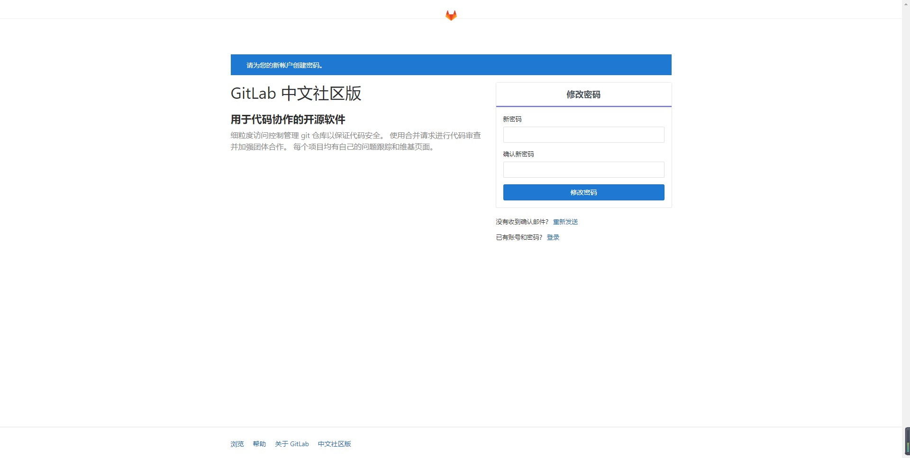
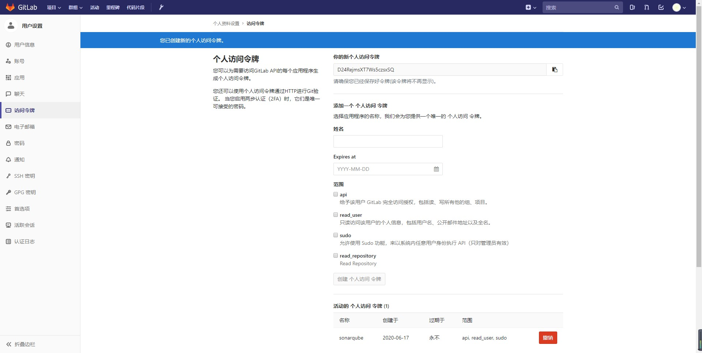
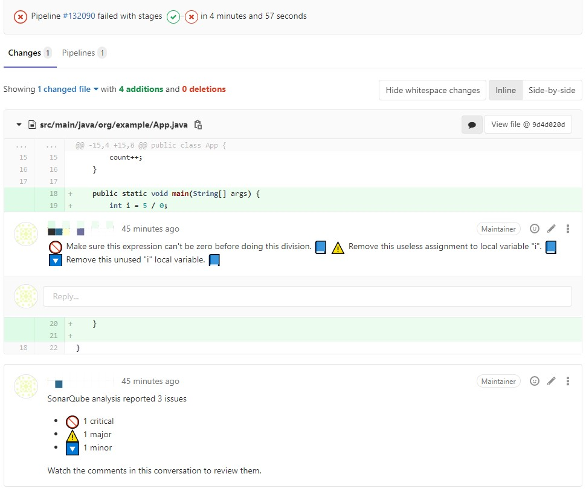

# 基于 SonarQube 搭建自动化代码检测平台

## 一、背景介绍

目前，成熟的代码检测工具有很多，如 SpotBugs（前身为 FindBugs）、PMD、Checkstyle 等，我们可以在本地开发环境，非常便捷地利用这些工具实现代码的扫描与检测。这看上去好像很不错，但实际上，采用这种代码检测方式，我们面临着两个问题：

- 代码提交前需要手动运行检测工具
- 检测结果仅对自己可见

那么，有没有什么方案可以规避这些问题呢？答案当然是有的。

我们可以基于 GitLab 和 SonarQube 搭建自动化代码检测平台，并通过该平台实现以下功能：

- 每次提交时，自动触发 SonarQube 代码检测，产生检测报告（包含坏味道、BUG 数、覆盖率等）
- 上述检测报告，若来源于主分支提交或合并，则发送至 SonarQube，若来源于其他分支提交，则以评论形式直接反馈至 GitLab

:::info

如果不知道 SonarQube 是什么，可以参考 [SonarQube 官方网站](https://www.sonarqube.org/)。

:::

## 二、环境要求

本次搭建使用的操作系统为 `CentOS 7`，需要安装的组件如下表所示：

|组件名|版本号|
|---|---|
|SonarQube|6.7|
|GitLab|11.1.4|
|GitLab-Runner|13.0.1|
|Maven|3.6.3|

实际版本号需严格遵循表格中的版本号，避免出现兼容性问题。目前，笔者已知的兼容性问题有以下几点：

- SonarQube 在 7.6 版本后不支持插件 `sonar-gitlab-plugin`，若使用 7.6 之后的版本，将无法实现 SonarQube 与 GitLab 协作（除非使用付费版）
- GitLab 与 GitLab-Runner 的版本要考虑兼容性，否则会出现 GitLab-Runner 无法连接至 GitLab 的问题

## 三、安装与配置

本节将描述上述组件安装与配置的详细步骤。其中，安装方式主要有本地安装和基于 Docker 安装，因此在安装前需确保宿主机已经具备 Docker 和 Docker Compose 的环境。

### 3.1 SonarQube

#### 3.1.1 SonarQube 安装

使用 Docker Compose 安装 SonarQube 很简单，只需以下几个步骤：

- 在任意位置创建安装目录 `sonar`，如 `/usr/local/sonar`
- 在安装目录下创建 `docker-compose.yml` 文件，文件内容如下：

```yaml
version: '2.1'

services:
  # 使用 PostgreSQL 作为 SonarQube 的持久化方案
  # 注：由于 SonarQube 7.9 及之后的版本不支持 MySQL，因此 MySQL 不作为考虑对象
  postgres:
    image: postgres:12
    container_name: sonarqube_postgres
    privileged: true
    ports:
      - "5432:5432"
    networks:
      - sonarnet
    restart: always
    # 将 PostgreSQL 数据文件存放至宿主机
    volumes:
      - ./postgres:/var/lib/postgresql/data
    environment:
      POSTGRES_DB: sonar
      POSTGRES_USER: sonar
      POSTGRES_PASSWORD: sonar

  sonarqube:
    image: sonarqube:6.7
    container_name: sonarqube
    privileged: true
    ports:
      - "9000:9000"
    restart: always
    networks:
      - sonarnet
    depends_on:
      - postgres
    # 将 SonarQube 日志文件、数据文件、配置文件、扩展插件存放至宿主机
    volumes:
      - ./data:/opt/sonarqube/data
      - ./extensions:/opt/sonarqube/extensions
      - ./logs:/opt/sonarqube/logs
      - ./conf:/opt/sonarqube/conf
    # 配置 SonarQube 的数据源，本例为 PostgreSQL
    environment:
      SONARQUBE_JDBC_USERNAME: sonar
      SONARQUBE_JDBC_PASSWORD: sonar
      SONARQUBE_JDBC_URL: jdbc:postgresql://postgres:5432/sonar?useUnicode=true&characterEncoding=utf8
    # 由于 SonarQube 内部会启动 ElasticSearch，因此需要此配置
    ulimits:
      nproc: 65535
      nofile:
        soft: 65536
        hard: 65536

networks:
  sonarnet:
    driver: bridge
```

- 在安装目录下分别创建 `data`、`extensions`、`logs`、`conf` 文件夹，并使用 `chmod -R 777 <dir>` 赋予所有权限，避免出现权限问题
- 若宿主机有开启防护墙，需开放上述配置的端口：

```bash
firewall-cmd --add-port=5432/tcp --permanent
firewall-cmd --add-port=9000/tcp --permanent
firewall-cmd --reload
```

- 在安装目录下，使用 `docker-compose up -d` 命令启动 SonarQube，若启动成功，控制台输出如下日志：

```纯文本
Creating network "sonar_sonarnet" with driver "bridge"
Creating sonarqube_postgres ... done
Creating sonarqube          ... done
```

- 打开浏览器，输入地址 `http://sonar.example.com:9000` 访问 SonarQube，若访问成功，则出现如下页面：


:::info

安装完成后，SonarQube 会自动生成管理员账号 `admin:admin`。

:::

#### 3.1.2 SonarQube 插件

SonarQube 安装完成后，还需要安装部分插件以支持某些功能，具体插件清单如下：

|插件名|版本号|插件用途|
|---|---|---|
|sonar-gitlab-plugin|3.0.2|为每个 GitLab 提交提供代码注释和评论的功能|
|sonar-l10n-zh-plugin|1.19|支持 SonarQube 汉化|

插件安装非常简单，只需要将插件 `jar` 包放至扩展目录 `${sonarqube_home}/extensions/plugins` 下，重启 SonarQube 即可。

关于 SonarQube 与 `sonar-gitlab-plugin` 的版本对照，可以参考：

[https://github.com/gabrie-allaigre/sonar-gitlab-plugin](https://github.com/gabrie-allaigre/sonar-gitlab-plugin)

关于 SonarQube 与 `sonar-l10n-zh-plugin` 的版本对照，可以参考：

[https://github.com/SonarQubeCommunity/sonar-l10n-zh%20](https://github.com/SonarQubeCommunity/sonar-l10n-zh%20)

:::info

上述插件不支持在 SonarQube 的应用中心直接下载，因为官方已经不再提供这两款插件的在线安装了，我们可以直接在上述的 GitHub 地址中下载指定版本的 jar 包。

:::

#### 3.1.3 Sonar GitLab Plugin 配置

若 `sonar-gitlab-plugin` 成功安装，则在 SonarQube 的配置页面可以见到如下页面：


具体路径为：登录 admin 账号 -> 点击顶部导航栏【配置】按钮 -> 点击【通用设置】中的【GitLab】选项卡

在该页面中，需要修改以下参数的值：

|参数名称|参数标识|目标值|
|---|---|---|
|GitLab url|sonar.gitlab.url|[http://gitlab.example.com](http://gitlab.example.com)|
|GitLab User Token|sonar.gitlab.user_token|GitLab 的用户令牌，获取方式参考 `3.2.2`|
|GitLab API version|sonar.gitlab.api_version|v4|

:::info

上述参数中，GitLab User Token 是核心，设置错误的 token，将直接影响到 SonarQube 与 GitLab 的协作。特别要注意的是，生成该 token 的用户 **一定要具备管理员权限**，否则 SonarQube 无法对 GitLab 上的所有项目进行评论。

:::

### 3.2 GitLab

#### 3.2.1 GitLab 安装

与 SonarQube 相似，我们采用 Docker Compose 的方式安装 GitLab，具体步骤如下：

- 在任意位置创建安装目录 `gitlab`，如 `/usr/local/gitlab`
- 在安装目录下创建 `docker-compose.yml` 文件，文件内容如下：

```yaml
version: '3'
services:
    gitlab:
      # 使用 gitlab 中文镜像，直接安装 gitlab 中文版
      image: 'twang2218/gitlab-ce-zh:11.1.4'
      restart: unless-stopped
      # 若没有域名，建议直接写ip，否则页面上克隆的复制链接串将显示该值，无法直接使用
      hostname: '192.168.117.128'
      container_name: gitlab
      environment:
        # 设置时区
        TZ: 'Asia/Shanghai'
        GITLAB_OMNIBUS_CONFIG: |
          external_url 'http://192.168.117.128'
          gitlab_rails['time_zone'] = 'Asia/Shanghai'
      ports:
        - '80:80'
        - '443:443'
        - '22:22'
      # 将 gitlab 日志文件、数据文件、配置文件存放至宿主机
      volumes:
        - config:/etc/gitlab
        - data:/var/opt/gitlab
        - logs:/var/log/gitlab
volumes:
    config:
    data:
    logs:
```

- 若宿主机 `ssh` 端口为默认值 `22`，则需要将其修改为其他值后，才能继续执行后续步骤，具体修改方式本文略
- 若宿主机有开启防护墙，需开放上述配置的端口（`22` 端口默认开启，无需配置）：

```bash
firewall-cmd --add-port=80/tcp --permanent
firewall-cmd --add-port=443/tcp --permanent
firewall-cmd --reload
```

- 在安装目录下，使用 `docker-compose up -d` 命令启动 GitLab，若启动成功，控制台输出如下日志：

```纯文本
Creating network "gitlab_default" with the default driver
Creating gitlab ... done
```

- 打开浏览器，输入地址 `http://gitlab.example.com` 访问 GitLab，若访问成功，则出现如下页面：



:::info

安装完成后，GitLab会自动生成管理员账号 `root`，首次登录前需要修改密码。

:::

#### 3.2.2 GitLab 用户令牌生成

GitLab 安装完成后，我们需要需要根据 `3.1.3` 中的要求，生成用户令牌。

具体步骤如下：

- 登录具有管理员权限的账号（一定要是管理员身份）
- 访问地址 `http://gitlab.example.com/profile/personal_access_tokens` 进入令牌生成页面
- 输入令牌名称，勾选 `api` 、`read_user`、`sudo` 权限，点击【创建】按钮，即可生成用户令牌


**生成的令牌需要马上保存，后续不再显示**，具体令牌信息在如下位置：



### 3.3 GitLab Runner

#### 3.3.1 GitLab Runner 安装

GitLab Runner 是一个处理构建的应用程序，我们需要通过它执行我们在 GitLab CI 中定义的 Job。

在本例中，由于后续编写的 Job 依赖于 Maven 环境，因此选择直接在宿主机上安装 GitLab
Runner。

（当然，我们也可以自己构建包含 GitLab Runner 和 Maven 的镜像，然后使用 Docker 安装，具体实现方式本例略。）

在宿主机上安装 GitLab Runner 的步骤如下：

- 下载 GitLab 官方源：

```bash
curl -L https://packages.gitlab.com/install/repositories/runner/gitlab-runner/script.rpm.sh | sudo bash
```

- 使用 yum 下载 GitLab Runner：

```bash
yum install gitlab-runner
```


#### 3.3.2 注册与启动 Runner

注册 Runner 前，我们需要先获取 GitLab 的注册令牌。

登录管理员账号，访问地址 `http://gitlab.example.com/admin/runners`，即可看到我们想要的注册令牌：


接下来，即可开始注册流程。

首先，执行注册命令：

```bash
gitlab-runner register
```

然后，根据控制台上的提示，我们需要依次输入以下信息：

- GitLab 地址：`http://gitlab.example.com`
- 注册令牌
- Runner 描述，如 test
- Runner 标签（与后续编写的 `.gitlab-ci.yml` 中的 `tags` 要一致，因此需要慎重填写，当然，写错了也无妨，后续在 UI 界面上可以修改）
- 选择执行者（ssh, docker+machine, docker-ssh+machine, kubernetes, docker, parallels, virtualbox, docker-ssh, shell）
- 若执行者选择 shell，则注册流程结束，若执行者选择 docker，则需要选择默认的镜像，如 `docker:stable`

完成注册后，即可在刚刚的地址中看见该 Runner 的信息：


现在，我们可以使用命令 `gitlab-ci-multi-runner run` 启动所有 Runner。

### 3.4 Maven

Maven 用于执行 SonarQube 的代码检测命令（同样的工具有 Sonar Scanner、Gradle 等）。

由于没有找到已配置好阿里源的 Maven 镜像，所以我们也选择使用本地安装的方式安装 Maven，具体步骤如下：

- 在任意目录下（如 `/usr/local`）下载 Maven 二进制包：

```bash
wget https://mirror.bit.edu.cn/apache/maven/maven-3/3.6.3/binaries/apache-maven-3.6.3-bin.tar.gz
```

- 解压压缩包，并将目录重命名为 `maven`：

```bash
tar -xzvf apache-maven-3.6.3-bin.tar.gz
mv apache-maven-3.6.3/ maven
```

- 在 `/etc/profile` 文件追加以下内容：

```纯文本
export M2_HOME=/usr/local//maven
export PATH=$PATH:$M2_HOME/bin
```

- 重置环境变量

```bash
source /etc/profile
```

至此，环境要求的所有组件已全部安装完毕。

## 四、结果验证

现在，我们通过一次完整的代码提交，来验证自动化代码检测平台是否生效，即：

- 代码提交时，是否触发 SonarQube 检测作业
- SonarQube 的检测结果，是否可以反馈至 GitLab

### 4.1 新建 Maven 工程

首先，我们创建满足要求的 Maven 工程。该工程的 `pom.xml`  文件要求具备以下内容：

- 加入 `sonar-maven-plugin` 和 `jacoco-maven-plugin` 插件：

```xml
<build>
    <pluginManagement>
        <plugins>
            <plugin>
                <groupId>org.apache.maven.plugins</groupId>
                <artifactId>maven-compiler-plugin</artifactId>
                <version>3.8.1</version>
            </plugin>
            <plugin>
                <groupId>org.sonarsource.scanner.maven</groupId>
                <artifactId>sonar-maven-plugin</artifactId>
                <version>3.6.0.1398</version>
            </plugin>
            <plugin>
                <groupId>org.jacoco</groupId>
                <artifactId>jacoco-maven-plugin</artifactId>
                <version>0.8.4</version>
            </plugin>
        </plugins>
    </pluginManagement>
</build>
```

- 添加 `jacoco-maven-plugin` 插件的配置信息：

```xml
<profiles>
    <profile>
        <id>coverage</id>
        <activation>
            <activeByDefault>true</activeByDefault>
        </activation>
        <build>
            <plugins>
                <plugin>
                    <groupId>org.jacoco</groupId>
                    <artifactId>jacoco-maven-plugin</artifactId>
                    <executions>
                        <execution>
                            <id>prepare-agent</id>
                            <goals>
                                <goal>prepare-agent</goal>
                            </goals>
                        </execution>
                        <execution>
                            <id>report</id>
                            <goals>
                                <goal>report</goal>
                            </goals>
                        </execution>
                    </executions>
                </plugin>
            </plugins>
        </build>
    </profile>
</profiles>
```

可能有人会有疑问，为什么需要加入 `jacoco-maven-plugin` 插件呢？这是因为，SonarQube 本身并不支持覆盖率计算，我们需要借助 jacoco 来计算出项目单元测试的覆盖率。

### 4.2 集成 GitLab-CI

`3.3.2` 中，我们演示了如何创建 GitLab Runner。

在这里，我们首先创建执行者为 docker 的 Runner，并将其命名为 `docker_runner`。

然后，我们编写如下 `.gitlab-ci.yml` 文件：

```yaml
image: maven:3.6.3-jdk-8

variables:
  SONAR_TOKEN: "${sonar_token}"
  SONAR_HOST_URL: "http://sonar.example.com:9000"
  GIT_DEPTH: 0

stages:
  - build_push
  - feedback_to_gitlab

# 执行 SonarQube 分析，并将检测结果推送至 SonarQube
sonarqube_analysis:
  stage: build_push
  only:
    - merge_requests
    - master
  script:
    - mvn --batch-mode verify sonar:sonar -Dsonar.host.url=$SONAR_HOST_URL -Dsonar.login=$SONAR_TOKEN
  tags:
    - docker_runner

# 执行 SonarQube 分析，并将检测结果反馈至 GitLab
sonarqube_gitlab_comment:
  stage: feedback_to_gitlab
  except:
    - master
  script:
    - mvn --batch-mode verify sonar:sonar -Dsonar.host.url=$SONAR_HOST_URL -Dsonar.login=$SONAR_TOKEN -Dsonar.analysis.mode=preview -Dsonar.gitlab.commit_sha=$CI_COMMIT_SHA -Dsonar.gitlab.ref_name=$CI_COMMIT_REF_NAME -Dsonar.gitlab.project_id=$CI_PROJECT_ID
  tags:
    - docker_runner
```

其中，参数 `SONAR_TOKEN` 为 SonarQube 的令牌，在 SonarQube 首次创建项目时即可创建。与 GitLab 的令牌一样，此 token 一旦创建，就需要马上保存，否则后续不再显示。

引入该 `.gitlab-ci.yml` 文件后，当我们提交代码时，上述 Runner 便会根据提交所来源的分支选择相应的执行脚本，具体描述如下：

- 若提交为主分支提交（或合并至主分支），则执行器 `docker_runner` 会执行 SonarQube 的分析指令，并将分析结果报送至 SonarQube 平台
- 若提交为非主分支提交，则执行器 `docker_runner` 会执行 SonarQube 的分析指令，并将分析结果反馈至 GitLab 中对应的分支下

### 4.3 提交验证

现在，我们分别在其他分支和主分支提交代码，查看提交结果。

在提交其他分支代码时，由于我们的代码中有严重 BUG，SonarQube 会在此分支下标记出 BUG 的具体信息，并标记该流水线的状态为失败，如下图所示：



在提交主分支代码时，我们发现执行器自动触发 SonarQube 分析作业，并将检测结果推送至 SonarQube 平台，如下图所示：


综上，我们发现结果符合预期，说明自动化代码检测平台搭建成功，enjoy it！

