## 一、为什么要用 Jenkins？

目前，我们在持续集成上使用的是 GitLab 自带的 gitlab-ci。它支持自动化完成代码编译、镜像构建与镜像推送，减少开发人员在项目构建上的时间开销。

但是，gitlab-ci 有一个明显的缺陷：在遇到多模块项目时（如基于 SpringBoot 搭建的微服务项目），它显得有些无力。具体表现为，**gitlab-ci 不支持多管道，每当项目中某个模块的代码有新的提交，gitlab-ci 都会触发全项目的自动构建，而无法仅针对产生变动的子模块进行构建**。当项目规模较大时，这种构建方式会导致自动构建的代价非常大。

而在这种场景下，Jenkins 可以很好地实现我们的需求。当代码提交触发构建事件时，Jenkins 可以筛选出产生变动的子模块，并对这些子模块进行构建与打包，使我们的自动化构建变得精准而优雅。

下图为 Jenkins 持续集成的工作流示意图：

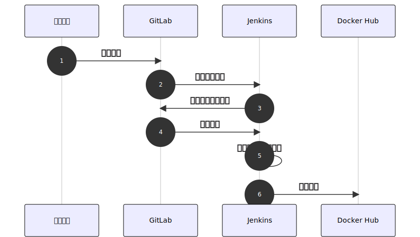

## 二、Jenkins 安装与部署

本节将介绍 Jenkins 的安装与部署。若只想了解流水线的构建，可以直接跳过本节内容。

### 2.1 环境准备

我们将采用 Docker 的方式部署 Jenkins，因此，部署前需在宿主机完成 Docker 环境的搭建。

:::info

Docker 环境搭建不作为本文分享内容，请自行实现。

:::

### 2.2 基础镜像

Jenkins 官方已提供现成的 Docker 镜像 `jenkinsci/blueocean`，该镜像内已包含以下组件：

- Docker
- Java
- Git

但是我们不能直接使用它，因为它并未安装常用的构建工具（如 Maven、Gradle 等）。

为解决这个问题，我们可以参考以下 Dockerfile 文件，构建符合我们自身需求的 Jenkins 镜像：

```docker
FROM jenkinsci/blueocean:1.24.7
MAINTAINER pentaxie@qq.com

ARG BASE_DIR=/opt/maven

USER root
ADD apache-maven-3.6.3-bin.tar.gz ${BASE_DIR}
ADD settings.xml ${BASE_DIR}/apache-maven-3.6.3/conf
RUN ["cp","/usr/share/zoneinfo/Asia/Shanghai","/etc/localtime"]

ENV M2_HOME=${BASE_DIR}/apache-maven-3.6.3
ENV PATH=$PATH:$M2_HOME/bin
```

:::info

该镜像在官方镜像的基础上，安装了 Maven，并相应地修改了 Maven 配置文件。

:::

### 2.3 启动 Jenkins

完成 Jenkins 基础镜像的构建后，我们可以直接使用 Docker 命令启动容器：

```bash
docker run \
  -u root \
  -d \
  -p 38080:8080 \
  -v /data/test/jenkins-data:/var/jenkins_home \
  -v /var/run/docker.sock:/var/run/docker.sock \
  hub.panda.com/dc-jenkins:2.289
```

其中，两个 `-v` 需要了解其作用：

- 第一个 `-v` 表示将 Jenkins 的安装及数据存储目录挂载到宿主机，下次我们重启 Jenkins 的 Docker 容器时，Jenkins 中的数据才得以保留
- 第二个 `-v` 表示支持容器内的 Docker 客户端直接使用宿主机的 Docker 服务，这样我们在容器内执行构建命令时，实际上是在宿主机构建镜像

### 2.4 插件安装

Jenkins 启动后，首先需要安装社区推荐的插件。

除此之外，我们还需要在 **插件管理** 界面自行安装以下插件：

- GitLab
- Maven Integration
- Pathignore

上述插件的主要功能为：

|**插件名称**|**主要功能**|
|---|---|
|GitLab|支持 GitLab Token 的配置|
|Maven Integration|Maven 集成插件，支持在流水线中创建 Maven Project|
|Pathignore|路径过滤插件，支持子模块过滤（实现多模块持续集成的关键）|

### 2.5 必要配置

#### 2.5.1 GitLab Token 设置

安装完 GitLab 插件后，需要在 **系统管理 - 系统设置** 页面添加 GitLab Token。

GitLab Token 是 GitLab 提供的身份验证的令牌，其生成方式可参考下图：

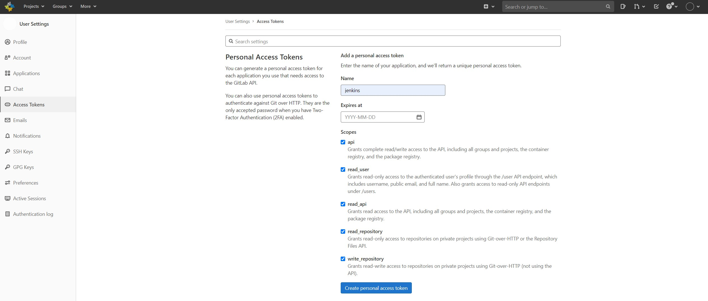

:::info

该 Token 尽可能赋予足够的权限，避免后续 Jenkins 集成出现权限不足的情况。

:::

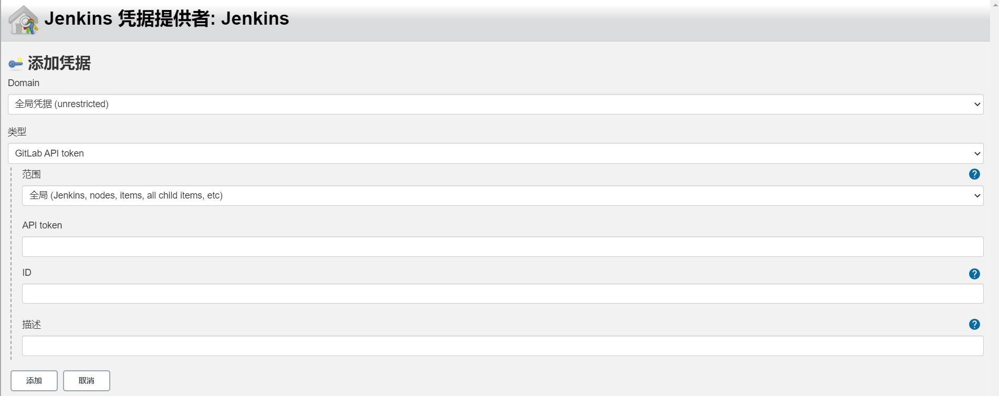

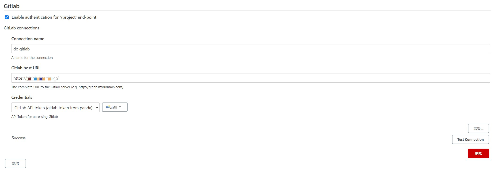

:::info

添加后，需点击图中的 **Test Connection** 按钮进行校验，确保 Token 可以正常运作。

:::

#### 2.5.2 Maven 设置

基础镜像部分介绍到，我们在官方 Jenkins 镜像的基础上安装了 Maven，并设置了环境变量与配置文件。

但这些还不够，使用 Jenkins 时，我们还需要在 **系统管理 - 全局工具配置** 页面中配置 Maven 的具体位置，使 Jenkins 能准确找到 Maven 的地址。

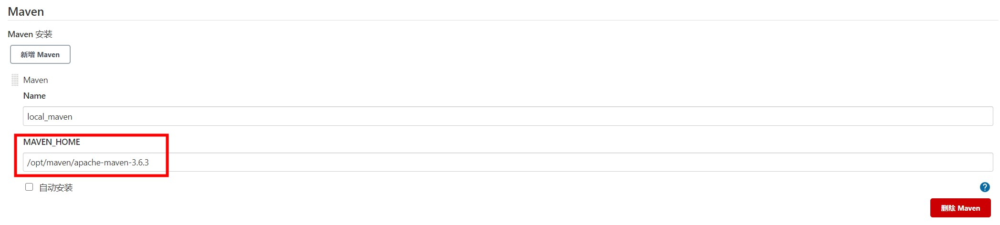

#### 2.5.3 时区设置

在基础镜像部分，我们已经将镜像的时区设置为东八区。

但是在 Jenkins 的界面中，每个用户的初始时区都是伦敦时间，需要我们手动设置为东八区：

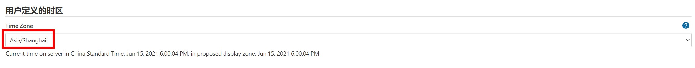

完成此步骤后，Jenkins 的整个初始化配置过程便完成了，接下来可开始创建流水线进行深入体验。

## 三、构建流水线

本节将以 **多模块集成流水线** 为例，展示具体的流水线构建流程。

### 3.1 创建任务

集成了 Maven Integration 插件后，我们就可以在 **新建任务** 界面中创建一个 Maven Project：

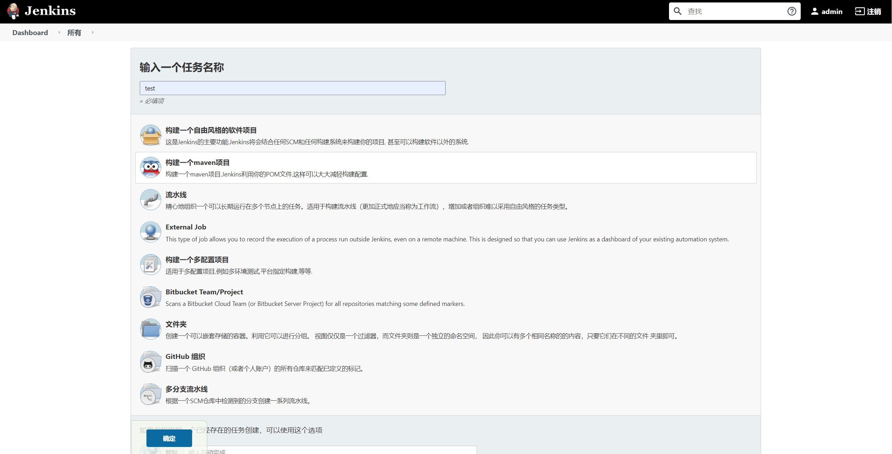

:::info

通过 Maven Project，我们可以很便捷地在 Jenkins 上实现代码的编译与打包。

:::

### 3.2 配置流水线

流水线任务创建后，需要经过一系列配置。

#### 3.2.1 代码源

Jenkins 支持从 GitLab 上拉取代码。

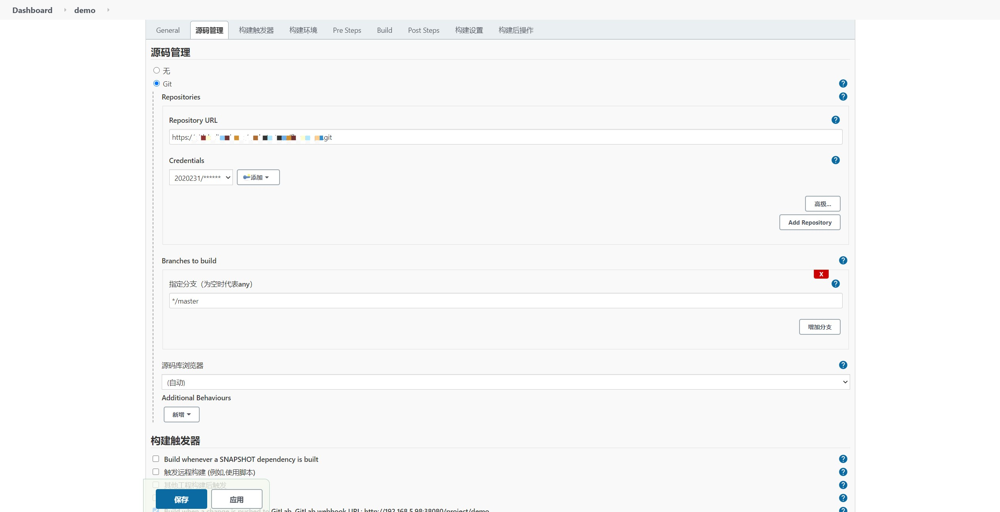

:::caution

仓库地址记得使用 HTTPS，如果要使用 SSH 方式，需在容器中创建私钥（本文不介绍此种方式）。

:::

如果我们的 GitLab 项目是 Private 级别，那么我们还需要创建一个 GitLab 凭据**（Username with password）**，该凭据需要填写具有项目对应权限的 **GitLab 用户名与密码**，如下所示：

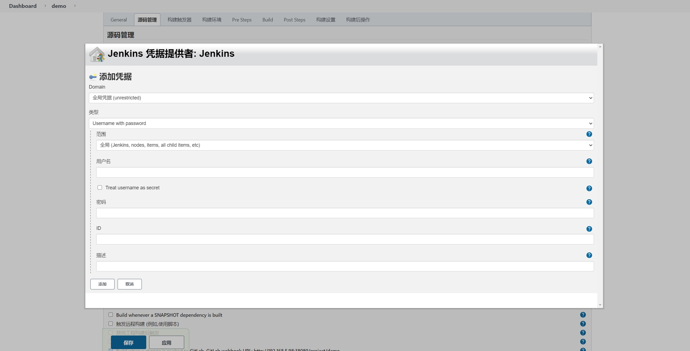

#### 3.2.2 构建器

构建器用于设置流水线任务触发的条件。

在本例中，我们勾选 `Build when a change is pushed to GitLab`。

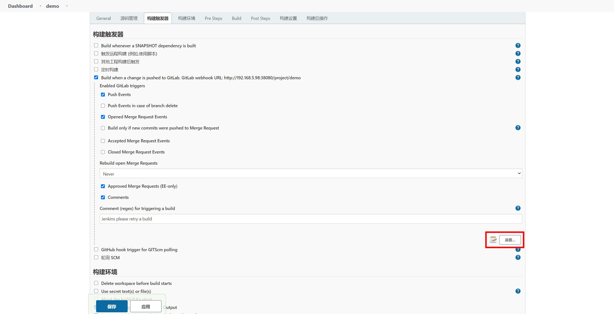

该选项实现了当 GitLab 上有代码提交等行为时，触发 Jenkins 作业。

需要注意的是，要实现 GitLab 主动向 Jenkins 推送触发事件，需在 GitLab 上配置 Webhooks：

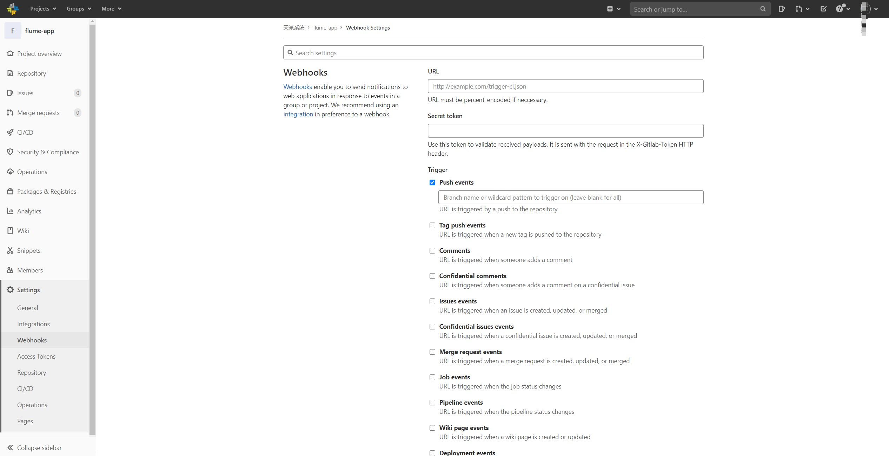

Webhooks 中，有两个配置项需要格外注意：

- URL 为 Jenkins 对应构建项目的地址，如本例为：[http://192.168.5.98:38080/project/demo](http://192.168.5.98:38080/project/demo)
- Secret token 为 Jenkins 对应构建项目的令牌，通过点击 **高级** 按钮进行生成，具体示例可见下图

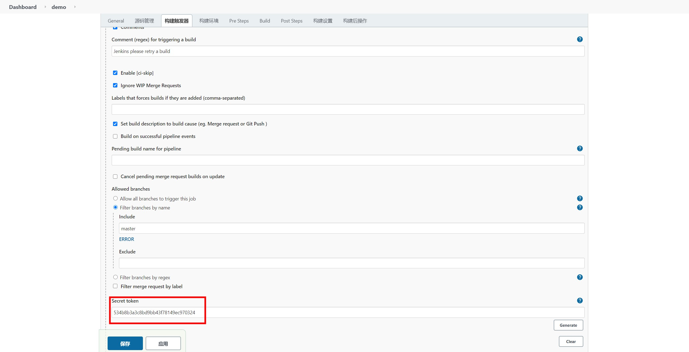

此外，图例中的 `Allowed Branched` 需要指定触发构建的分支。默认情况下，任意分支的提交都会触发构建任务。

:::info

在本例中，我们设置为只有 master 分支发生变更才会触发构建任务。

:::

#### 3.2.3 构建环境

构建环境设定了构建过程中的一些条件与行为。

由于本节主要介绍多模块的持续集成，因此关键点在于 `Do not build if only specified paths have changed` 选项。

:::info

该选项由 Pathignore 插件提供，可支持子模块的单独构建。

:::

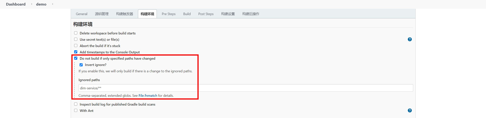

图例中的配置表示，只有子模块 `dim-service` 产生了变更项，才会触发构建任务。**这是实现多模块持续集成的根基**，在此基础上，我们可以很轻松地过滤掉其他子模块的构建流程。

#### 3.2.4 Pre Steps

顾名思义，Pre Steps 可以完成构建前的一些准备工作。

例如，我们想要在构建时推送 Docker 镜像，那么就需要提前登录对应的 Docker 仓库：

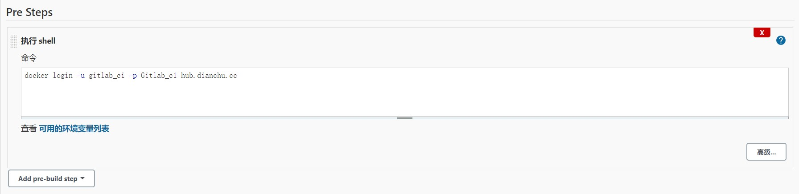

#### 3.2.5 Build

该步骤指明了我们整个流水线想要完成的构建指令。

在本例中，我们通过 `-pl` 参数指定构建的模块为 `dim-service`，配合上述 Pathignore 插件的过滤功能，我们可以实现当 `dim-serivce` 子模块发生变更项时自动触发该模块的 Docker 镜像创建与推送：

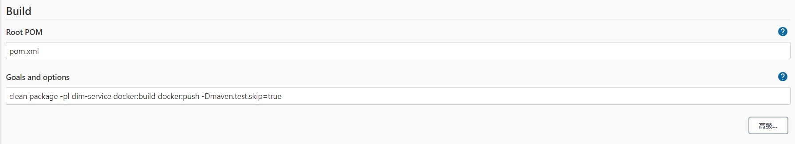

:::info

 `docker:build` 与 `docker:push` 依赖 `docker-maven-plugin` 插件，可自行研究，或等待后续教程。

:::

完成上述所有步骤后，点击 **应用** 与 **保存**，便完成了流水线的配置。如果项目有多个模块，创建多个对应的流水线任务即可。

### 3.3 构建与验收

现在，我们可以提交一次代码，验证一下流水线任务执行情况。若无异常，在我们提交代码后，流水线会自动开启构建任务，完成我们预设的构建工作。

:::info

代码提交时，各子模块对应的流水线任务都会被触发，但是由于 Pathignore 插件的作用，流水线任务检测自身对应的子模块无变更项时，当前被触发的构建任务不会执行任何构建操作。

:::

在构建任务明细中，可以通过点击 **控制台输出** 按钮，查看具体的构建日志：

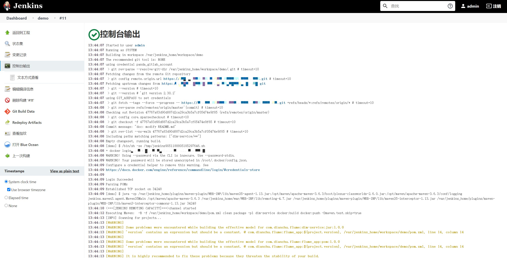

如果一切顺利，即可在我们的 Docker 私仓里看到本次构建的镜像了！