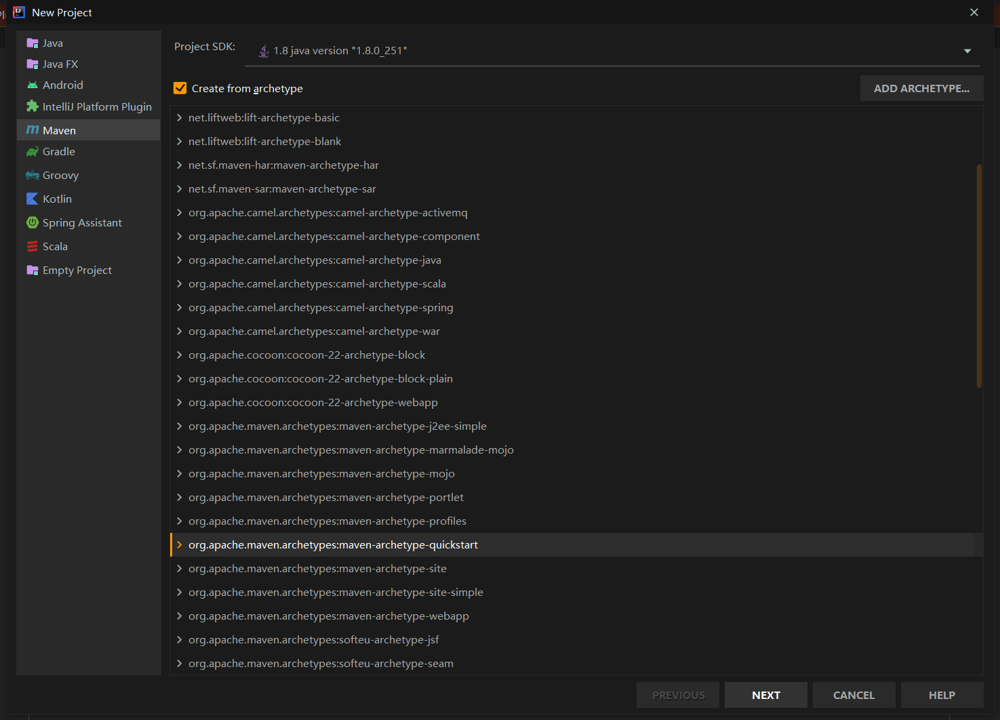
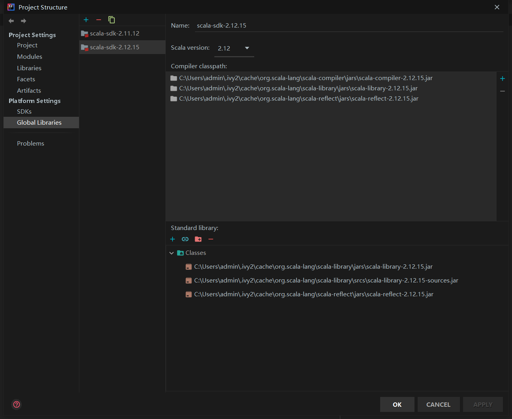
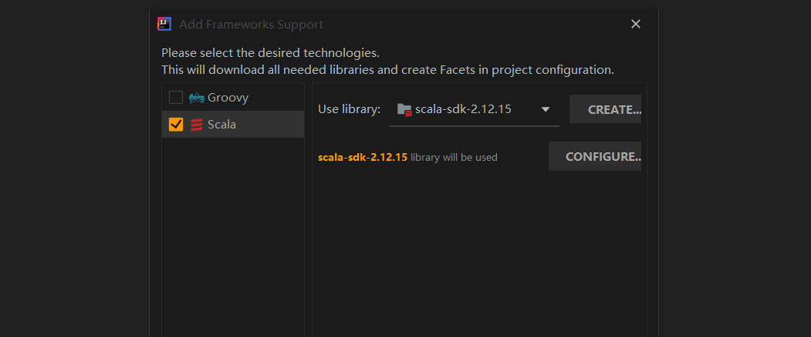
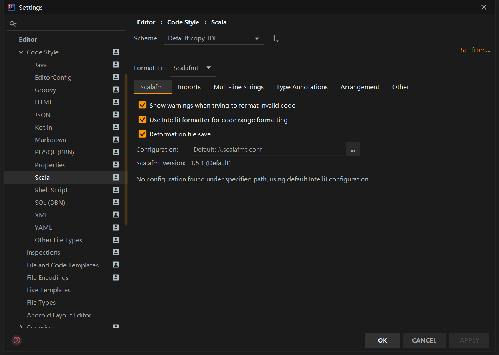
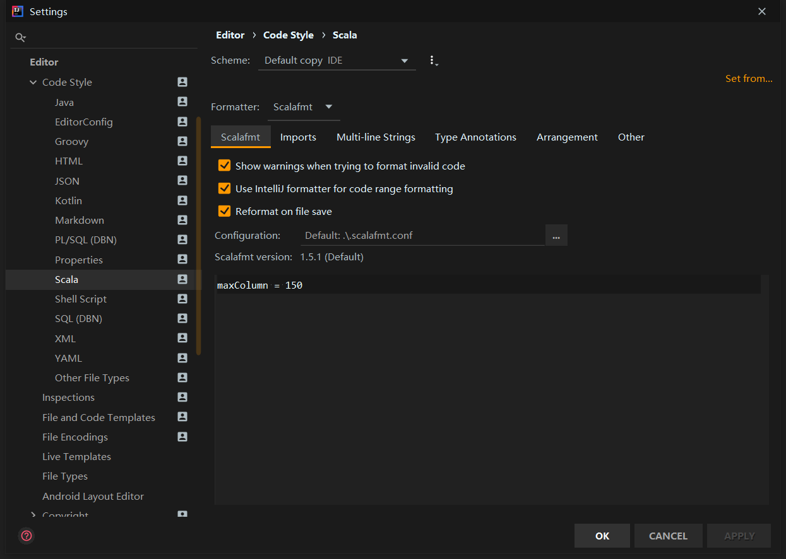
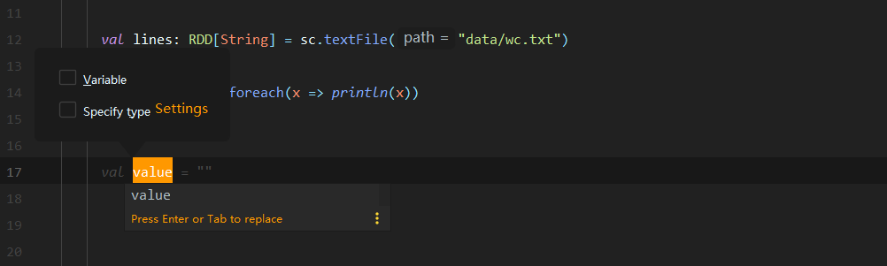
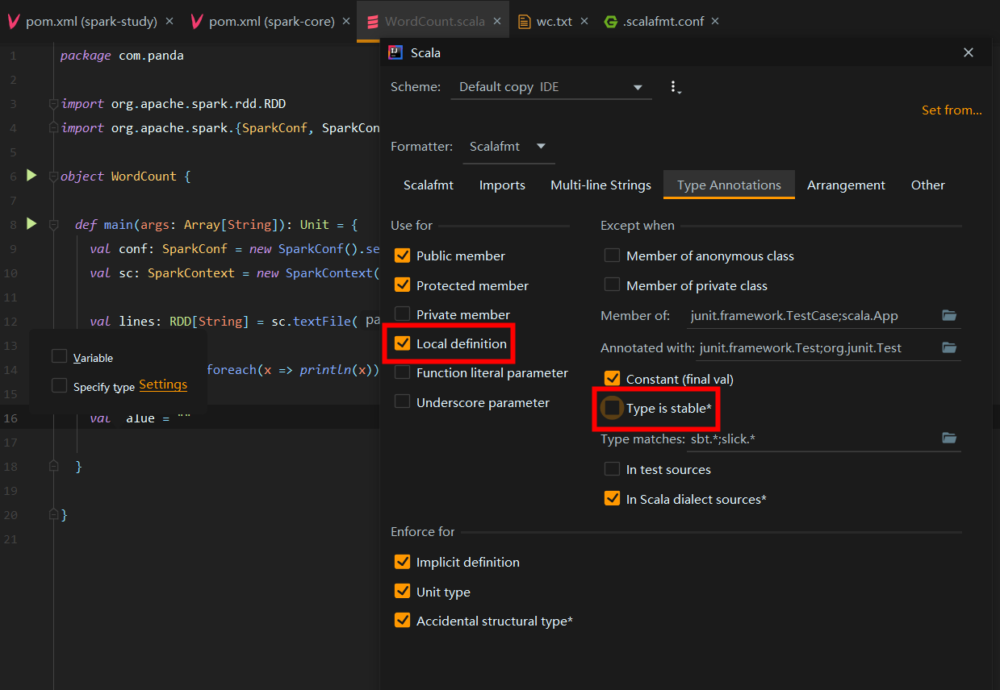

# Scala 代码规范

## 一、前言

与 Java 不同，Scala 比较小众，没有放之四海而皆准的规范。

为了使团队在 Scala 项目上的代码尽可能地保持一致，笔者在借鉴 **官方文档**、**开源项目** 的基础上，整理了适用于自身团队的 Scala 代码规范。

## 二、项目创建规约

本规约展示了一个在 IDEA 上创建 Scala 项目的流程，以供参考。

### 2.1 依赖管理

Scala 支持通过 Maven 或 sbt 来管理项目。基于以下因素，我们选择 Maven：

- Scala 开源项目大部分都是通过 Maven 进行管理
- 团队成员对 Maven 比较熟悉，学习成本低
- 主流持续集成产品对 Maven 支持度比较高

使用 Maven 创建 Scala 项目时，与  Java 无太大区别，可以通过 archetype 快速创建：



此时，项目仅能创建 Java 类，还无法创建 Scala 类。

###  2.2 Scala SDK

Scala SDK 是 Scala 项目中不可缺少的部分，我们可以在 Project Structure 完成 Scala SDK 的添加。

:::info

若本地没有 Scala SDK，可以点击 `+` 号，在弹出的对话框中选择对应的 Scala 版本进行下载。

:::



### 2.3 框架支持

此时，距离完整创建 Scala 项目还差最后一步，即框架支持。

我们可以右键项目根目录，点击 `Add Framework Support`，然后会弹出如下对话框：



勾选 Scala，点击 OK。此时，Scala 项目创建完毕，可以在项目中新建 Scala 类并进行编码。

## 三、代码风格规约

Scala 官方提供了代码风格参考：

[https://docs.scala-lang.org/style/index.html](https://docs.scala-lang.org/style/index.html#)

但是，基于文档的规约常常是不安全的，团队中总会有“糊涂蛋”一不小心犯了“错”。为避免这个问题，我们可以引入 **Scalafmt 插件**，以强制的手段保证项目代码风格的一致性。

### 3.1 Scalafmt 安装

Scalafmt 可以直接在 IDEA 的插件商场中安装。

安装完成后，需重启 IDEA。

### 3.2 Scalafmt 配置

Scalafmt 基于 `.scalafmt.conf` 文件实现配置。

首先，打开 Settings，进入 **Editor > Code Style > Scala** 界面，将 Formatter 设置为 Scalafmt，如下图所示：



然后，在项目根目录下创建 `.scalafmt.conf` 文件，输入如下内容：

```properties
maxColumn = 150
```

若配置成功，可在 **Editor > Code Style > Scala** 界面看到如下结果：



### 3.3 变量类型补全

在 Scala 中，变量的实际类型可以是不显式指定的。例如，我们可以这样定义字符串类型的变量：

```scala
val value = "panda"
```

实际上，它的完整表达式是：

```scala
val value: String = "panda"
```

为了提高代码阅读性，使其他开发人员能快速知晓变量的实际类型，我们规定 **变量类型要完全补全**。

在 Java 开发中，我们常常使用 `.var` 实现变量类型自动补全。但是，在 Scala 项目里，`.var` 补全的内容默认情况下是不显示实际类型的，如下图所示：



若想要显示实际类型，需要在 Type Annotations 选项卡中勾选 `Local definition` 选项，并取消勾选 `Type is stable*` 选项：



此时，再次使用 `.var` 进行补全时，会发现变量的实际类型已经自动补上了。


