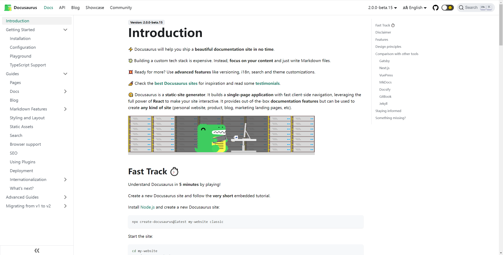
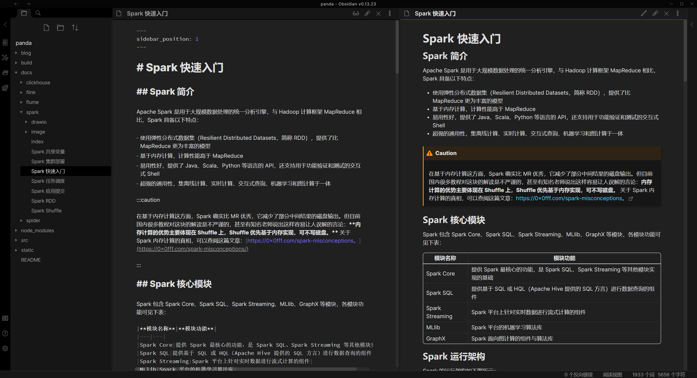
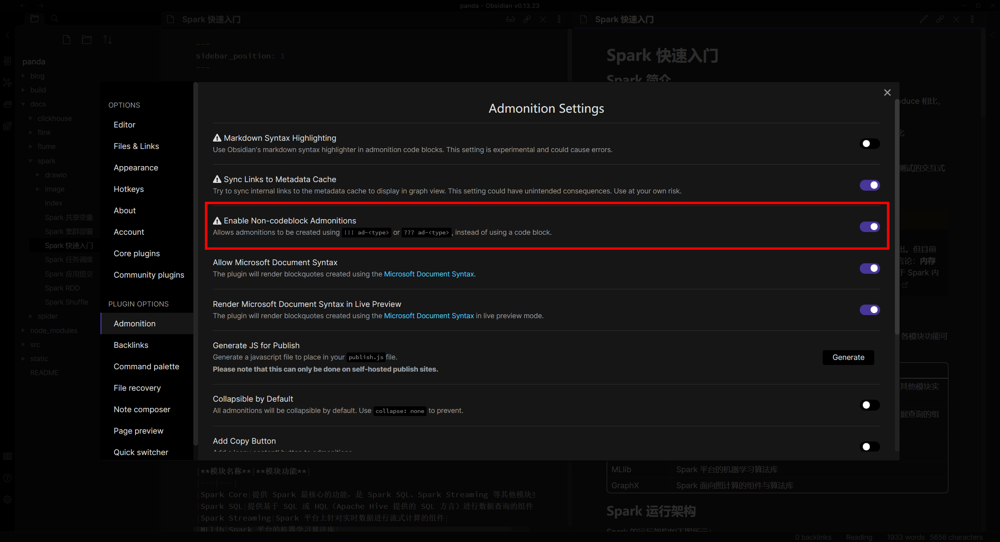

## 一、简介

[Docusaurus](https://docusaurus.io) 是一款静态网站生成器，可以帮助我们快速搭建一个优美的文档网站。

Docusaurus 的基本特性主要有：

- 支持 Markdown
- 支持侧边栏
- 支持目录导航
- 支持提示功能
- 支持自定义样式
- ……

此外，Docusaurus 还有一些高级特性：

- 支持夜间模式
- 支持站内搜索
- 支持 SEO 优化
- 支持插件扩展
- 支持多语言
- 支持多版本
- ……

以下为 Docusaurus 的官网截图，我们可以先一睹为快： 



## 二、核心组件

Docusaurus 的核心组件有：Docs、Blog、Pages。

### 2.1 Docs

Docs 为用户提供了按层级管理 Markdown 文档的功能，由官方插件 `@docusaurus/plugin-content-docs` 提供支持。

在 Docs 中，Markdown 文档具有清晰的层级关系，如下图所示：


### 2.2 Blog

Blog 即为我们熟知的博客。

该功能由官方插件 `@docusaurus/plugin-content-blog` 提供，可以帮助我们快速搭建博客页面。

下图为 Blog 示例：


### 2.3 Pages

Pages 指独立的页面，页面之间没有父子关系，由官方插件 `@docusaurus/plugin-content-pages` 提供支持。

在 Docusaurus 中，用户可以添加一个 React 页面，也可以添加一个 Markdown 页面。

下图为 Pages 示例：


## 三、使用指南

### 3.1 环境准备

Docusaurus 要求我们预先安装以下组件：

- [Node.js](https://nodejs.org/en/)
- [yarn](https://yarnpkg.com/)

:::caution

yarn 指的是依赖管理工具，并不是 Hadoop 中的资源管理器 yarn。若本地安装了 Hadoop，注意在环境变量中去掉 yarn 脚本的地址，避免 `yarn` 命令冲突。

:::

### 3.2 创建站点

在任意路径执行以下命令：

```bash
npx create-docusaurus@latest my-website classic
```

若创建成功，在当前路径下会出现 `my-website` 目录，且控制台输出如下信息：


### 3.3 配置说明

`my-website` 目录下包含多个配置文件，这些配置文件的具体作用可参考下表：

|配置文件|具体说明|
|---|---|
|`docusaurus.config.js`|核心配置文件，包含基础信息配置、插件配置、主题配置等|
|`src/css/custom.css`|自定义样式设置|
|`src/pages/index.js`|主页标题栏配置|
|`src/components/HomepageFeatures.js`|主页特性栏配置|

:::info

具体配置项说明请参考官方文档：[https://docusaurus.io/docs/api/docusaurus-config](https://docusaurus.io/docs/api/docusaurus-config)。

:::

### 3.4 快速启动

进入 `my-website` 目录，输入以下命令快速启动站点：

```bash
npx docusaurus start
```

若启动正常，则控制台会输出如下信息：


此时，我们便可以通过 [http://localhost:3000/](http://localhost:3000/) 预览我们的本地站点。

### 3.5 语法高亮

默认情况下，Docusaurus 未开启 Java、Scala 等语言的语法高亮，需要我们在 `docusaurus.config.js` 增加如下配置：

```javaScript
module.exports = {
  // ...
  themeConfig: {
    prism: {
      additionalLanguages: ['powershell'],
    },
    // ...
  },
};
```

:::info

Docusaurus 基于 [Prism](https://prismjs.com/#supported-languages) 实现语法高亮。

:::

## 四、编辑器

### 4.1 编辑器选择

对于自建博客来说，找到合适的 MD 编辑器是非常重要的一件事，这将会影响到我们的文档编写体验与发布效率。

若条件允许，我们希望编辑器可以满足以下功能：

- 功能一：支持与博客站点相同的文档层级结构
- 功能二：支持自定义 CSS，以实现本地的实时预览
- 功能三：支持与站点相同的提示功能与语法（Admonition），以实现本地的实时预览
- 功能四：支持源文件快速同步

基于这些功能需求，笔者类比了几款知名 MD 编辑器，得出如下结论：

|编辑器|功能一|功能二|功能三|功能四|
|---|---|---|---|---|
|Mark Text|✅|❌|❌|❌|
|Joplin|❌|✅|✅|✅|
|Obsidian|✅|✅|✅|❌|

:::info

Typero 目前已收费，因此不列入比较清单。此外，Obsidian 实际上是支持功能四的，但是需要付费。

:::

综合以上，笔者最终选择 Obsidian 作为本地的编辑器，其编辑界面如下图所示：



### 4.2 自定义设置

使用 Obsidian，我们有两个自定义项需要设置。

#### 4.2.1 自定义 CSS 

自定义 CSS 可以帮助我们复制博客站点的 CSS，使编辑器的预览样式与站点一致。为实现该功能，需要以下步骤：

1. 在 `.obsidian/snippets` 目录下创建 `custom.css` 文件，将博客站点的全部 CSS 复制到该文件中
2. 通过路径 Settings → Appearance → CSS snippets 进入设置页面，点击按钮启用自定义样式


#### 4.2.2 Admonition

默认情况下，Obsidian 不支持 Admonition。

为了使 Obsidian 支持 Admonition，我们需要下载 Admonition 插件，然后安装到目录 `.obsidian/plugins`。

:::info

Admonition 的下载地址为：[https://github.com/valentine195/obsidian-admonition](https://github.com/valentine195/obsidian-admonition)。

:::

安装完成后，进入设置页面，并启用 `Enable Non-codeblock Admonitions`：



插件支持的提示语法为 `!!!` 或 `???`，与博客站点的 `:::` 不同，因此我们还需要做一些修改。

打开目录 `.obsidian/plugins/obsidian-admonition` 下的 `main.js` 文件，找到其中的 `enableMarkdownProcessor` 方法，将 `TYPE_REGEX` 和 `END_REGEX` 修改为图中所示值：


重启 Obsidian，此时，我们便可以正常使用 Admonition 功能了。

## 五、部署

我们已经完成了 Docusaurus 的本地启动和编辑，现在，我们还需要将它发布到 GitHub Pages。

发布时，只需在 `my-website` 目录下输入以下命令：

```bash
set "GIT_USER=xxx" && set "GIT_PASS=xxx" && yarn deploy
```


其中，各参数的说明为：

- `GIT_USER`：用户的 GitHub 账号
- `GIT_PASS`：用户的 GitHub 私有凭证

:::caution

`GIT_PASS` 并非指密码，而是私有凭证，其生成方式请参考：[https://docs.github.com/en/authentication/keeping-your-account-and-data-secure/creating-a-personal-access-token](https://docs.github.com/en/authentication/keeping-your-account-and-data-secure/creating-a-personal-access-token)。

:::