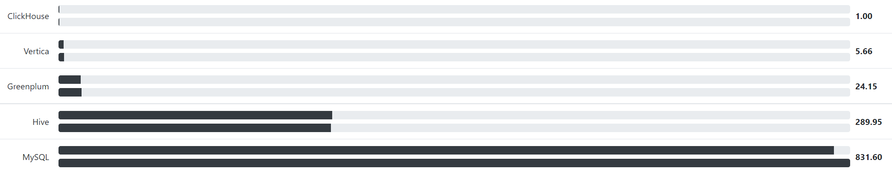

# ClickHouse 安装与启动

## ClickHouse 简介

ClickHouse 是一个开源的 **面向联机分析处理**（OLAP，On-Line Analytical Processing）的 **列式存储** 数据库管理系统（DBMS），由 Yandex 公司开发。它的查询效率非常高，其官网给出的与其他数据库的测试比较结果如下：



ClickHouse 的优势主要有：

- 写入快、查询快
- SQL 支持
- 简单方便，不依赖 Hadoop 技术栈
- 支持线性扩展
- 深度列存储
- 向量化查询执行
- 数据压缩
- 并行和分布式查询
- 实时数据更新
- 允许角色的访问控制
- 支持二级索引（又称跳数索引）

ClickHouse 的不足主要有：

- 没有完整的事务支持
- 不适合典型的 K/V 存储
- 不适合 Blob/Document 存储
- 不支持高频率低延迟的 Update/Delete 操作
- 非跨平台

## ClickHouse 安装

### 系统要求

ClickHouse 可以在任何具有 x86_64、AArch64 或 PowerPC64LE CPU 架构的 Linux、FreeBSD 或 Mac OS X 上运行，但是机器 CPU 必须支持 SSE 4.2 指令集。

可以通过如下命令检查当前 CPU 是否支持 SSE 4.2 指令集：

```bash
$ grep -q sse4_2 /proc/cpuinfo && echo "SSE 4.2 supported" || echo "SSE 4.2 not supported"

```

若支持，可以得到如下响应：

```bash
SSE 4.2 supported
```

### 安装方式

本文主要介绍基于 `RPM` 的安装方式，适用于 Centos、RedHat 等平台。

:::info

 除 `RPM` 外，官方还提供了 `DEB` 、`Tgz` 和 `Docker` 等安装方式。

:::

首先，需要添加官方库：

```bash
sudo yum install yum-utils
sudo rpm --import https://repo.clickhouse.tech/CLICKHOUSE-KEY.GPG
sudo yum-config-manager --add-repo https://repo.clickhouse.tech/rpm/stable/x86_64
```

然后，运行命令下载和安装：

```bash
sudo yum install clickhouse-server clickhouse-client

```

在这个过程中，会安装 3 个模块：

|模块|作用|
|---|---|
|clickhouse-client|ClickHouse客户端交互工具|
|clickhouse-server|ClickHouse服务端模块|
|clickhouse-common-static|包含 ClickHouse 的可执行文件|

安装后，ClickHouse 主要目录分布如下表所示：

|路径|说明|
|---|---|
|/etc/clickhouse-server|ClickHouse 服务端配置文件目录|
|/etc/clickhouse-client|ClickHouse 客户端配置文件目录|
|/var/lib/clickhouse|ClickHouse 默认数据目录|
|/var/log/clickhouse-server|ClickHouse 默认日志目录|
|/etc/init.d/clickhouse-server|ClickHouse 服务端启动脚本|

## Clickhouse 启动与验证

安装完成后，使用官方脚本启动服务：

```bash
sudo /etc/init.d/clickhouse-server start
```

若启动正常，默认端口 `9000` 会处于监听状态：

```纯文本
[root@master clickhouse]# netstat -anp | grep 9000
tcp        0      0 127.0.0.1:9000          0.0.0.0:*               LISTEN      35574/clickhouse-se 
tcp6       0      0 ::1:9000                :::*                    LISTEN      35574/clickhouse-se
```

:::caution

若服务启动失败，尝试用 `clickhouse-server --config-file=/etc/clickhouse-server/config.xml` 进行启动。该方式会输出日志到控制台，便于排查启动失败的原因。

:::

:::danger

若出现权限问题，尝试给各目录及其父目录赋予最高权限（即所有用户均可读写与执行）。

:::

现在，我们输入命令 `clickhouse-client` 进入客户端交互界面，正常情况下控制台会输出以下信息：

```纯文本
ClickHouse client version 21.9.2.17 (official build).
Connecting to localhost:9000 as user default.
Connected to ClickHouse server version 21.9.2 revision 54449.

master :)
```

验证 SQL 是否正常执行：

```sql
master :) select 1

SELECT 1

Query id: 9cc92d1b-e713-4972-93ab-f1557e752c5b

┌─1─┐
│ 1 │
└───┘

1 rows in set. Elapsed: 0.006 sec.
```


