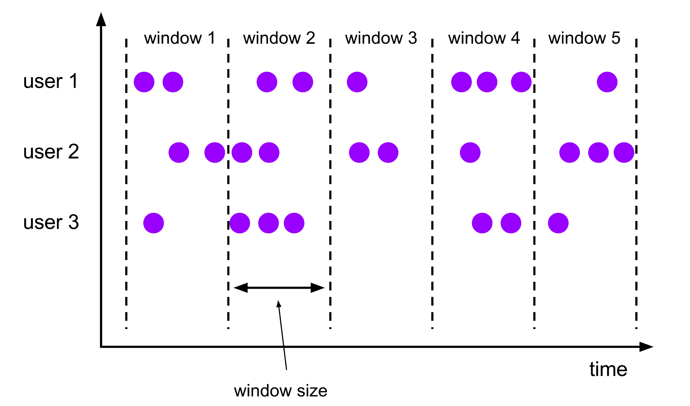
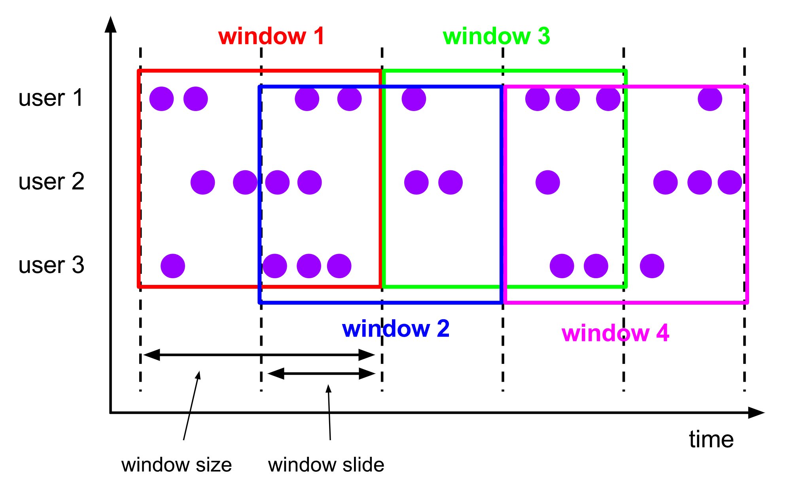
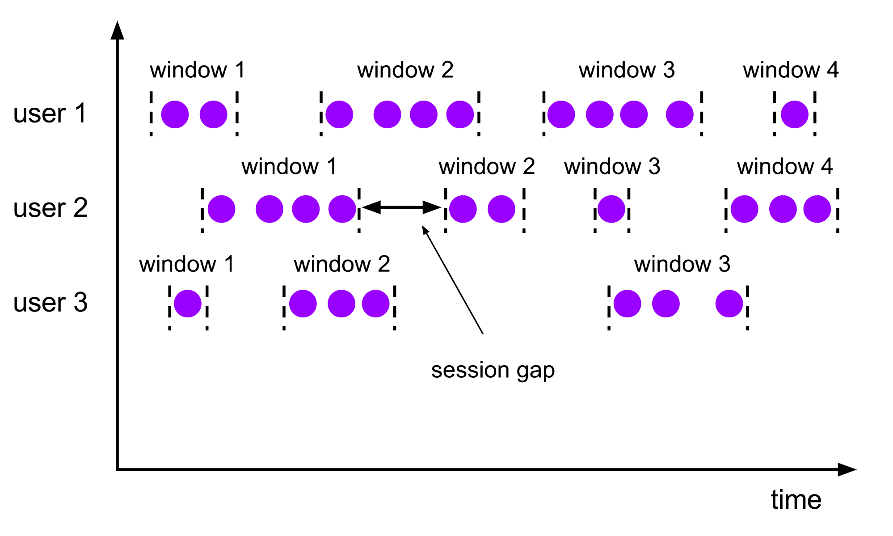

# Flink Window

Flink 是流处理计算框架，专为流式数据而生。

流式数据有一个特点，即无界性。在很多场景中，这种无界性会使很多计算指标失去了意义，如结果统计、大小排序等。**Window（窗口）的出现，正是为了解决无界性的问题**。它可以将无界数据按照某种规则划分成有界数据，并在之上完成业务计算。

本文将重点介绍 Flink 的 Window API，以帮助读者了解 Flink Window 的概念及使用方式。

:::info

在 Flink 1.13 版本中，常用的 Window 基本都是基于时间的 TimeWindow，因此下文提到的 Window 默认都指 TimeWindow。

:::

## Window Lifecycle

每个 Window 都有一个开始时间和结束时间。**它会在属于它的第一个元素流入时创建，在达到结束时间时销毁**。举个例子，假如我们定义了一个 **基于 processing time 的**、**创建大小为 10s 的 Tumbling Window** 的策略，那么每隔 10s 应用程序都会创建一个新的窗口，并在其达到结束时间后销毁。

:::caution

Window 的开始时间与应用程序的启动时间无关。假设含有上述 Window 策略的应用程序于 12:00:05 启动 **并流入了第一个元素**，那么第一个 Window 的开始时间为 12:00:00，结束时间为 12:00:10。

:::

:::danger

若上述 Window 为 Sliding Window，则 **第一个 Sliding Window** 的开始时间与 **触发时间（第一个元素流入的时间）**、**窗口大小** 和 **滑动时间** 相关，具体计算公式请见： SlidingProcessingTimeWindows 和 SlidingEventTimeWindows 中的 `assignWindows(...)` 方法。

:::

## Keyed vs Non-Keyed

在定义 Window 前，首先要确认数据流是 Keyed 还是 Non-Keyed，即数据流是否调用了 `keyBy()` 方法。

两者在定义 Window 时存在区别，前者依赖 `window(...)` 方法，后者依赖 `windowAll(...)` 方法。

当然，两者更重要的区别是，**Keyed Stream 支持多个窗口的并行计算（ **`**keyBy()**`** 可以根据 key 拆分数据流到不同的 Subtask），而 Non-Keyed Stream 只能支持并行度为 1 的单个窗口计算。**

:::caution

使用 `windowAll(...)` 时，无论上游算子并行度为多少，下游算子的并行度只会为 1。

:::

## Window Assigner

Window Assigner 决定了流入的数据被分配到哪个窗口。

Flink 根据常见的应用场景预设了几个 Window Assigner，分别有：Tumbling Window、Sliding Window、Session Window、Global Window。

:::info

当然，用户也可以通过继承 WindowAssigner 实现自定义的窗口装配器。

:::

在上述预设的 Window Assigner 中，除了 Global Window，其他几个都是基于基于元素时间（processing time 和 event time）来决定将元素置入哪个窗口。

下面，将对这些预设 Window Assigner 进行逐一介绍。

### Tumbling Window

Tumbling Window 中文名为滚动窗口，具有 **固定大小**、**不可重叠** 的特点。

假设我们定义了大小为 5s 的 Tumbling Window，那么应用程序会每隔 5s 都会销毁当前 Window 并创建一个新的 Window，新旧 Window 不会交叉重叠，如下图所示：



以下为 Tumbling Window 的代码示例：

```java
DataStream<T> input = ...;

// tumbling event-time windows
input
    .keyBy(<key selector>)
    .window(TumblingEventTimeWindows.of(Time.seconds(5)))
    .<windowed transformation>(<window function>);

// tumbling processing-time windows
input
    .keyBy(<key selector>)
    .window(TumblingProcessingTimeWindows.of(Time.seconds(5)))
    .<windowed transformation>(<window function>);

// daily tumbling event-time windows offset by -8 hours.
input
    .keyBy(<key selector>)
    .window(TumblingEventTimeWindows.of(Time.days(1), Time.hours(-8)))
    .<windowed transformation>(<window function>);
```

### Sliding Window

Sliding Window 中文名为滑动窗口，具有 **固定大小**、**允许重叠** 的特点。

与 Tumbling Window 不同的是，Sliding Window 除了要配置 window size，还要配置 window slide。这个参数用于设置 Window 的滑动时间（即下一个 Window 要多久后才能创建）。

假设我们定义了大小为 10s、滑动时间为 5s 的 Sliding Window，那么应用程序每隔 5s 都会创建一个大小为 10s 新的 Window。由于滑动时间小于 Window 的生命周期，新旧 Window 会出现交叉重叠的情况，如下图所示：



以下为 Sliding Window 的代码示例：

```java
DataStream<T> input = ...;

// sliding event-time windows
input
    .keyBy(<key selector>)
    .window(SlidingEventTimeWindows.of(Time.seconds(10), Time.seconds(5)))
    .<windowed transformation>(<window function>);

// sliding processing-time windows
input
    .keyBy(<key selector>)
    .window(SlidingProcessingTimeWindows.of(Time.seconds(10), Time.seconds(5)))
    .<windowed transformation>(<window function>);

// sliding processing-time windows offset by -8 hours
input
    .keyBy(<key selector>)
    .window(SlidingProcessingTimeWindows.of(Time.hours(12), Time.hours(1), Time.hours(-8)))
    .<windowed transformation>(<window function>);
```

### Session Window

Session Window 中文名为会话窗口。

会话窗口不会重叠，也不存在一个固定的起止时间。比较特殊的是，它的关闭取决于 session gap 的触发，即允许当前会话未接收到新数据的最大时间间隔，如下图所示：<br />



对于用户来说，session gap 有两种设置方式，分别为静态与动态：

```java
DataStream<T> input = ...;

// event-time session windows with static gap
input
    .keyBy(<key selector>)
    .window(EventTimeSessionWindows.withGap(Time.minutes(10)))
    .<windowed transformation>(<window function>);
    
// event-time session windows with dynamic gap
input
    .keyBy(<key selector>)
    .window(EventTimeSessionWindows.withDynamicGap((element) -> {
        // determine and return session gap
    }))
    .<windowed transformation>(<window function>);

// processing-time session windows with static gap
input
    .keyBy(<key selector>)
    .window(ProcessingTimeSessionWindows.withGap(Time.minutes(10)))
    .<windowed transformation>(<window function>);
    
// processing-time session windows with dynamic gap
input
    .keyBy(<key selector>)
    .window(ProcessingTimeSessionWindows.withDynamicGap((element) -> {
        // determine and return session gap
    }))
    .<windowed transformation>(<window function>);
```

静态与动态的区别在于：

- 前者有 EventTimeSessionWindows 和 ProcessingTimeSessionWindows，可直接指定 session gap 大小，以生成 TimeWindow
- 后者有 DynamicEventTimeSessionWindows 和 DynamicProcessingTimeSessionWindows，需要实现 SessionWindowTimeGapExtractor 接口从元素中提取 session gap，以生成 TimeWindow

:::caution

Session Window 底层创建的窗口实际上也是 TimeWindow，有固定的起止时间，但是，为了实现上述 session gap 的功能，Session Window 提供了一种窗口合并的方案，具体实现原理可参考：[http://wuchong.me/blog/2016/06/06/flink-internals-session-window](http://wuchong.me/blog/2016/06/06/flink-internals-session-window/)。

:::

## Window Function

Window Function 指定了窗口划分后的有界数据的计算逻辑。

它包含三种类型，分别为 ReduceFunction、AggregateFunction、ProcessWindowFunction。前两者支持增量计算（即来一个算一个），执行效率较高；后者会将窗口中的数据缓存起来，待满足条件时统一计算，相较而言执行效率较差、损耗资源较多，但胜在灵活性更强。<br />

下面，我们将通过示例详细介绍一下这些 Window Function。

### ReduceFunction

ReduceFunction 可以将输入流中 **前后两个元素** 进行 **合并运算** 后输出 **类型相同** 的新元素。

通常，用户可以通过 ReduceFunction 来对窗口中的元素做增量聚合：

```java
DataStream<Tuple2<String, Long>> input = ...;

input
    .keyBy(<key selector>)
    .window(<window assigner>)
    .reduce(new ReduceFunction<Tuple2<String, Long>>() {
        public Tuple2<String, Long> reduce(Tuple2<String, Long> v1, Tuple2<String, Long> v2) {
            return new Tuple2<>(v1.f0, v1.f1 + v2.f1);
        }
    });
```

### AggregateFunction

同 ReduceFunction，AggregateFunction 也支持对输入元素进行增量聚合，但是它比 ReduceFunction 更加通用和全面。它有三个参数，分别是：

- 输入类型（IN）：输入流中的元素类型
- 累加器类型（ACC）：可对输入的数据进行累加
- 输出类型（OUT）：输出流中的元素类型

AggregateFunction 接口中定义了以下 4 个方法：

|**方法名称**|**返回类型**|**方法说明**|
|---|---|---|
|createAccumulator()|ACC|创建初始累加器|
|add(IN var1, ACC var2)|ACC|累加输入元素到累加器|
|getResult(ACC var1)|OUT|从累加器提取输出元素|
|merge(ACC var1, ACC var2)|ACC|合并累加器|

我们可以如下定义和使用 AggregateFunction：

```java
public class AverageAggregateFunction
        implements AggregateFunction<Tuple2<String, Integer>, Tuple2<Long, Long>, Double> {

    @Override
    public Tuple2<Long, Long> createAccumulator() {
        return Tuple2.of(0L, 0L);
    }

    @Override
    public Tuple2<Long, Long> add(Tuple2<String, Integer> value, Tuple2<Long, Long> accumulator) {
        return Tuple2.of(accumulator.f0 + value.f1, accumulator.f1 + 1);
    }

    @Override
    public Double getResult(Tuple2<Long, Long> accumulator) {
        return ((double) accumulator.f0) / accumulator.f1;
    }

    @Override
    public Tuple2<Long, Long> merge(Tuple2<Long, Long> acc1, Tuple2<Long, Long> acc2) {
        return Tuple2.of(acc1.f0 + acc2.f0, acc1.f1 + acc2.f1);
    }
}

DataStreamSource<String> source = env.socketTextStream("192.168.117.128", 9999);

source.flatMap((String value, Collector<Tuple2<String, Integer>> collector) -> {
    String[] words = value.split(",");
    collector.collect(Tuple2.of(words[0], Integer.valueOf(words[1])));
}).returns(Types.TUPLE(Types.STRING, Types.INT))
    .keyBy(value -> value.f0)
    .window(TumblingProcessingTimeWindows.of(Time.seconds(20)))
    .aggregate(new AverageAggregateFunction())
    .print();
```

通过该 AggregateFunction，用户可以计算各 key 值在窗口范围内对应的平均数。

### ProcessWindowFunction

ProcessWindowFunction 包含了一个含有窗口所有元素的可迭代器，以及一个具有时间和状态信息访问权的上下文对象。它有 4 个参数，分别是：

- 输入类型（IN）：输入流中的元素类型
- 输出类型（OUT）：输出流中的元素类型
- 分区键类型（KEY）：用于分区的字段的元素类型
- 窗口类型（W）：通常为 TimeWindow

ProcessWindowFunction 的特性，使得它比其他窗口函数更加灵活，但这是以性能和资源消耗为代价的，因为在 ProcessWindowFunction 中元素不能增量聚合，而是需要在内部缓冲，直到窗口准备就绪为止。

以下是 ProcessWindowFunction 的使用示例：

```java
public class CountWindowFunction extends ProcessWindowFunction<Tuple2<String, Integer>, String, String, TimeWindow> {

    @Override
    public void process(String key, Context context, Iterable<Tuple2<String, Integer>> iterable,
                        Collector<String> collector) {

        System.out.println("------- process invoked -------");
        
        long count = 0;
        for (Tuple2<String, Integer> element : iterable) {
            count++;
        }

        collector.collect("Window: " + context.window() + "count: " + count);
    }
}

DataStream<Tuple2<String, Long>> input = ...;

input
    .keyBy(<key selector>)
    .window(<window assigner>)
    .process(new CountWindowFunction());
```

### ProcessWindowFunction with Incremental Aggregation

ProcessWindowFunction 也可以和 ReduceFunction 或者 AggregateFunction 结合使用。通过这种方式，用户既可以在窗口期内实现增量计算，又可以在窗口结束时触发 ProcessWindowFunction，进而获取元数据信息。<br />

以下是 ProcessWindowFunction 与 AggregateFunction 结合使用的示例：

```java
DataStream<Tuple2<String, Long>> input = ...;

input
    .keyBy(<key selector>)
    .window(<window assigner>)
    .aggregate(new AverageAggregate(), new MyProcessWindowFunction());
```

:::caution

AggregateFunction 的输出类型要与 ProcessWindowFunction 的输入类型一致。

:::

## Trigger

Trigger，中文名为触发器，决定了何时启动 Window Function 来处理窗口中的数据以及何时将窗口内的数据清理。

每一个 Window Assigner 都会有一个默认的触发器。若默认触发器无法满足业务需求，用户也可以通过实现 Trigger 抽象类满足个性化需求。

Trigger 抽象类主要声明了以下 5 个方法：

- onElement：每一个元素进入窗口时都会触发
- onProcessingTime：基于 processing time 的计时器（Timer）到期时触发
- onEventTime：基于 event time 的计时器（Timer）到期时触发
- onMerge：当两个 Window 合并时同时合并其相应的 Trigger
- clear：执行窗口及状态数据的清除方法

:::info

`onProcessingTime(...)` 和 `onEventTime(...)` 本质上是由 ScheduledThreadPoolExecutor 的定时调度实现的，其实现原理可参考：[https://cloud.tencent.com/developer/article/1677299](https://cloud.tencent.com/developer/article/1677299)。

:::

在上述的 `onElement`、`onProcessingTime`、`onEventTime` 方法中，会返回一个 TriggerResult，窗口会根据 TriggerResult 的值决定下一步行为。关于 TriggerResult 和窗口行为的映射关系可参考下表：

|**TriggerResult**|**窗口行为**|
|---|---|
|CONTINUE|不进行操作|
|FIRE|触发计算|
|PURGE|清除窗口内的数据|
|FIRE_AND_PURGE|触发计算并在完成后清除窗口内的数据|

## Evictor

Evictor，中文名为驱逐者，可以在 **Trigger 触发后**、**窗口函数使用之前或之后** 清除窗口内的数据。

默认情况下，Window 的操作类为 WindowOperator，它没有使用到 Evictor。若用户需要使用 Evictor，需要显示调用 `evictor(...)` 方法，此时，Window 的操作类会变为 EvictingWindowOperator，并由其完成 Evictor 的调用。

Evictor 的使用示例如下：

```java
DataStream<T> input = ...;

input
    .keyBy(<key selector>)
    .window(<window assigner>)
    .evictor(CountEvictor.of(2L))
```

在 Flink 中，已经预设了 3 种驱逐器：

|**驱逐器类型**|**驱逐器说明**|
|---|---|
|CountEvictor|在窗口中维护指定数量的元素，若当前 **窗口元素数量** 多于 **用户指定的数量**，从窗口缓冲区的 **头部** 丢弃多余的元素|
|TimeEvictor|对于给定的窗口，找到元素中最大的时间戳 max_ts，并删除时间戳小于 max_ts - interval 的所有元素，其中，interval 为以毫秒为单位的 TimeEvictor 的参数|
|DeltaEvictor|使用 DeltaFunction 计算窗口缓冲区中 **最后一个元素** 与 **其他元素** 之间的差值，并删除差值大于或等于 **用户指定阈值** 的元素|

:::caution

使用驱逐器将无法实现增量聚合，所有元素需要统一由驱逐器处理才交给窗口函数。

:::
