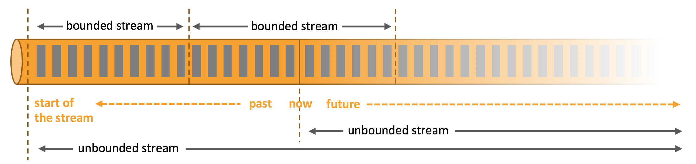
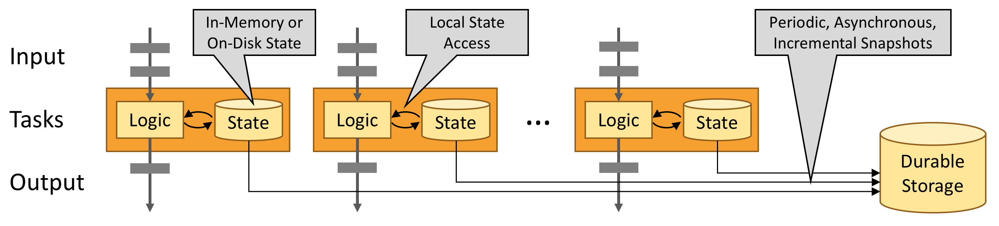
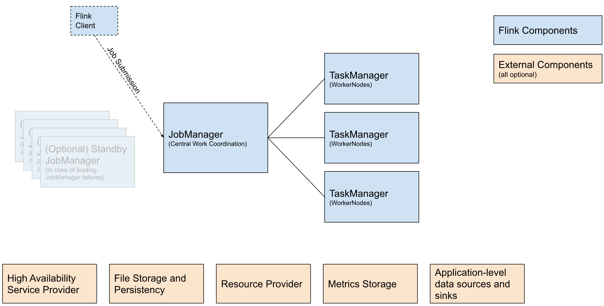
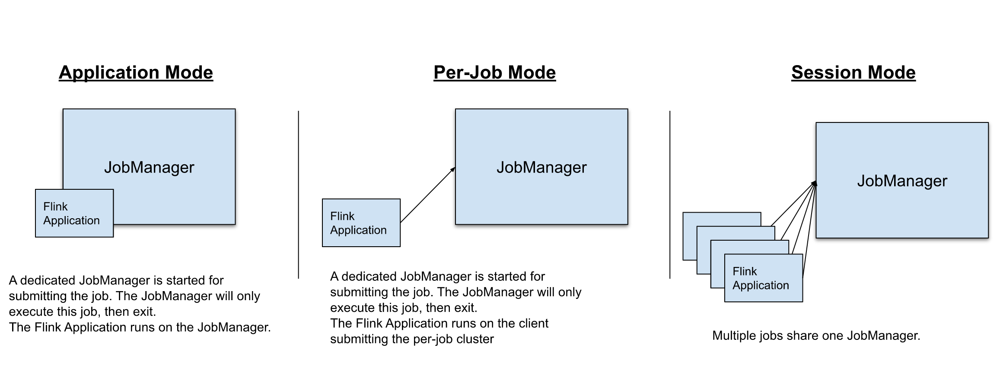
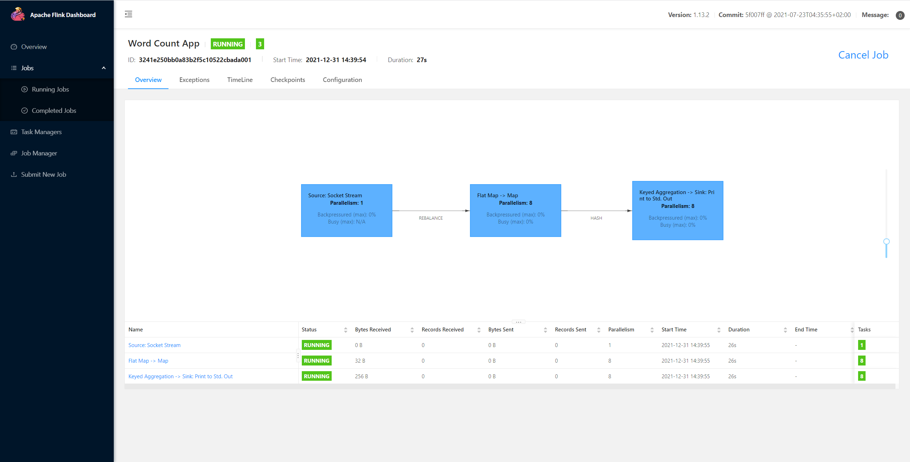

# Flink 快速入门

## What is Flink

Apache Flink 是一个分布式计算框架，它能够对有界和无界的数据流进行高效的处理。

- 有界数据：即批数据（离线数据），具有已定义的起止位置，属于静态数据集
- 无界数据：即流式数据（实时数据），无已定义的结束位置，属于动态数据集



## Flink Feature

在官方的介绍中，Flink 具有以下优势：

- Deploy Applications Anywhere：Flink 集成了所有常见的集群资源管理器，例如 [Hadoop YARN](https://hadoop.apache.org/docs/stable/hadoop-yarn/hadoop-yarn-site/YARN.html)、[Apache Mesos](https://mesos.apache.org/) 和 [Kubernetes，](https://kubernetes.io/)也可以作为独立集群运行
- Run Applications at any Scale：Flink 的设计目标就是为了支撑任意规模、有状态流应用程序的运行，应用程序被并行化为分布式集群中的数千个任务，因此，可以利用几乎无限量的 CPU、主内存、磁盘和网络 IO
- Leverage In-Memory Performance：在 Flink 中，任务状态始终保存在内存中，因此，任务通过访问本地的状态（通常在内存中）来执行所有计算，从而产生非常低的处理延迟



综合所有方面来看，Flink 具有以下特点：

- 支持 Scala 和 Java API
- 支持批流一体
- 同时支持高吞吐、低延迟、高性能
- 支持事件时间和处理时间语义，基于事件时间语义能够针对无序事件提供精确、一致的结果；基于处理时间语义能够用在具有极低延迟需求的应用中
- 支持不同时间语义下的窗口编程
- 支持有状态计算
- 支持具有 Backpressure 功能的持续流模型
- 提供精确一次（exactly once）的状态一致性保障
- Flink 在 JVM 内部实现了自己的内存管理
- 基于轻量级的分布式快照 Checkpoint 的容错
- 支持 Savepoint 机制，手工触发，适用于升级
- 支持高可用性配置（无单点失效），与 k8s、Yarn、Apache Mesos 紧密集成
- 提供常见存储系统的连接器：Kafka，Elasticsearch 等
- 提供详细、可自由定制的系统及应用指标（metrics）集合，用于提前定位和响应问题

## Compare with Other Frame

|**指标/框架**|**Flink**|**Spark**|**Storm**|**Storm-Trident**|
|---|---|---|---|---|
|处理模型|Native|Micro-Batch|Native|Micro-Batch|
|处理语义|Exactly-Once|Exactly-Once|At-Least-Once|Exactly-Once|
|容错|Checkpoint|Checkpoint|Ack|Ack|
|吞吐量|High|High|Low|Medium|
|延迟|Low|High|High|Very Low|

## Flink Architecture

Flink 的架构与大数据中常见的分布式架构（如 HDFS、HBase、Spark 等）相似，都遵循主从模式。

下图为官方提供的 Flink 架构图：



图中蓝色部分为 Flink 核心组件：

|**组件名**|**组件职责**|**实现**|
|---|---|---|
|Flink Client|Flink 客户端，可以将作业提交给 JobManager|Command Line Interface、REST Endpoint、SQL Client、Python REPL、Scala REPL|
|JobManager|Flink 的中心协调组件|Standalone、Kubernetes、YARN、Mesos|
|TaskManager|执行 Flink 作业的进程| |

橙色部分为外部支撑组件：

|**组件名**|**组件职责**|**实现**|
|---|---|---|
|High Availability Service Provider|高可用性服务提供商|Zookeeper、Kubernetes HA|
|File Storage and Persistency|外部文件系统|HDFS、Alluxio、阿里云 OSS|
|Resource Provider|资源提供者|Yarn、Mesos、Kubernetes|
|Metrics Storage|Flink 指标模块|JMX、InfluxDB、Prometheus|

## Flink Concept

|**概念**|**说明**|
|---|---|
|Task|一个阶段多个功能相同 subTask 的集合，类似于 Spark 中的 TaskSet|
|SubTask|Flink 中任务最小执行单元，是一个 Java 类的实例，这个 Java 类中有属性和方法，完成具体的计算逻辑|
|Slot|Flink 中计算资源进行隔离的单元，一个 Slot 中可以运行多个 subTask，但是这些 subTask 必须是来自同一个 Application 的不同阶段的 subTask|
|State|Flink 在运行过程中计算的中间结果|
|Source|Flink 作业的数据源，可以是本地文件、Socket、Kafka 等|
|Transformation|负责数据处理的算子，包括 map、filter、reduce 等|
|Sink|Flink 作业的数据存放点，可以是 MySQL、Kafka 等|

## Flink Deployment Mode

在 Flink 中，可以通过以下 3 种方式执行应用程序：

- Session Mode
- Per-Job Mode
- Application Mode



### Session Mode

Session Mode 是预分配资源的，也就是提前根据指定的资源参数初始化一个 Flink 集群，拥有固定数量的 JobManager 和 TaskManager。（JobManager 只有一个）

这样做的好处是，提交的作业可以直接执行，无需花费额外的开销去启动集群。相应地，Session Mode 的弊端也很明显。如果 TaskManager 因某个作业崩溃了，那么该 TaskManager 上运行的所有作业都会受到故障的影响。除了对相关作业产生负面影响外，这还意味着潜在的大规模恢复过程。此外，只有一个集群也意味着 JobManager 的负载大大增加，这是具有一定风险的。

### Per-Job Mode

Per-Job Mode 可以基于资源协调框架（如 YARN、k8s）为每个提交的作业启动专属的 Flink 集群。这提供了更好的资源隔离保证，当作业完成后，集群将被关闭，所有附属的资源也会被清除。

这样的好处是，一个作业的 TaskManager 失败不会影响其他作业的运行，且 JobManager 的负载是分散开来的，不存在单点问题。当然，缺点也很明显，为每个作业启动一个集群会消耗更多的集群资源，同时也会导致一定程度的延时。

### Application Mode

在 Per-Job Mode 和 Session Mode 下，应用程序的 `main` 方法都是在客户端执行的，此过程包括：

- 在本地下载应用程序依赖项
- 提取 Flink 运行时可以理解的应用程序表示形式（即 JobGraph）
- 将依赖项和 JobGraph 传输到 Flink 集群

这导致客户端需要消耗非常多的资源，因为它可能需要大量的网络带宽来下载依赖项并将二进制文件传输到集群，并且需要 CPU 资源来执行 `main` 方法。当有多用户共享客户端时，这个问题将更加明显。

为解决 Per-Job Mode 和 Session Mode 存在的这个缺陷，Application Mode 在 Per-Job Mode 的基础上，将应用程序的 `main` 方法转移到 JobManager 上执行。通过这种体系结构，Application Mode 提供了与 Per-Job Mode 相同的资源隔离和负载平衡保证，同时也解决了客户端负载过多的问题。

与 Per-Job Mode 相比，Application Mode 允许提交包含多个作业的应用程序。作业的执行顺序不受部署模式影响，但受启动作业调用位置的影响。使用 `execute` 会导致“下一个”作业的执行被推迟到“该”作业完成为止，使用非阻塞的 `executeAsync()` 可以使“下一个”作业在“此”作业完成之前就开始。

综合上述内容，Flink 几种部署模式的异同点可以归纳为下表：

|**部署模式**|**集群启动数**|**资源隔离**|**客户端压力**|**延时性**|
|---|---|---|---|---|
|Session Mode|1|❌|高|低|
|Per-Job Mode|N|✅|高|高|
|Application Mode|N|✅|低|高|

## First Flink App

词频统计（word count）是大数据中常见的入门计算。

我们的第一个 Flink 程序，也使用词频统计作为示例，首先引入依赖包：

```xml
<dependency>
    <groupId>org.apache.flink</groupId>
    <artifactId>flink-streaming-java_${scala.binary.version}</artifactId>
    <version>${flink.version}</version>
    <scope>provided</scope>
</dependency>
<dependency>
    <groupId>org.apache.flink</groupId>
    <artifactId>flink-clients_${scala.binary.version}</artifactId>
    <version>${flink.version}</version>
    <scope>provided</scope>
</dependency>
<dependency>
    <groupId>org.apache.flink</groupId>
    <artifactId>flink-runtime-web_${scala.binary.version}</artifactId>
    <version>${flink.version}</version>
    <scope>provided</scope>
</dependency>
```

:::info

其中，`scala.binary.version` 为 `2.11`，`flink.version` 为 `1.13.2`。

:::

然后编写如下代码：

```java
package com.panda.flink.datastream;

import org.apache.flink.api.common.functions.FlatMapFunction;
import org.apache.flink.api.common.functions.MapFunction;
import org.apache.flink.api.java.functions.KeySelector;
import org.apache.flink.api.java.tuple.Tuple2;
import org.apache.flink.streaming.api.datastream.DataStreamSource;
import org.apache.flink.streaming.api.environment.StreamExecutionEnvironment;
import org.apache.flink.util.Collector;

/**
 * 基于 flink 的词频统计 demo
 *
 * @author panda
 * @date 2021/7/12
 */
public class WordCountApp {

    public static void main(String[] args) throws Exception {
        
        // 使用本地模式并开启 WebUI
        Configuration conf = new Configuration();
        conf.setString(RestOptions.BIND_PORT, "8081-8089");
        StreamExecutionEnvironment env = StreamExecutionEnvironment.createLocalEnvironmentWithWebUI(conf);

        // 定义数据源：source
        DataStreamSource<String> source = env.socketTextStream("192.168.117.128", 9999);

        // 业务处理：transformation
        source.flatMap(new FlatMapFunction<String, String>() {
            @Override
            public void flatMap(String value, Collector<String> collector) throws Exception {
                String[] words = value.split(",");
                for (String word : words) {
                    collector.collect(word.trim());
                }
            }
        }).map(new MapFunction<String, Tuple2<String, Integer>>() {
            @Override
            public Tuple2<String, Integer> map(String value) throws Exception {
                return new Tuple2<>(value, 1);
            }
        }).keyBy(new KeySelector<Tuple2<String, Integer>, String>() {
            @Override
            public String getKey(Tuple2<String, Integer> value) throws Exception {
                return value.f0;
            }
        }).sum(1).print();
        
        // 执行
        env.execute("Word Count App");

    }
}
```

:::danger

Tuple2 所属包是 `org.apache.flink.api.java.tuple.Tuple2` 而不是 `scala`，切记，否则程序会报错。

:::

可以发现，Flink 的编程模型其实很简单，主要由以下三部分组成：

- 定义数据源（source）
- 编写业务处理逻辑（transformation）
- 输出结果集（sink）

最后，执行 demo 中的 `main` 方法，在 `9999` 端口输入 `spark,flink,flink,panda`，即可在控制台见到如下输出：

```纯文本
1> (spark,1)
7> (flink,1)
7> (flink,2)
3> (panda,1)
```

由于我们开启了 Web UI 功能，可以直接在本地通过 Flink 的可视化界面（[http://localhost:8081](http://localhost:8081)）查看对应作业的详细执行信息，如下图所示：




