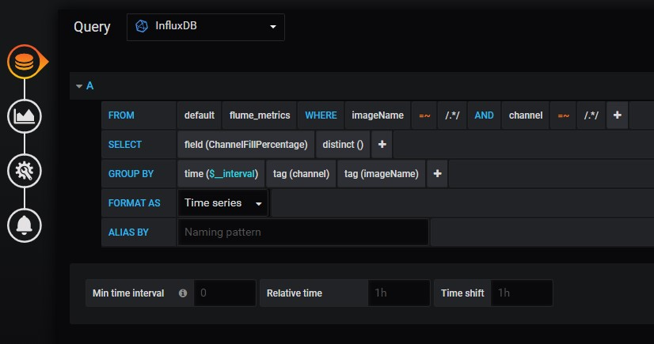
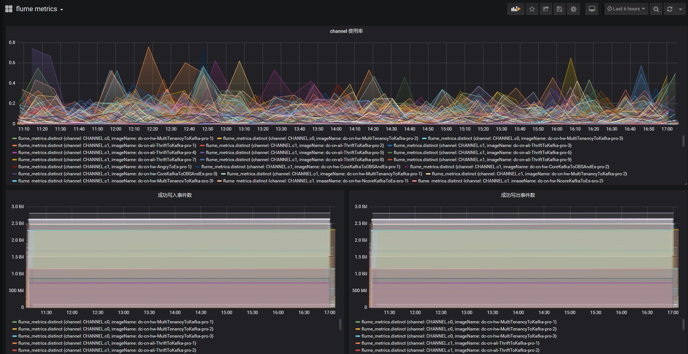

# Flume 自定义监控

## 官方组件

Flume 自带运行指标监控线程。它可以实时或定时上报各组件（Source、Channel、Sink）的运行指标数据，以帮助维护人员了解 Flume 运行情况。

当前，官方提供的监控指标上报组件有：JSON Reporting 和 Ganglia Reporting。

### JSON Reporting

JSON Reporting 会提供一个 web 接口，以 JSON 的格式将 Flume 运行指标返回给用户，其指标示例如下所示：

```json
{
  "CHANNEL.fileChannel": {
    "EventPutSuccessCount": "468085",
    "Type": "CHANNEL",
    "StopTime": "0",
    "EventPutAttemptCount": "468086",
    "ChannelSize": "233428",
    "StartTime": "1344882233070",
    "EventTakeSuccessCount": "458200",
    "ChannelCapacity": "600000",
    "EventTakeAttemptCount": "458288"
  },
  "CHANNEL.memChannel": {
    "EventPutSuccessCount": "22948908",
    "Type": "CHANNEL",
    "StopTime": "0",
    "EventPutAttemptCount": "22948908",
    "ChannelSize": "5",
    "StartTime": "1344882209413",
    "EventTakeSuccessCount": "22948900",
    "ChannelCapacity": "100",
    "EventTakeAttemptCount": "22948908"
  }
}
```

使用 JSON Reporting，需要在启动 Flume 时指定 **监控类型** 与 **Web 监听端口**，如：

```bash
bin/flume-ng agent --conf-file example.conf --name a1\
  -Dflume.monitoring.type=http\
  -Dflume.monitoring.port=34545
```

:::info

在 Flume 集群规模较小时，使用 JSON Reporting 是不错的选择。但是当集群规模变大，Flume 主机地址与监控端口会相应变多，届时过多的监控请求地址会导致维护成本急剧升高。

:::

### Ganglia Reporting

Ganglia Reporting 会定时上报 Flume 运行指标到 Ganglia 服务端。上报后，用户便可以在 Ganglia 查看 Flume 运行指标的可视化图表。

要使用 Ganglia Reporting，需要在启动 Flume 时指定 **监控类型** 与 **Ganglia 服务端地址**，如：

```bash
bin/flume-ng agent --conf-file example.conf --name a1\
  -Dflume.monitoring.type=ganglia\
  -Dflume.monitoring.hosts=com.example:1234,com.example2:5455

```

:::info

Ganglia Reporting 可以避免 JSON Reporting 的问题，使用户无需关注大量的 Web 监听地址，但是其在可视化界面上的表现只能用差强人意来形容。

:::

## 自定义监控

为补齐 Flume 在监控上的不足，我们提出 InfluxDB Reporting + Grafana 的指标监控方案：



该方案会先将 Flume 运行指标上报至时序数据库 InfluxDB，然后由 Grafana 进行查询与可视化展示。 

:::info

InfluxDB Reporting 也可以由 Prometheus Reporting 替代。

:::

### InfluxDB Reporting

为了实现上报指标数据到 InfluxDB，我们需要自己实现 InfluxDB Reporting。

第一步，添加 InfluxDB 客户端依赖：

```xml
<dependency>
    <groupId>org.influxdb</groupId>
    <artifactId>influxdb-java</artifactId>
    <version>2.15</version>
</dependency>
```

第二步，实现 MonitorService 接口：

```java
package org.apache.flume.instrumentation;

import com.google.common.collect.Maps;
import java.net.InetAddress;
import java.net.UnknownHostException;
import java.util.Map;
import java.util.concurrent.Executors;
import java.util.concurrent.ScheduledExecutorService;
import java.util.concurrent.TimeUnit;
import org.apache.commons.lang.StringUtils;
import org.apache.flume.Context;
import org.apache.flume.conf.ConfigurationException;
import org.apache.flume.instrumentation.util.JMXPollUtil;
import org.influxdb.InfluxDB;
import org.influxdb.InfluxDBFactory;
import org.influxdb.dto.BatchPoints;
import org.influxdb.dto.Point;
import org.influxdb.dto.Pong;
import org.influxdb.dto.Query;
import org.slf4j.Logger;
import org.slf4j.LoggerFactory;

/**
 * InfluxDB 监控服务
 *
 * @author panda
 * @date 2021/2/4
 */
public class InfluxServer implements MonitorService {

    private static final Logger LOGGER = LoggerFactory.getLogger(InfluxServer.class);

    private static final String APP_NAME = "APP_NAME";

    private static final String POLL_FREQUENCY_CONFIG = "pollFrequency";

    private static final String HOST_CONFIG = "hosts";

    private static final String DATABASE_CONFIG = "database";

    private static final String MEASURE_CONFIG = "measure";

    private ScheduledExecutorService service = Executors.newSingleThreadScheduledExecutor();

    private int pollFrequency;

    private String url;

    private String database;

    private String measure;

    private InfluxDB db;

    private String hostname;

    public InfluxServer() {
        try {
            // 先读取环境变量，若环境变量为空，再读取主机名
            String appName = System.getenv(APP_NAME);
            if (StringUtils.isNotEmpty(appName)) {
                this.hostname = appName;
            } else {
                this.hostname = InetAddress.getLocalHost().getCanonicalHostName();
                // 删除 k8s pod 名称后缀，如 hk-thrift-a1-988dd6f67-cm8v2 转换为 hk-thrift-a1
                this.hostname = this.hostname.replaceFirst("-\\w{9,10}-\\w{5}", "");
            }
        } catch (UnknownHostException e) {
            LOGGER.error("unknown host: ", e);
            this.hostname = "UnknownHost";
        }
    }

    @Override
    public void start() {
        try {
            this.db = InfluxDBFactory.connect(url);
        } catch (Exception e) {
            LOGGER.error("Unexpected error: ", e);
        }

        if (service.isShutdown() || service.isTerminated()) {
            service = Executors.newSingleThreadScheduledExecutor();
        }
        CollectorRunnable collectorRunnable = new CollectorRunnable(this);
        service.scheduleAtFixedRate(collectorRunnable, 0, pollFrequency, TimeUnit.SECONDS);
    }

    @Override
    public void stop() {
        service.shutdown();

        while (!service.isTerminated()) {
            try {
                LOGGER.warn("Waiting for influxDB service to stop");
                service.awaitTermination(500, TimeUnit.MILLISECONDS);
            } catch (InterruptedException ex) {
                LOGGER.warn("Interrupted while waiting"
                        + " for influxDB monitor to shutdown", ex);
                service.shutdownNow();
                Thread.currentThread().interrupt();
            }
        }

        // 节点下线后自动删除信息
        deletePoint();

        if (db != null) {
            db.close();
        }
    }

    private void deletePoint() {
        LOGGER.info("delete point: {}", hostname);
        try {
            String deleteSql = "delete from " + measure + " where imageName = '" + hostname + "'";
            Query query = new Query(deleteSql, database);
            db.query(query);
        } catch (Exception e) {
            LOGGER.error("delete point error: ", e);
        }
    }

    @Override
    public void configure(Context context) {
        this.pollFrequency = context.getInteger(POLL_FREQUENCY_CONFIG, 300);
        String host = context.getString(HOST_CONFIG);
        if (StringUtils.isEmpty(host)) {
            throw new ConfigurationException("Host cannot be empty.");
        }
        this.url = this.getUrlFromString(host);
        this.database = context.getString(DATABASE_CONFIG, "big_data_monitor");
        this.measure = context.getString(MEASURE_CONFIG, "flume_metrics");
    }

    private String getUrlFromString(String host) {
        String[] hostAndPort = host.split(":");
        if (hostAndPort.length < 2) {
            throw new ConfigurationException("Invalid host: " + host);
        }
        return "http://" + host;
    }

    public void checkConnection() {
        boolean isConnected = false;
        try {
            Pong pong = db.ping();
            if (pong != null && pong.isGood()) {
                isConnected = true;
            }
        } catch (Exception e) {
            LOGGER.error("ping influxDB error: ", e);
        }
        if (!isConnected) {
            this.db = InfluxDBFactory.connect(url);
        }
    }

    static class CollectorRunnable implements Runnable {

        private static final String CHANNEL_PREFIX = "CHANNEL";

        private static final String CHANNEL_FILL_PERCENTAGE = "ChannelFillPercentage";

        private static final String EVENT_PUT_SUCCESS_COUNT = "EventPutSuccessCount";

        private static final String EVENT_TAKE_SUCCESS_COUNT = "EventTakeSuccessCount";

        private final InfluxServer server;

        public CollectorRunnable(InfluxServer server) {
            this.server = server;
        }

        @Override
        public void run() {
            try {
                Map<String, Map<String, String>> metricsMap = JMXPollUtil.getAllMBeans();
                // 上报指标前检查连接
                server.checkConnection();
                BatchPoints batchPoints = BatchPoints
                        .database(server.database)
                        .build();

                for (Map.Entry<String, Map<String, String>> entry : metricsMap.entrySet()) {
                    String component = entry.getKey();
                    Map<String, String> attributeMap = entry.getValue();
                    // 仅监控 channel 的指标
                    if (!component.toUpperCase().startsWith(CHANNEL_PREFIX)) {
                        continue;
                    }
                    Point point = createPoint(component, attributeMap);
                    batchPoints.point(point);
                }

                server.db.write(batchPoints);
            } catch (Exception e) {
                LOGGER.error("Unexpected error: ", e);
            }
        }

        private Point createPoint(String component, Map<String, String> attributeMap) {
            Map<String, String> tags = Maps.newHashMap();
            tags.put("channel", component);
            tags.put("imageName", server.hostname);
            Map<String, Object> fields = Maps.newHashMap();
            fields.put(CHANNEL_FILL_PERCENTAGE, Double.valueOf(attributeMap.get(CHANNEL_FILL_PERCENTAGE)));
            fields.put(EVENT_PUT_SUCCESS_COUNT, attributeMap.get(EVENT_PUT_SUCCESS_COUNT));
            fields.put(EVENT_TAKE_SUCCESS_COUNT, attributeMap.get(EVENT_TAKE_SUCCESS_COUNT));
            LOGGER.info("tags: {}", tags);
            LOGGER.info("fields: {}", fields);
            return Point.measurement(server.measure)
                    .tag(tags)
                    .fields(fields)
                    .time(System.currentTimeMillis(), TimeUnit.MILLISECONDS)
                    .build();
        }
    }

}
```

:::info

本例中，仅上报 `ChannelFillPercentage`、`EventPutSuccessCount`、`EventTakeSuccessCount` 这 3 个指标。

:::

第三步，在 Flume 的监控枚举类新增类型：

```java
package org.apache.flume.instrumentation;

/**
 * Enum for Monitoring types.
 */
public enum MonitoringType {
    OTHER(null),
    GANGLIA(org.apache.flume.instrumentation.GangliaServer.class),
    GRAFANA(org.apache.flume.instrumentation.InfluxServer.class),
    HTTP(org.apache.flume.instrumentation.http.HTTPMetricsServer.class);

    private Class<? extends MonitorService> monitoringClass;

    private MonitoringType(Class<? extends MonitorService> klass) {
      this.monitoringClass = klass;
    }

    public Class<? extends MonitorService> getMonitorClass() {
      return this.monitoringClass;
    }
}
```

第四步，重新编译打包 `flume-ng-core` 模块，并替换 Flume 目录下的对应 Jar 包。

最后一步，在 Flume 启动时指定监控类型为 InfluxDB Reporting：

```bash
bin/flume-ng agent --conf-file example.conf --name a1\
  -Dflume.monitoring.type=grafana\
  -Dflume.monitoring.hosts=com.example:8086
```

### Grafana

指标上报到 InfluxDB 后，我们便可以使用 Grafana 搭建监控仪表盘，如下图所示：



:::info

表达式 `=~ /.*/` 表示匹配所有。 

:::

仪表盘搭建完毕后，即可查看 Flume 集群的运行指标情况：




