# Flume 负载均衡选择器

## 选择器简述

选择器 Selector 决定了来自 Source 的数据要发往下游的哪个 Channel，如下图所示：



官方已经提供了两款 Selector：replicating 和 multiplexing。

### Replicating

Replicating Channel Selector 为复制流选择器，是 Flume 的默认选择器。

复制流选择器会将来自 Source 的数据发往下游所有 Channel，如图所示：



### Multiplexing

Multiplexing Channel Selector 为多路复用选择器。

它可以通过数据中的 **header** 值，将来自 Source 的混杂数据分别发往不同的 Channel，如图所示：



## 需求背景

在面对混杂数据流时，Multiplexing Channel Selector 可以起到其分发的作用，但这里存在一个 **数据倾斜** 的风险。

假设当前有 3 个埋点日志：reg（注册）、login（登录）、tran（订单），它们的日均数据量分别为：`10000`、`1000000`、`5000`。当它们通过 Multiplexing Channel Selector 发往不同的 Channel 时，由于数据量上的巨大差异，会导致 login 对应的 Channel 处于较高的占用，而 reg 和 tran 所对应的 Channel 基本上属于空闲状态，这就造成了 **数据倾斜** 现象，会使我们的 Channel 负载不均。

为解决这个问题，我们需要能实现 **负载均衡** 的选择器。

但官方并未提供这个选项，我们只能自己实现。

## 设计思路

Flume 允许自定义选择器，只要实现接口 ChannelSelector 即可。

在 ChannelSelector 接口中，重点要实现的方法是：

```java
List<Channel> getRequiredChannels(Event var1);
```


该方法会根据输入的 Event，返回相应的 Channel 集合。

那么，我们的思路可以是这样的：

- 根据 Channel 数量定义一个随机数范围，对于每个输入的 Event，给予该范围内任意随机整数
- 以获取到的随机整数作为下标，从 Channel 集合中获取相应的 Channel

其实现后的流程图如下所示：



但是，该方案还存在不足。假设我们想将 Channel 分成不同组，使不同 Channel 组的数据可以发往不同的 Sink，那该怎么办？上述设计方案仅支持 **在所有 Channel 中实现负载均衡**。

我们可以进一步设计：

- 将 Channel 进行分组，交由 Map 管理，其中 Key 为分组名称，Value 为所对应分组的 Channel 列表
- 轮询各分组的 Channel 列表，重复上述随机数获取过程

其实现后的流程图如下所示：



## 负载均衡选择器的实现

在设计思路部分，我们已经描述了大概设计流程，现在便用代码进行实现：

```java
package com.panda.flume.selector;

import com.google.common.base.Preconditions;
import com.google.common.collect.Lists;
import com.google.common.collect.Maps;
import java.util.List;
import java.util.Map;
import java.util.concurrent.ThreadLocalRandom;
import org.apache.commons.collections.CollectionUtils;
import org.apache.flume.Channel;
import org.apache.flume.Context;
import org.apache.flume.Event;
import org.apache.flume.FlumeException;
import org.apache.flume.channel.AbstractChannelSelector;
import org.slf4j.Logger;
import org.slf4j.LoggerFactory;

/**
 * 基于随机数的 channel 选择器
 *
 * @author panda
 * @date 2021/5/8
 */
public class RandomChannelSelector extends AbstractChannelSelector {

    private static final Logger LOGGER = LoggerFactory.getLogger(RandomChannelSelector.class);

    private static final String GROUP_CONFIG_PREFIX = "group.";

    private static final String DEFAULT_GROUP_ID = "default";

    private final ThreadLocalRandom random = ThreadLocalRandom.current();

    /**
     * 以组别划分 channel，key 为组 ID，value 为组别下的 channel 列表
     */
    private final Map<String, List<Channel>> channelMap = Maps.newHashMap();

    @Override
    public List<Channel> getRequiredChannels(Event event) {
        List<Channel> requiredChannels = Lists.newArrayList();
        for (Map.Entry<String, List<Channel>> entry : channelMap.entrySet()) {
            List<Channel> groupChannelList = entry.getValue();
            // 随机选取组别中的 channel
            Channel channel = groupChannelList.get(random.nextInt(groupChannelList.size()));
            requiredChannels.add(channel);
        }
        return requiredChannels;
    }

    @Override
    public List<Channel> getOptionalChannels(Event event) {
        return Lists.newArrayList();
    }

    @Override
    public void configure(Context context) {
        // 获取 group 键值对，例如配置 group.1 = c1 c2，则生成键值对 ["1", "c1 c2"]
        Map<String, String> groupConfig = context.getSubProperties(GROUP_CONFIG_PREFIX);

        // 若未设置分组，全部 channel 默认为一个分组
        if (groupConfig == null || groupConfig.isEmpty()) {
            List<Channel> allChannels = getAllChannels();
            Preconditions.checkState(CollectionUtils.isNotEmpty(allChannels), "all channels list is empty");
            channelMap.put(DEFAULT_GROUP_ID, allChannels);
            return;
        }

        Map<String, Channel> channelNameMap = getChannelNameMap();

        for (Map.Entry<String, String> entry : groupConfig.entrySet()) {
            String groupId = entry.getKey();
            String channels = entry.getValue();
            // 通过 channel 名称获取 channel 对象集合
            List<Channel> configuredChannels = getChannelListFromNames(channels, channelNameMap);

            if (configuredChannels.isEmpty()) {
                throw new FlumeException("No channel configured for group " + groupId);
            }

            if (channelMap.put(groupId, configuredChannels) != null) {
                throw new FlumeException("Group channel configured twice");
            }
        }

        LOGGER.info("channel map: {}", channelMap);
    }

}
```

实现后，进行打包并将 Jar 包上传至 `plugins.d` 目录下，然后编写如下 Selector 配置：

```properties
agent.sources.r1.channels = c1 c2 c3 c4 c5 c6 c7 c8 c9
agent.sources.r1.selector.type = com.dianchu.flume.selector.RandomChannelSelector
agent.sources.r1.selector.group.1 = c1 c2 c3 c4 c5
agent.sources.r1.selector.group.2 = c6 c7
agent.sources.r1.selector.group.3 = c8 c9
```

通过 Flume 监控观察 Channel 的写入指标 `EventPutSuccessCount`，若各 Channel 该指标值相近，说明自定义选择器正常运作。


