# Flume 集群部署（Docker）

## Flume 简介

Flume 是一款分布式、可靠、高可用的海量日志采集系统，由 source、channel、sink 三要素组成。在 Flume 中，一个最基本的数据采集流程如下图所示：



## 准备工作

本文目的在于通过 flume、zookeeper、kafka、docker 搭建基本的日志采集系统，实现日志的采集并将数据发送至 Kafka。搭建前，需确保已安装以下组件：

- JDK 8
- Flume
- Zookeeper
- Kafka
- Docker

同时需确保已掌握以下技能：

- 能在本地部署并成功启动 Flume，且了解 Flume 的核心概念 `source`、`channel`、`sink`
- 能基本使用 Zookeeper，了解节点的创建、更新、查看与删除
- 能基本使用 Kafka，了解 topic 的概念，实现消息的创建与消费
- 了解 Docker，能基于 `Dockerfile` 创建镜像并启动容器

在本系统中，各组件职责分配如下：

|组件名|组件职责|
|---|---|
|Flume|负责日志采集|
|Zookeeper|负责配置管理|
|Kafka|负责数据接收|

## Flume 配置

日志采集系统搭建的第一步，是完成 Flume 的配置。

在进行 Flume 配置前，我们首先假设面临如下需求：

- 数据来源为 Thrift
- 要求不同的日志源发送往相应的 kafka 队列

在此基础上，我们设计 Flume 配置文件 `flume-docker.conf` 如下：

```properties
# 配置一个 agent，agent 的名称可以自定义（如：docker）
# 指定 agent 的 sources（如：s1）、sinks（如：k1）、channels（如：c1）
docker.sources = s1
docker.sinks = k1 k2
docker.channels = c1 c2

# 配置 source
docker.sources.s1.channels = c1 c2
docker.sources.s1.type = thrift
docker.sources.s1.bind = 0.0.0.0
docker.sources.s1.port = 9999

docker.sources.s1.selector.type = multiplexing
docker.sources.s1.selector.header = type
docker.sources.s1.selector.mapping.panda_1 = c1
docker.sources.s1.selector.mapping.panda_2 = c2

# 配置 channels
docker.channels.c1.type = file
docker.channels.c1.dataDirs = /tmp/data/flume/c1/data
docker.channels.c1.checkpointDir = /tmp/data/flume/c1/checkpoint

docker.channels.c2.type = file
docker.channels.c2.dataDirs = /tmp/data/flume/c2/data
docker.channels.c2.checkpointDir = /tmp/data/flume/c2/checkpoint

# 配置 sinks
docker.sinks.k1.channel = c1
docker.sinks.k1.type = org.apache.flume.sink.kafka.KafkaSink
docker.sinks.k1.kafka.bootstrap.servers = 192.168.117.128:9092
docker.sinks.k1.kafka.topic = panda_1
docker.sinks.k1.kafka.producer.acks = -1

docker.sinks.k2.channel = c2
docker.sinks.k2.type = org.apache.flume.sink.kafka.KafkaSink
docker.sinks.k2.kafka.bootstrap.servers = 192.168.117.128:9092
docker.sinks.k2.kafka.topic = panda_2
docker.sinks.k2.kafka.producer.acks = -1
```

该配置文件主要是通过以下 3 点满足上述假设的需求：

- 使用 Flume Selector，通过 `multiplexing` 实现将多数据源发送至多管道
- 通过 Selector 中的 `header` 和 `mapping` 决定不同的数据源分别发送至哪个 `channel`
- 配置多个 `sink`，分别对应各个 `channel`，并将其发送至指定的 kafka 队列

## Zookeeper 管理

日志采集系统搭建的第二步，是将上述配置文件 `flume-docker.conf` 交由 Zookeeper 管理。

为此，我们首先要启动 Zookeeper 服务。在本例中，我们使用单节点模式，启动命令如下：

```bash
cd ${zk_home}/bin
./zkServer.sh start
```

然后，我们需要将上述配置文件 `flume-docker.conf` 的内容添加至 Zookeeper 的节点。

在本例中，此部分通过 Java API 实现，具体步骤如下：

**STEP 01：引入 Zookeeper 客户端框架 Curator**

```xml
<dependency>
    <groupId>org.apache.curator</groupId>
    <artifactId>curator-framework</artifactId>
    <version>2.12.0</version>
</dependency>
```

**STEP 02：编写代码实现 Zookeeper 节点创建**

首先，启动客户端连接：

```java
RetryPolicy retryPolicy = new ExponentialBackoffRetry(1000, 3);
client = CuratorFrameworkFactory.builder()
        .connectString(ip + ":" + port)
        .sessionTimeoutMs(10000)
        .connectionTimeoutMs(10000)
        .retryPolicy(retryPolicy)
        .build();
client.start();
```

然后，编写节点创建方法：

```java
client.create().creatingParentContainersIfNeeded()
        .withMode(CreateMode.PERSISTENT)
        .forPath(path, data.getBytes(Charsets.UTF_8.name()));
```

最后，将配置文件 `flume-docker.conf` 发送至 Zookeeper 的 `/flume/docker` 节点：

```java
ClientDemo clientDemo = new ClientDemo("192.168.x.x", 2181);
String filePath = ClientDemo.class.getClassLoader().getResource("").getPath() + "flume-docker.conf";
String content = FileUtils.readFileToString(new File(filePath), Charsets.UTF_8);
clientDemo.createPersistentNode("/flume/docker", content);
```

## Kafka 启动

日志采集系统搭建的第三步，是启动 Kafka，用于接收 Flume 传输过来的日志。

在本例中，仅启动单节点 Kafka，启动命令如下：

```bash
${kafka_home}/bin/kafka-server-start.sh -daemon ${kafka_home}/config/server.properties
```

## Docker 镜像

完成了前面的三个步骤后，我们来到了系统搭建的最后一部分，使用 Docker 构建镜像。

具体构建步骤如下：

**STEP 01：创建本地构建的上下文目录**

```bash
cd /usr/local/docker
mkdir flume-app
```

**STEP 02：传输所需文件至构建目录下**

在本例中，所需文件列表如下：

- apache-flume-1.9.0-bin.tar.gz
- jdk-8u251-linux-x64.tar.gz
- zookeeper-3.4.8.jar

**STEP 03：创建并编写 `Dockerfile`**

本例的 `Dockerfile` 如下所示：

```docker
FROM centos
MAINTAINER panda "pentaxie@qq.com"

# install java
ADD jdk-8u251-linux-x64.tar.gz /usr/java
RUN cp /etc/profile /etc/profile.bak
ENV JAVA_HOME /usr/java/jdk1.8.0_251
ENV PATH $JAVA_HOME/bin:$PATH
ENV CLASSPATH .:$JAVA_HOME/lib

# install Flume
ADD apache-flume-1.9.0-bin.tar.gz /usr/local
WORKDIR /usr/local
RUN mv apache-flume-1.9.0-bin flume

# add lib
ADD zookeeper-3.4.8.jar /usr/local/flume/lib

EXPOSE 19999

ENTRYPOINT (/usr/local/flume/bin/flume-ng agent -n docker -c /usr/local/flume/conf -z zkhost:2181 -p /flume -Dflume.root.logger=DEBUG,console)
```

在编写 `Dockerfile` 时，需注意以下几点：

- 必须引入 Zookeeper 依赖包，否则启动 Flume 时会抛出异常
- Flume 启动命令中 `agent` 的名称需与配置文件中的 `agent` 保持一致，否则 Flume 无法找到 `agent` 的配置
- Flume 启动命令中的 Zookeeper 目录（`-p` 所指目录）要与上述配置文件 `flume-docker.conf` 所处目录一致，即 `/flume`

**STEP 04：构建镜像**

```bash
docker build -t flume-docker .
```

**STEP 05：启动容器**

```bash
docker run --add-host zkhost:192.168.x.x --add-host master:192.168.x.x -p 19999:9999 flume-docker
```

启动容器时，需要注意以下几点：

- 需使用 `--add-host` 设置 Zookeeper 和 Kafka 所处主机的 `ip` 地址，否则启动时会抛出连接异常
- 需使用 `-p` 映射容器中 thrift 的监听端口，否则外部客户端无法调用

## Thrift 客户端调用

至此，日志采集系统搭建步骤已经全部完成。

现在，我们可以使用 thrift 客户端发送数据，看看系统的实现效果如何。

在本例中，thrift 客户端由 Java 实现。

首先，引入依赖包：

```xml
<dependency>
    <groupId>org.apache.flume</groupId>
    <artifactId>flume-ng-core</artifactId>
    <version>1.9.0</version>
</dependency>
```

然后，编写客户端代码，实现将数据发送至 thrift 监听端口：

```java
public void writeData(String data) {
    Map<String, String> headers = Maps.newHashMap();
    headers.put("type", "panda_1");
    Event event = EventBuilder.withBody(data, Charsets.UTF_8);
    event.setHeaders(headers);
    try {
        client.append(event);
    } catch (EventDeliveryException e) {
        e.printStackTrace();
    } finally {
        client.close();
    }
}

public void init(String hostname, Integer port) {
    this.client = RpcClientFactory.getThriftInstance(hostname, port);
}

public static void main(String[] args) {
    String data = "hello, dianchu";
    ClientDemo clientDemo = new ClientDemo();
    clientDemo.init("192.168.x.x", 19999);
    clientDemo.writeData(data);
}
```

此处，需要注意以下几点：

- 代码中的 `19999` 端口指向 Docker 容器中的 `9999` 端口
- 在往 `Event` 写入数据时，要在请求头中设置 `type` 值，该值要处于 `flume-docer.conf` 文件中 `mapping` 的取值范围内

最后，执行 `main` 方法，并到 Kafka 中查看 `panda_1` 队列的情况：

```bash
cd ${kafka_home}/bin
./kafka-console-consumer.sh --bootstrap-server localhost:9092 --topic panda_1 --from-beginning
hello, dianchu
```

控制台成功输出预期结果，说明日志采集系统正常运行。

