# Spark Shuffle

## Shuffle 简介

在前面的文章中我们提到，RDD 的依赖类型可以分为 **窄依赖** 和 **宽依赖**。宽依赖存在的地方，便意味着 Shuffle 的发生。

Shuffle 翻译成中文是洗牌的意思。在 Spark 中，Shuffle 也确实担当了“洗牌”的角色，**它会对 ShuffleMapStage 中 RDD 的数据进行重分区，以实现不同分区间的数据分组。**这是分布式计算中不可或缺的一项特性。试想，在分布式环境中，我们的数据都是分散在集群里的各个节点，如果没有 Shuffle 这种机制，分布在不同节点上的数据如何能完成排序、聚合等操作？

为了更直观地解释 Shuffle 的概念，我们以 WordCount 为例展示 Shuffle 运作的过程：



在这个例子中，我们发现，借助 Shuffle，不同分区中属于同一个 key 的数据得以聚合到同一个下游分区中。如图中的 `panda`，它原本分散在 2 个 RDD 分区，经 Shuffle 后重组到了同一个分区中。不过，显而易见的是，为了实现这个过程，Shuffle需要在不同 Executor 甚至是不同主机间复制数据，这导致 Shuffle 成为一种复杂且成本高昂的操作。

本文尝试从 **发展历程**、**执行过程** 和** 实现原理** 3 个方面来探究 Spark Shuffle，尽可能地揭开 Spark Shuffle 的神秘面纱。但由于 Spark Shuffle 确实是非常复杂且分支众多的模块，笔者也不敢保证自己所理解的是正确的、全面的。若发现文章有纰漏之处，也请多多包涵，并指点一二。

## Shuffle 发展历程

自 Spark 面世以来，它的 Shuffle 模块历经了多次迭代 ：

- Spark 0.8 及以前使用 Hash Based Shuffle
- Spark 0.8.1 为 Hash Based Shuffle 引入 File Consolidation 机制
- Spark 0.9 引入 ExternalAppendOnlyMap
- Spark 1.1 引入 Sort Based Shuffle，但默认仍为 Hash Based Shuffle
- Spark 1.2 默认的 Shuffle 方式改为 Sort Based Shuffle
- Spark 1.4 引入 Tungsten-Sort Based Shuffle
- Spark 1.6 Tungsten-sort 并入 Sort Based Shuffle
- Spark 2.0 Hash Based Shuffle 退出历史舞台

总之，到了 Spark 3.x 版本，在 Spark Core 已经看不到 Hash Based Shuffle 的相关源码了。本着旧事物不再重提的态度，本文不再讨论 Hash Based Shuffle，而是聚焦于 Sort Based Shuffle。

当然，值得一提的是，Hash Based Shuffle 之所以被弃用，主要原因是 **其在 shuffle 过程中容易生成大量文件，导致读写性能降低，进而影响到 shuffle 的效率**。而在 Sort Based Shuffle 中，这个问题得到了有效的解决，具体的解决方式，且看下文分解。

## Shuffle 执行过程

Shuffle 的执行过程可以分为两大块，分别是 Shuffle Write 和 Shuffle Read，其中：

- Shuffle Write 是 map 端（Shuffle 前的任务）将自身计算完的结果持久化到磁盘的过程
- Shuffle Read 是 reduce 端（Shuffle 后的任务）从磁盘读取 map 端计算结果的过程

:::info

在每个 Executor 上，Shuffle 的磁盘管理由 BlockManager 中的 DiskBlockManager 对象负责。

:::

结合代码来看，Spark Shuffle 的执行过程主要包含以下步骤：

1. map 端任务使用 ShuffleWriter 将自身的计算结果输出到 Executor 所在节点的磁盘
2. 完成 shuffle 文件落地后，map 端任务会响应 MapStatus 给 DAGScheduler，该对象包含了 BlockManager 的地址
3. DAGScheduler 将接收到的 BlockManager 地址及 `shuffleId` 注册到 MapOutputTracker 实例
4. reduce 端任务启动时，会从 MapOutputTracker 实例获取 shuffle 文件的地址，然后完成读取并计算出最终结果



## Shuffle Writer

在上一节中，我们知道了 Shuffle Writer 的存在，也知道了它的作用是将计算结果输出到磁盘中的 shuffle 文件，但是对于 Shuffle Writer 的具体实现并没有多少了解。

Spark 中的 Shuffle Writer 有 BypassMergeSortShuffleWriter、UnsafeShuffleWriter、SortShuffleWriter 三种实现类。在获取 ShuffleWriter 实现类前，要先通过 SortShuffleManager 的 `registerShuffle` 方法注册ShuffleDependency 中的 `shuffleHandle`：

```scala
override def registerShuffle[K, V, C](
    shuffleId: Int,
    dependency: ShuffleDependency[K, V, C]): ShuffleHandle = {
  if (SortShuffleWriter.shouldBypassMergeSort(conf, dependency)) {
    new BypassMergeSortShuffleHandle[K, V](
      shuffleId, dependency.asInstanceOf[ShuffleDependency[K, V, V]])
  } else if (SortShuffleManager.canUseSerializedShuffle(dependency)) {
    new SerializedShuffleHandle[K, V](
      shuffleId, dependency.asInstanceOf[ShuffleDependency[K, V, V]])
  } else {
    new BaseShuffleHandle(shuffleId, dependency)
  }
}
```

一旦确认了 ShuffleHandle 的实现类，SortShuffleManager 便可以基于 ShuffleHandle 映射出具体的 ShuffleWriter 实现类。关于 ShuffleHandle 和 ShuffleWriter 的对照关系可参考下表：

|**ShuffleHandle**|**ShuffleWriter**|
|---|---|
|BypassMergeSortShuffleHandle|BypassMergeSortShuffleWriter|
|SerializedShuffleHandle|UnsafeShuffleWriter|
|BaseShuffleHandle|SortShuffleWriter|

### BypassMergeSortShuffleWriter

#### 基本概念

BypassMergeSortShuffleWriter 是具有 hash 风格的 Shuffle Writer 实现类，它的主要特点为：

- 产生多个临时文件
- 无排序操作

#### 适用条件

BypassMergeSortShuffleWriter 在 Shuffle 过程中会 **为每个 reduce 分区打开一个独立的输出文件**，实现在物理层面上隔离开不同分区的数据。在这种情况下，不同分区的临时文件可以直接合并到一起，而不需要额外的排序过程。这使得，BypassMergeSortShuffleWriter 可以在一定程度上节省因排序所带来的性能开销。

:::info

下游的 reduce 分区数可以通过 ShuffleDependency 的 Partitioner 变量获得，而 ShuffleDependency 在阶段划分时由下游 reduce 对应的 ShuffledRDD 赋予。

:::

但这并非毫无代价。当下游 reduce 分区数过大，BypassMergeSortShuffleWriter 持有的文件句柄数也会增多，反而导致性能下降。因此，它仅适用于以下条件：

- map 端不存在聚合操作（例如，`sortByKey` 适用，而 `reduceByKey` 不适用）
- reduce 分区数小于 `spark.shuffle.sort.bypassMergeThreshold` 指定的值，默认为 `200`

#### **执行步骤**

BypassMergeSortShuffleWriter 的执行步骤相对简单，如图所示：



结合示意图和源码，我们总结出 BypassMergeSortShuffleWriter 更细粒度的执行步骤：

1. 为每一个 reduce 分区准备一份临时文件 `temp_shuffle_${uuid}` 以及它的写出对象 DiskBlockObjectWriter
2. 遍历计算结果集 `records`，通过 Partitioner 的 `getPartition` 决定每一条数据写到哪份临时文件
3. 调用 `writePartitionedData` 方法将所有临时文件合并到一个数据文件，该数据文件尚处于写入状态，其文件名格式为：`shuffle_${shuffleId}_${mapId}_${reduceId}.data.${uuid}`
4. 最后，使用 ShuffleMapOutputWriter 的 `commitAllPartitions` 方法提交所有写入并创建相应的索引文件：
	- 最终的数据文件为：`shuffle_${shuffleId}_${mapId}_${reduceId}.data`
	- 最终的索引文件为：`shuffle_${shuffleId}_${mapId}_${reduceId}.index`

:::info

索引文件会记录每个分区（临时）文件的起始位置，以提升 Shuffle Read 的效率。

:::

### UnsafeShuffleWriter

#### 基本概念

UnsafeShuffleWriter 是带有排序的 Shuffle Write 实现类，它具有以下特点：

- 基于内存页及内存指针的内存管理方式
- 支持分区级别的排序
- 支持溢写文件
- 支持直接操作序列化数据

#### 适用条件

UnsafeShuffleWriter 在提高性能方面做了些尝试，包括独特的内存管理方式以及支持直接操作序列化数据等。但与此同时，它的适用场景比较少，仅在以下条件全部满足时才能触发：

- BypassMergeSortShuffleWriter 的触发条件不被满足
- map 端不存在聚合操作（例如，`sortByKey` 适用，而 `reduceByKey` 不适用）
- Serializer 需要支持 relocation，例如 KryoSerializer
- reduce 分区数不大于 16777216（即 `(1 << 24)`）

:::caution

支持 relocation 的 Serializer 是 UnsafeShuffleWriter 直接操作序列化数据的根本。通过这个特性，它可以在合并临时文件的过程中 **减少额外的反序列化操作**，降低性能损耗。

:::

:::danger

当 map 端不存在聚合操作时，若数据的 key 和 value 均满足 SerializerManager 的 `canUseKryo` 方法（即 key 和 value 均为 **基本数据类型** 或 **字符串**），Serializer 的默认实现便是 KryoSerializer，而非 `spark.serializer` 的默认值，即 JavaSerializer。

:::

#### 核心组件

UnsafeShuffleWriter 中有两个核心组件，分别为 ShuffleExternalSorter 和 ShuffleInMemorySorter。

**ShuffleExternalSorter 主要负责内存页的管理及临时文件的写出**，具有以下核心成员变量：

|**变量名**|**变量类型**|**变量说明**|
|---|---|---|
|allocatedPages|LinkedList\<MemoryBlock\> |存储当前任务的所有 shuffle 内存页|
|currentPage|MemoryBlock|当前正在使用的内存页，输入的数据将优先写入到该内存页中|
|spills|LinkedList\<SpillInfo\>|存储所有写出的临时文件的 SpillInfo 对象，该对象封装了临时文件的 File 对象及对应的 `blockId`|

ShuffleExternalSorter 包含的主要方法有：

|**方法名**|**方法说明**|
|---|---|
|insertRecord|将数据写入内存页，并创建指向该数据所在内存地址的指针|
|spill|溢写文件，并释放内存与重置内存指针|
|growPointerArrayIfNecessary|检测内存空间是否充足，若不足，触发溢写或者 OOM|
|writeSortedFile|触发内存指针队列排序，并将内存中的数据写到临时文件中|

**ShuffleInMemorySorter 则是负责指针队列的管理及排序**，它的成员变量 `array` 存储了所有指针元素。该指针元素由 PackedRecordPointer 的 `packPointer` 方法得来，主要包含了以下 3 个信息：

- partition number：占据 24 bit 的空间
- memory page number：占据 13 bit 的空间
- offset in page：占据 27 bit 的空间

:::info

partition number 的空间限制便是 reduce 分区数不大于 16777216（即 `(1 << 24)`）的原因。

:::

ShuffleInMemorySorter 的方法相对简单，主要包括：

|**方法名**|**方法说明**|
|---|---|
|insertRecord|创建指向数据所在内存地址的指针|
|getSortedIterator|基于 RadixSort 算法对指针队列进行排序，并返回排序后的迭代器 ShuffleSorterIterator|
|getMemoryUsage|检测当前内存空间使用情况|

#### 执行步骤

对比 BypassMergeSortShuffleWriter，UnsafeShuffleWriter 的执行步骤会复杂一些，其示意图如下：



示意图仅展示了大概的流程，实际上 UnsafeShuffleWriter 的具体执行步骤为：

1. 遍历计算结果集 `records`，通过 Partitioner 的 `getPartition` 决定每一条数据的下游分区 ID
2. 准备添加数据到 ShuffleExternalSorter 的当前内存页 `currentPage` 中，添加前，先判断内存空间是否充足
3. 若不足，执行 **步骤 7** 完成 **数据溢写**（对应图中的 if spill），然后释放当前内存空间，**重置** 指针队列，继续 **步骤 4**
4. 将数据添加到内存页中（如果当前内存页已满，则新建内存页，旧内存页由 `allocatedPages` 持有）
5. 添加数据到内存页的同时，计算出数据在内存页中的地址，然后加入到 ShuffleInMemorySorter 的指针队列 `array`
6. 当数据全部输入后，执行 **步骤 7**，然后释放当前内存空间和指针队列
7. 调用 ShuffleExternalSorter 的  `writeSortedFile` 执行 **数据排序** 和 **临时文件写出** 步骤：
	- 按分区对数据进行排序，得到排序后的迭代器 `sortedRecords`，在该迭代器中每个分区的数据是连续的
	- 遍历迭代器，通过指针获取每条数据对应的内存页及起始位置，从内存页中取出数据
	- 最后，通过 DiskBlockObjectWriter 对象将取出的数据写入到临时文件 `temp_shuffle_${uuid}` 中
8. 写完临时文件后，UnsafeShuffleWriter 会调用 `mergeSpills` 方法对当前任务下的所有临时文件（包含 **步骤 3 **产生的临时文件）进行合并，获得最终的数据文件以及索引文件，这两者的命名格式同 BypassMergeSortShuffleWriter

#### 排序特征

UnsafeShuffleWriter 的排序仅支持分区级别，排序主要发生在临时文件写出的过程，即上述的 **步骤 3** 与 **步骤 6**。具体执行时，仅针对指针队列排序，不会对整个数据体进行排序，效率会比较高。

此外，UnsafeShuffleWriter 支持 TimSort 和 RadixSort 两种排序算法：

- 若 `spark.shuffle.sort.useRadixSort` 为 `true`，即默认值，使用 RadixSort 排序算法
- 若 `spark.shuffle.sort.useRadixSort` 为 `false`，使用 TimSort 排序算法

:::info

使用 RadixSort 可以获得更好的排序效率，但同时也需要消耗更多的内存资源。

:::

#### 溢写条件

UnsafeShuffleWriter 的溢写由 ShuffleExternalSorter 触发。这个溢写的条件较为苛刻，主要有以下两种：

- ShuffleInMemorySorter 的 record 数量大于 `spark.shuffle.spill.numElementsForceSpillThreshold`，该配置项的默认值为 `Integer.MAX_VALUE`，即 `2147483647`
- ShuffleInMemorySorter 中 `array.size() * 16` 的值大于 `17179869176`（约为 `16g`）

可见，在实际业务中，UnsafeShuffleWriter 发生溢写的概率较低，这使得 **每个 map 端的任务在 UnsafeShuffleWriter 下的 shuffle 不会产生过多的临时文件**。当然，不足之处在于数据排序会损耗一定的性能。

#### 合并方式

UnsafeShuffleWriter 在临时文件的合并上存在两个要点。

第一个要点，UnsafeShuffleWriter 会根据临时文件数和 IO 压缩方式选择最快的合并策略，这些合并策略包括：

- `mergeSpillsWithTransferTo`：基于 NIO 的 `transferTo` 方法实现文件合并，效率较高
- `mergeSpillsWithFileStream`：基于 Java FileStreams 实现合并较高，效率相对低一些

第二个要点，无论使用哪种合并策略，UnsafeShuffleWriter 都支持 **将不同临时文件中相同分区的数据块写入到最终数据文件的对应分区**，如图所示：



这个特性的实现与临时文件所关联的 **SpillInfo 对象** 息息相关： 

```scala
final class SpillInfo {
  final long[] partitionLengths;
  final File file;
  final TempShuffleBlockId blockId;

  SpillInfo(int numPartitions, File file, TempShuffleBlockId blockId) {
    this.partitionLengths = new long[numPartitions];
    this.file = file;
    this.blockId = blockId;
  }
}
```


在 SpillInfo 中，`partitionLengths` 存储了每个分区的数据长度，这样使得 UnsafeShuffleWriter 在合并文件时，**可以快速地划分临时文件中每个分区所对应的数据块。**

### SortShuffleWriter

#### 基本概念

SortShuffleWriter 也是带有排序的 Shuffle Write 实现类，它具有以下特点：

- 支持 map 端预聚合
- 基于 Map 和 Buffer 的内存管理方式
- 支持分区级别和 key 级别的排序
- 支持溢写文件

#### 适用条件

SortShuffleWriter 的适用条件很简单，凡是不满足 BypassMergeSortShuffleWriter 和 UnsafeShuffleWriter 的，都适用 SortShuffleWriter。

#### 核心组件

SortShuffleWriter 的核心组件主要有 PartitionedPairBuffer、PartitionedAppendOnlyMap、ExternalSorter。

**PartitionedPairBuffer 和 PartitionedAppendOnlyMap**

PartitionedPairBuffer 和 PartitionedAppendOnlyMap 是 SortShuffleWriter 的内存缓存实现，其类关系图如下所示：



:::info

**WritablePartitionedPairCollection** 是定义了集合操作方法（包括基于分区的数据插入、数据排序和数据写出等）和排序比较器（包括分区级别的比较器和 key 级别的比较器）的通用接口。

:::

:::info

**SizeTracker** 是一个用于追踪和预估集合所占据的字节大小的接口，是判断是否溢写文件的关键组件。

:::

在定义上，PartitionedPairBuffer 和 PartitionedAppendOnlyMap 分别以 Buffer 和 Map 的形式管理缓存数据。实际上，两者的底层数据结构都是 **数组 Array**，其中偶数位下标 `(2 * pos)` 用于存放 key，奇数位下标 `(2 * pos + 1)` 用于存放 value。

有所区别的是，PartitionedPairBuffer 在新增数据时是直接往 Array 追加的，而 PartitionedAppendOnlyMap 则是通过 **hash + 开放定址法** 来确定 key 的位置，然后再完成插入动作，具体如下图所示：



:::info

**hash + 开放定址法** 具体就是：首先通过 `var pos = rehash(k.hashCode) & mask` 计算 key 的位置，如果发现该位置上已存在其他 key，则通过 `pos = (pos + delta) & mask` 计算新的位置。

:::

此外，PartitionedPairBuffer 和 PartitionedAppendOnlyMap 还存在其他或相同或不同的地方。为了可以更直观地显示这些异同点，我们将这些内容整理成如下表格：

|**组件类型**|**排序算法**|**支持扩容**|**支持值更新**|**支持预聚合**|**存储的最大字节数**|
|---|---|---|---|---|---|
|PartitionedPairBuffer|TimSort|✅|✅|✅|`1073741819`|
|PartitionedAppendOnlyMap|TimSort|✅|❌|❌|`375809638`|

**ExternalSorter**

ExternalSorter 是 SortShuffleWriter 中最为核心的部分，shuffle write 过程中的数据写入、数据排序、文件溢写甚至是文件合并，都在 ExternalSorter 中完成。

ExternalSorter 的主要变量有：

|**变量名**|**变量类型**|**变量说明**|
|---|---|---|
|aggregator|Option[Aggregator[K, V, C]]|聚合规则|
|partitioner|Option[Partitioner]|分区器|
|ordering|Option[Ordering[K]]|key 的排序规则|
|serializer|Serializer|溢写磁盘的序列化器|
|spills|ArrayBuffer[SpilledFile]|存储已溢写的临时文件的 File 对象引用|
|map|PartitionedAppendOnlyMap[K, C]|持有 PartitionedAppendOnlyMap 对象引用|
|buffer|PartitionedPairBuffer[K, C]|持有 PartitionedPairBuffer 对象引用|

:::caution

`aggregator` 和 `ordering` 在生成 ShuffledRDD 时便已定义好，然后经由 ShuffleDependency 传递到 map 端。但是在 SortShuffleWriter 中，当 `mapSideCombine` 为 `false` 时，创建的 ExternalSort 中 `aggregator` 和 `ordering` 一定为空。

:::

ExternalSorter 包含的主要方法为：

|**方法名**|**方法说明**|
|---|---|
|insertAll|将数据集 `records` 插入到内存对象中|
|maybeSpillCollection|评估当前内存空间使用情况，判断是否需要触发文件溢写|
|spill|将内存中的数据有序地溢写到临时文件中|
|writePartitionedMapOutput|将该 ExternalSorter 的数据全部写入到 ShuffleMapOutputWriter 对象中|
|partitionedIterator|返回一个迭代器，其中 key 为分区号，value 为该分区下的数据集|
|merge|由 `partitionedIterator` 触发，合并各分区对应的 **内存块** 与 **临时文件数据块**|
|mergeSort|合并某个分区下的所有迭代器，并根据迭代器头部元素进行排序|
|mergeWithAggregation|结合 `mergeSort`，对某个分区下的数据进行归并排序并聚合|

#### 执行步骤

SortShuffleWriter 的执行步骤也比较复杂，其示意图如下所示：



同样地，我们也以文字表述的方式来详细描述 SortShuffleWriter 的执行步骤：

1. 初始化 ExternalSorter 对象，根据 ShuffleDependency 的 `mapSideCombine` 确定是否需要 map 端的预聚合
2. 若需要，将数据集 `records` 新增或更新到 PartitionedAppendOnlyMap
3. 若不需要，将数据集 `records` 直接插入到 PartitionedPairBuffer
4. 判断内存空间是否充足，若充足，执行 **步骤 5** 和 **步骤 8**，否则，执行 **步骤 6 ~ 步骤 8**（对应图中的 if spill）
5. 数据集 `records` 全部写完后，对内存中的数据进行排序，然后通过 ShufflePartitionPairsWriter 预写入
6. 触发溢写文件机制，对内存中的数据进行排序，然后调用 `spillMemoryIteratorToDisk` 方法将数据溢写到临时文件，溢写完成后，释放 `map` 或者 `buffer` 的空间，继续插入数据
7. 数据集 `records` 全部写完后，调用 `merge` 方法合并 **临时文件数据** 和 **经排序后的内存剩余数据** 以获得按分区划分的迭代器（类型为 `Iterator[(Int, Iterator[Product2[K, C]])]`），然后遍历迭代器完成数据的预写入
8. 最后，使用 ShuffleMapOutputWriter 的 `commitAllPartitions` 方法提交所有写入并创建相应的索引文件

:::caution

参考 **步骤 5**，若内存充足，SortShuffleWriter 不会产生 temp 文件，而是直接将数据写入最终数据文件。

:::

#### 排序特征

SortShuffleWriter 的排序比较复杂，主要发生在上述 **步骤 5**、**步骤 6** 和 **步骤 7**，具体来说就是：

- 在未发生溢写的情况下，内存数据（`map` 或者 `buffer` 中的数据）写往数据文件时由 `writePartitionedMapOutput` 方法调用 `collection.destructiveSortedWritablePartitionedIterator(comparator)` 方法触发排序
- 在发生溢写的情况下，内存数据（`map` 或者 `buffer` 中的数据）写往临时文件时由 ExternalSorter 的 `spill` 方法调用 `collection.destructiveSortedWritablePartitionedIterator(comparator)` 方法触发排序
- 在发生溢写的情况下，合并临时数据文件与内存数据（`map` 或者 `buffer` 中的数据）时由 `partitionedIterator` 方法调用 `destructiveIterator(collection.partitionedDestructiveSortedIterator(comparator))` 触发排序

尽管触发点多样，本质上都是调用 WritablePartitionedPairCollection 的 `partitionedDestructiveSortedIterator` 方法，这个方法在 PartitionedPairBuffer 和 PartitionedAppendOnlyMap 中都被覆写了。

其中，PartitionedPairBuffer 的实现如下：

```scala
override def partitionedDestructiveSortedIterator(keyComparator: Option[Comparator[K]])
  : Iterator[((Int, K), V)] = {
  val comparator = keyComparator.map(partitionKeyComparator).getOrElse(partitionComparator)
  new Sorter(new KVArraySortDataFormat[(Int, K), AnyRef]).sort(data, 0, curSize, comparator)
  iterator
}
```

PartitionedAppendOnlyMap 的实现如下：

```scala
def partitionedDestructiveSortedIterator(keyComparator: Option[Comparator[K]])
  : Iterator[((Int, K), V)] = {
  val comparator = keyComparator.map(partitionKeyComparator).getOrElse(partitionComparator)
  destructiveSortedIterator(comparator)
}

def destructiveSortedIterator(keyComparator: Comparator[K]): Iterator[(K, V)] = {
  destroyed = true
  // Pack KV pairs into the front of the underlying array
  var keyIndex, newIndex = 0
  while (keyIndex < capacity) {
    if (data(2 * keyIndex) != null) {
      data(2 * newIndex) = data(2 * keyIndex)
      data(2 * newIndex + 1) = data(2 * keyIndex + 1)
      newIndex += 1
    }
    keyIndex += 1
  }
  assert(curSize == newIndex + (if (haveNullValue) 1 else 0))

  new Sorter(new KVArraySortDataFormat[K, AnyRef]).sort(data, 0, newIndex, keyComparator)

  // return iterator
}

```

可见，两者主要都是在获取比较器 `comparator` 后，通过 **TimSort 算法** 完成数据排序的。

:::info

在介绍比较器 `comparator` 前，我们有必要先了解一下 PartitionedPairBuffer 和 PartitionedAppendOnlyMap 中 key 的构成。在这两个缓存实现里，key 的格式均为元组 `(partition ID, K)`，**这是 SortShuffleWriter 得以支持分区级排序和 key 级排序的前提。**

:::

如果说排序算法决定了排序的方式和过程，那么比较器 `comparator` 就决定了排序的结果。前者的作用对我们来说不甚明显，后者的作用则直接让我们看到了排序结果的不同。

正如前面提到的，SortShuffleWriter 支持 **分区级别** 和 **key 级别** 的排序，这正好对应了它的两个比较器：

- partitionComparator
- partitionKeyComparator

当 `ordering` 和 `aggregator` 未被定义，比较器的实现是 partitionComparator，它会比较两个 key 中的 `partition ID`，按升序进行排列，具体代码如下：

```scala
def partitionComparator[K]: Comparator[(Int, K)] = (a: (Int, K), b: (Int, K)) => a._1 - b._1
```

当 `ordering` 或 `aggregator` 有值，比较器的实现则是 partitionKeyComparator，它会先比较 key 中的 `partition ID`，若发现属于同一个分区，则继续通过 key 排序，否则直接返回 `partition ID` 的比较结果，具体实现如下：

```scala
def partitionKeyComparator[K](keyComparator: Comparator[K]): Comparator[(Int, K)] =
  (a: (Int, K), b: (Int, K)) => {
    val partitionDiff = a._1 - b._1
    if (partitionDiff != 0) {
      partitionDiff
    } else {
      keyComparator.compare(a._2, b._2)
    }
  }

private val keyComparator: Comparator[K] = ordering.getOrElse((a: K, b: K) => {
  val h1 = if (a == null) 0 else a.hashCode()
  val h2 = if (b == null) 0 else b.hashCode()
  if (h1 < h2) -1 else if (h1 == h2) 0 else 1
})
```

下图为比较器 partitionComparator 和 partitionKeyComparator 的排序效果示意图：



#### 溢写条件

SortShuffleWriter 判断是否溢写文件需要经历两个阶段：

- 由 SizeTracker 预估当前集合（`map` 或者 `buffer`）所占空间的字节数大小
- 由 Spillable 根据预估结果来决定是否触发溢写

在 Spillable 的 `maybeSpill` 方法中，判断是否触发溢写的条件有两个：

- 比较采样估算的当前缓存字节大小 `currentMemory` 和常量 `myMemoryThreshold` 的值，若 `currentMemory` 较大，则尝试向 TaskMemoryManager 申请 `2 * currentMemory - myMemoryThreshold` 的内存空间，若 **实际申请到的内存空间** 加上 `myMemoryThreshold` 仍是小于 `currentMemory`，则触发溢写
- 比较累计（或自上一次 spill 后）写入的数据条数 `_elementsRead` 和常量 `numElementsForceSpillThreshold` 的值，若 `_elementsRead` 较大，则触发溢写

:::info

`myMemoryThreshold` 的大小由配置项 `spark.shuffle.spill.initialMemoryThreshold` 指定，默认为 `5mb`。`numElementsForceSpillThreshold` 的大小由配置项 `spark.shuffle.spill.numElementsForceSpillThreshold` 指定，默认值为 `Integer.MAX_VALUE`。

:::

#### 合并方式

与排序一样，SortShuffleWriter 的合并也与 `ordering` 或 `aggregator` 相关：

- 若两者均未定义，直接将每个分区所对应的 **临时文件数据** 和 **内存数据** 合并到一起，返回 **按分区划分** 的迭代器，迭代器类型为 `Iterator[(Int, Iterator[Product2[K, C]])]`，其中第一个 `Int` 为分区号 `partition ID`
- 若 `ordering` 有值，调用 `mergeSort` 方法对每个分区下合并后的迭代器进行排序（通过迭代器的 head 元素进行比较排序），然后加入到队列中
- 若 `aggregator` 有值，调用 `mergeWithAggregation` 方法，该方法会先对每个分区下合并后的迭代器进行排序（实际上就是先调用 `mergeSort` 方法），然后按顺序遍历这些迭代器完成每个分区的聚合，这本质上就是 **归并排序** 的实现

上述的 `mergeSort` 和 `mergeWithAggregation` 从字面上来看可能比较难以理解，我们辅以示意图来直观地表示这个过程：



此外，与 UnsafeShuffleWriter 不同，SortShuffleWriter 在合并临时文件时必须要先通过 **反序列化** 读取数据后再行合并，这一点在 SpillReader 的 `readNextItem` 方法中得到了体现：

```scala
private def readNextItem(): (K, C) = {
  // ...
  val k = deserializeStream.readKey().asInstanceOf[K]
  val c = deserializeStream.readValue().asInstanceOf[C]
  // ...
  (k, c)
}
```


## Shuffle Reader

（未完待续...）

## Shuffle 的调优参数

时间

`spark.shuffle.file.buffer`

`spark.shuffle.spill.diskWriteBufferSize`

空间

`spark.shuffle.compress`

`spark.shuffle.spill.compress`

其他

`spark.shuffle.sort.bypassMergeThreshold`

（未完待续...）

