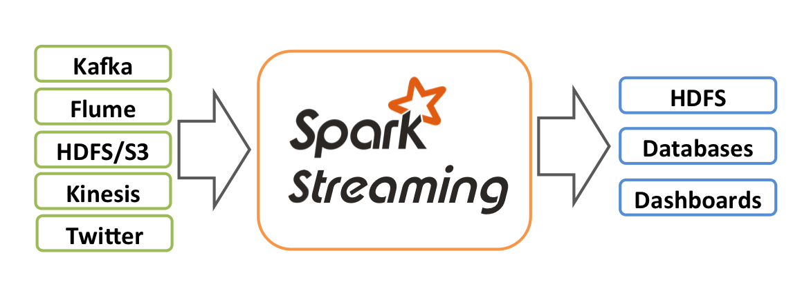
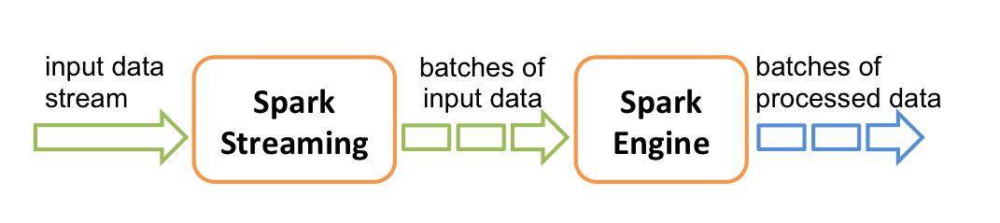
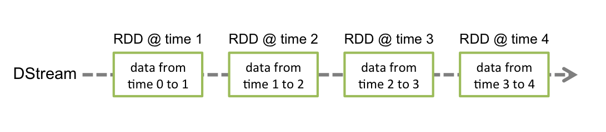
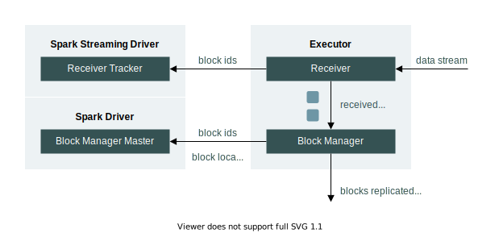
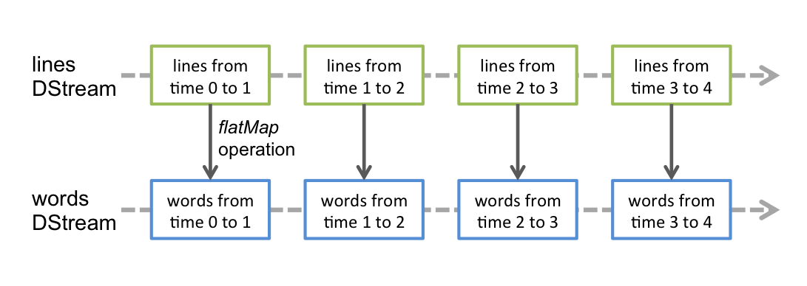
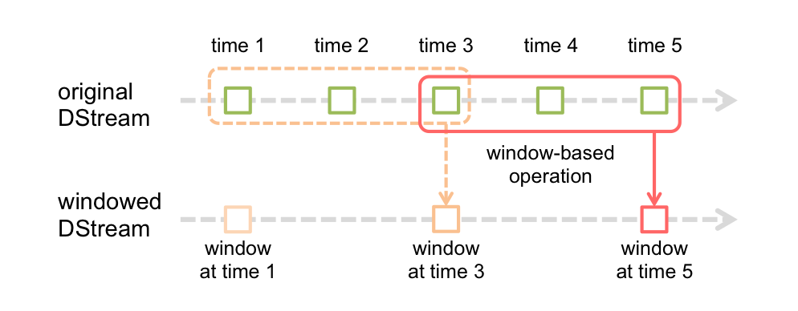
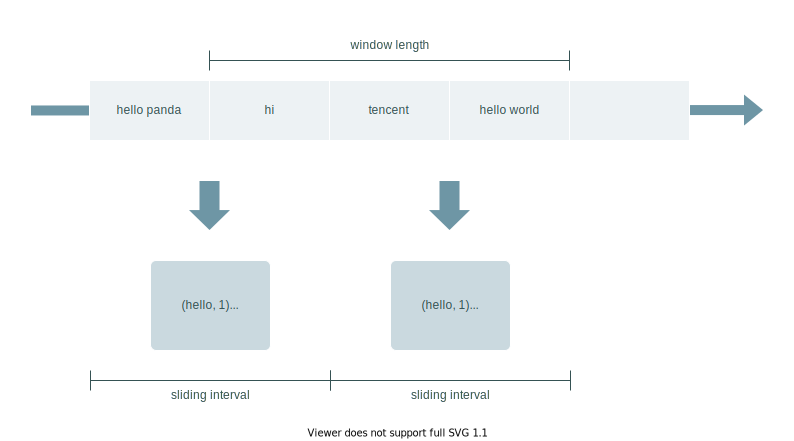

# Spark Streaming 入门指南

## 简介

在官方定义上，Spark Streaming 是基于 Spark Core 实现的一套可扩展、高吞吐、容错的流式计算框架。

与常见的流式计算框架相同，Spark Streaming 的数据处理过程也是由 **接入**、**计算**、**输出** 3 个部分组成。“流数据”从 Kafka、Flume 等上游组件接入，经 `map`、`reduce`、`join` 等算子转换后，写入到 HDFS、数据库等下游组件中，如下图所示：



整个流程看上去便是标准的流式计算过程，但是，严谨地说，Spark Streaming 并不是真正意义上的流式计算框架，它更像是一种微批计算框架。在 Spark Streaming 中，数据并不是以流的形式接入的，而是会被拆成一块块，形成一批批数据，再分批交给 Spark 引擎执行计算，以达到类似流计算的效果，如下图所示：



这种微批的本质，在数据量比较小时，与 Flink 等流式计算框架相比不会有显著的区别，但是当数据量达到了一定量级时，计算延迟、消费突刺等问题将接踵而来。坦白说，Spark Streaming 并不是一款非常优秀的流式计算框架，但借助于 Spark 的广泛运用，它还是在市场上占据了一席之地。所以，了解和学习 Spark Streaming，是有一定必要性的。

## 代码示例

在正式学习 Spark Streaming 前，我们先以常见的 **词频统计** 来展示 Spark Streaming 的编程模型：

```scala
object WordCountStream {

  def main(args: Array[String]): Unit = {
    // 1. 设置运行模式为 local，线程数为 3
    val conf: SparkConf = new SparkConf().setMaster("local[3]").setAppName("Word Count Streaming App")
    // 2. 创建批次周期为 10s 的 StreamingContext
    val ssc: StreamingContext = new StreamingContext(conf, Seconds(10))

    // 3. 创建来自于本地 9999 端口的 Dtream 对象
    val inputStream: ReceiverInputDStream[String] = ssc.socketTextStream("localhost", 9999)

    // 4. 定义 DStream 转换算子
    val wcStream: DStream[(String, Int)] = inputStream
      .flatMap(_.split(" "))
      .map(word => (word, 1))
      .reduceByKey(_ + _)
    
    // 5. 定义 DStream 输出算子
    wcStream.print()
    
    // 6. 启动计算作业
    ssc.start()
    // 7. 进行阻塞，防止 Driver 进程退出
    ssc.awaitTermination()
  }
}
```

:::caution

在批处理作业中，Driver 进程在执行完计算任务后即可退出。但对于流计算来说，作业一经启动，便意味着需要 7\*24 小时运行，因此必须进行阻塞，防止 Driver 进程退出。

:::

完成上述代码的编写后，在本地开启服务端程序监听 `9999` 端口：

```bash
nc -lk 9999
```

然后，启动 Spark Streaming 作业，并每隔 `10s` 在终端输入一些单词，便可在控制台日志看到如下结果：

```text
-------------------------------------------
Time: 1670314870000 ms
-------------------------------------------
(world,1)
(hello,2)
(tencent,1)

-------------------------------------------
Time: 1670314880000 ms
-------------------------------------------
(panda,1)
(hello,1)
```

## 核心概念

在上节中，可以发现 Spark Streaming 的词频统计模型与 Spark Core 是比较相似的，但还是有些区别：

1.  Spark Core 中的 SparkContext 由 StreamingContext 替代
2.  Spark Core 中的 RDD 由 DStream 替代
3.  Spark Streaming 需要设置作业启动位置与阻塞位置

看到这里，我们应该会产生一些疑问。StreamingContext 是什么？它与 SparkContext 是什么关系？同样地，DStream 本质上是什么？与 RDD 之间有何关联？在深入学习 Spark Streaming 前，我们有必要将这些概念理清楚，了解代码背后蕴藏的本质。

### StreamingContext

StreamingContext 是 Spark Streaming 功能点的主要入口，我们可以基于它完成 DStream 的创建、流作业的启动与停止等，它有 3 种状态：

-   `INITIALIZED`：表示 Context 已被创建，但还未启动，此时可以创建 DStream 和定义算子行为
-   `ACTIVE`：表示 Context 已被启动，此时不可再创建 DStream 和定义算子行为
-   `STOPPED`：已停止，Context 不可再使用

:::caution

每个 JVM 进程在同一时间内只允许一个 StreamingContext 处于 `ACTIVE` 状态。

:::

早在学习 Spark Core 时，我们便知道了 SparkContext 的存在，它是 Spark Core 功能点的主要入口，我们可以基于它完成 RDD、累加器（Accumulator）、广播变量（Broadcast） 的创建，并通过它启动计算任务。那么，StreamingContext 与它究竟是什么关系呢？

在代码示例中，我们通过以下方式创建了 StreamingContext：

```scala
val ssc: StreamingContext = new StreamingContext(conf, Seconds(10))
```

实际上，这段代码最终还是依赖 SparkContext 完成 StreamingContext 的创建：

```scala
class StreamingContext private[streaming] (
    _sc: SparkContext,
    _cp: Checkpoint,
    _batchDur: Duration
  ) extends Logging {
  
  //...
  
  def this(conf: SparkConf, batchDuration: Duration) = {
    this(StreamingContext.createNewSparkContext(conf), null, batchDuration)
  }
  
  //...
}
```

不严谨地说，SparkContext 像是 StreamingContext 的父类，我们可以在 SparkContext 的生命周期里重复创建 StreamingContext，只要它的上一代已经被停止。

### DStream

DStream 的全称为 **Discretized Stream**，因此又被称为 **离散型数据流**。它是 Spark Streaming 中的一个基本抽象类，代表一个连续的数据流。

:::info

该数据流既可以是从数据源接收数据的流，也可以是由其他数据流转换过来的流。

:::

对于初学者而言，单纯根据定义就想准确认识 DSream 还是有难度的。实际上，DStream 的底层是一个连续的 RDD 序列，当 Spark Streaming 作业启动后，它会周期性地创建相同类型的 RDD。由于每个 RDD 表示某个范围内的数据，使得 DStream 看上去像一个离散的数据流，如下图所示：



在代码示例中，我们已经知道，DStream 可以基于数据源创建：

```scala
val inputStream: ReceiverInputDStream[String] = ssc.socketTextStream("localhost", 9999)
```

:::info

从数据源（如 TCP、Kafka、文件系统等）接收数据的流，又统称为 InputDStream，将于下文展开介绍。

:::

此外，我们还可以通过对已存在的 DStream 使用 `map`、`flatMap` 等转换算子来得到新的 DStream：

```scala
val flatStream: DStream[String] = inputStream.flatMap(_.split(" "))

```

接下来，我们简要介绍一下 DStream 的内部构造。上面提到，DStream 是一个抽象类，它内部有 3 个核心方法，所有 DStream 的子类均需要实现这些方法，以决定 RDD 的生成周期和生成方式：

| **方法**                         | **返回值类型**            | **说明**        |
| ------------------------------ | -------------------- | ------------- |
| **slideDuration**              | Duration             | 生成 RDD 的周期时间  |
| **dependencies**               | List\[DStream\[\_]] | DStream 的依赖列表 |
| **compute**(*validTime: Time*) | Option\[RDD\[T]]     | 生成 RDD 的方法    |

除了核心方法，DStream 中还包含了大量的算子方法，这一点与 RDD 极为相似。所以从表象上看，DStream 在 Spark Streaming 的地位就如同 RDD 在 Spark Core 中的地位。但抛开表象，RDD 才是 Spark Streaming 任务调度的基础，DStream 只是 RDD 序列的描绘者。

### InputDStream

InputDStream 是所有从数据源接受数据的 DStream 的基础抽象类，其常见的子类有：

-   ReceiverInputDStream
-   FileInputDStream
-   DirectKafkaInputDStream

其内部定义的 `start()` 和 `stop()` 方法会被 Spark Streaming 系统调用，分别用于 **启动数据接收** 与 **关闭数据接收**。

如果子类直接继承 InputDStream，那么接收数据的行为是发生在 Driver 节点的；如果子类继承 ReceiverInputDStream，那么接收数据的行为将由 Receiver 负责。顾名思义，Receiver 是接收外部数据源的接收器，在 Spark Streaming 生成 RDD 前，它会被封装到一个特殊的 RDD 中，然后在 Executor 中启动并接收数据，如下图所示：



:::danger

由于 Receiver 会占用 Worker 节点的 CPU 资源，在使用 Receiver 接收数据时，必须保证分配给作业的总核数大于 Receiver 的数量，否则会出现作业只接收但不计算数据的情况。

:::

## DStream 算子

DStream 的算子分为 **转换算子** 和 **输出算子**。

### 转换算子

当我们使用转换算子时，可以基于已存在的 DStream 获得新的 DStream。但本质上，这个转换逻辑是作用于新 DStream 底层的 RDD 上的，如下图所示：



:::info

经过多次转换，我们会获得多个 DStream，相应地会获得多组 RDD 序列，但只有最后一组 RDD 序列会由输出算子提交到 Spark 引擎进行任务调度。

:::

当前版本已定义的 DStream 转换算子有：

| **操作**                                    | **含义**                                                                                                                            |
| ----------------------------------------- | --------------------------------------------------------------------------------------------------------------------------------- |
| **filter**(*func*)                        | 筛选出满足条件的元素，并返回一个新的 DStream                                                                                                        |
| **map**(*func*)                           | 将每个元素传递到函数 *func* 中，返回一个新的 DStream，每个输入元素会映射到 **1 个输出结果**                                                                         |
| **flatMap**(*func*)                       | 与 map 相似，但每个输入元素都可以映射到 **0 或多个输出结果**                                                                                              |
| **repartition**(*numPartitions*)          | 对 DStream 进行重分区，新的分区数由 *numPartitions* 指定                                                                                         |
| **union**(*func*)                         | 将两个 DStream 中的元素合并到一个新的 DStream                                                                                                   |
| **count**()                               | 返回一个计算每个 RDD 中元素个数的 DStream                                                                                                       |
| **reduce**(*func*)                        | 返回一个使用 *func* 聚合每个 RDD 中所有元素的 DStream，该 DStream 由单元素  RDD 组成                                                                      |
| **countByValue**()                        | 应用于元素类型为 K 的 DStream，返回一个形式为 (K, Long) 的 DStream，可计算每个 key 在每个 RDD 中出现的次数                                                         |
| **reduceByKey**(*func*, *\[numTasks]*)    | 应用于 (K, V) 形式的 DStream，返回一个新的 (K, V) 形式的 DStream，新 DStream中的 V 是每个 RDD 中每个 K 对应的 V 传递到 *func* 中进行聚合后的结果，其参数 *numTasks* 可用于设置并行度 |
| **join**(*otherStream*, \[*numTasks*])    | 表示内连接，对于给定的两个形式分别为 (K, V) 和 (K, W) 的 DStream，只有在两个 DStream 中都存在的 K 才会被输出，最终得到 (K, (V, W)) 类型的 DStream                             |
| **cogroup**(*otherStream*, \[*numTasks*]) | 给定两个形式分别为 (K, V) 和 (K, W) 的 DStream，返回一个形式为 (K, (Seq\[V], Seq\[W])) 类型的 DStream                                                   |
| **transform**(*func*)                     | 返回一个新的 DStream，其中的 *func* 会用于转换原 DStream 中的每个 RDD，该算子使得对 DStream 中的 RDD 进行任意操作成为可能                                                |
| **updateStateByKey**(*func*)              | 返回一个带状态的 DStream，其中的 *func* 会将每个 key 的当前值与上一个状态值聚合起来，然后更新当前状态值                                                                    |

### 输出算子

DStream 输出算子会将数据流中的数据输出到外部存储。与 RDD 的行动算子相似，DStream 的输出算子是真实的计算任务的触发者。

:::info

 严谨地说，DStream 输出算子只生成计算任务，任务的启动还是取决于 StreamingContext 的 `start()` 方法何时被调用。

:::

当前版本已定义的 DStream 输出算子有：

| **操作**                                     | **含义**                                                                                                      |
| ------------------------------------------ | ----------------------------------------------------------------------------------------------------------- |
| **print**()                                | 在 Driver 节点打印 DStream 每个批次数据的前 10 个元素，通常用于调试                                                                |
| **saveAsTextFiles**(*prefix, \[suffix]*)   | 将 DStream 的内容存储为文件，输出文件所在目录名由 *prefix*、*suffix*、批次时间共同组成，例如：*prefix-TIME\_IN\_MS.suffix*                    |
| **saveAsObjectFiles**(*prefix, \[suffix]*) | 将 DStream 的内容转为序列化对象并存储为 SequenceFile，输出文件所在目录名由 *prefix*、*suffix*、批次时间共同组成，例如：*prefix-TIME\_IN\_MS.suffix* |
| **saveAsHadoopFiles**(*prefix, \[suffix]*) | 将 DStream 的内容存储为 Hadoop 文件，输出文件所在目录名由 *prefix*、*suffix*、批次时间共同组成，例如：*prefix-TIME\_IN\_MS.suffix*            |
| **foreachRDD**(*func*)                       | **最通用** 的输出算子，其中的 *func* 会应用在 DStream 中的每个 RDD，在 *func* 中，用户需自己定义数据写出的逻辑                                    |

:::caution

上述写文件的输出算子，其参数 `prefix` 和 `suffix` 是作用于输出目录的，而不是文件。此外，`prefix` 如果是绝对路径，输出目录将输出到绝对路径，否则输出到当前路径下。

:::

:::danger

foreachRDD 中的 `func` 是运行在 Driver 进程的，真正的数据写出操作要包含在 RDD 的行动算子里。

:::

## 高级特性

### 窗口计算

在流式计算中，窗口计算是一种将 **无界数据** 划分为 **有界数据** 进行统计处理的计算方式。通过窗口计算，我们可以解决很多现实的业务需求，例如每 10 分钟统计 1 小时内的词频、每 10 分钟刷新当天的热点排名等。

作为流式计算中的重要特性，Spark Streaming 当然也对窗口计算提供了支持，其实现逻辑如下图所示：



图例中，每个窗口都横跨了 3 个批次，且每隔 2 个批次周期便滑动一次。换句话说，就是每隔 2 个批次周期将原始 DStream 中 3 个批次范围的数据汇总到 WindowedDStream，由 WindowedDStream 做统计计算，内部实现代码如下：

```scala
// 将滑动步长设置为 WindowedDStream 的批次周期
override def slideDuration: Duration = _slideDuration

// 将窗口长度内的 RDD 汇总到 WindowedDStream
override def compute(validTime: Time): Option[RDD[T]] = {
  val currentWindow = new Interval(validTime - windowDuration + parent.slideDuration, validTime)
  val rddsInWindow = parent.slice(currentWindow)
  Some(ssc.sc.union(rddsInWindow))
}

```

可见，窗口计算涉及到两个关键的参数：

-   窗口长度（window length）：每个窗口的生命周期，即汇总多长时间的数据
-   滑动步长（sliding interval）：每个窗口触发计算的时间间隔

:::danger

窗口长度和滑动步长必须为批次周期的 **整倍数**，否则 Spark Streaming 会抛出异常。

:::

为更直观地理解窗口计算的运行细节，我们以词频统计来模拟图例中的过程，代码如下：

```scala
object WindowStream {

  def main(args: Array[String]): Unit = {
    val conf: SparkConf = new SparkConf().setMaster("local[3]").setAppName("Window Stream App")

    val batchSeconds: Int = 5

    val ssc: StreamingContext = new StreamingContext(conf, Seconds(batchSeconds))

    val inputStream: ReceiverInputDStream[String] = ssc.socketTextStream("localhost", 9999)

    // 转换为窗口 DStream
    val windowedStream: DStream[String] = inputStream.window(Seconds(3 * batchSeconds), Seconds(2 * batchSeconds))

    val wcStream: DStream[(String, Int)] = windowedStream
      .flatMap(_.split(" "))
      .map(word => (word, 1))
      .reduceByKey(_ + _)

    wcStream.print()

    ssc.start()
    ssc.awaitTermination()
  }
}
```

在这个例子中，批次周期为 `5s`，窗口长度为 `15s`，滑动步长为 `10s`。程序运行后，我们持续输入一些数据，会发现 Spark Streaming 每隔 `10s` 触发一次统计，每次统计的数据范围横跨了 3 个批次，如下图所示：



:::info

当窗口长度大于滑动步长时，总会有数据同时落在多个批次中，被计算多次，这与 Flink 的滑动窗口相吻合。同样地，当窗口长度等于滑动步长时，便是 Flink 中的滚动窗口。实际上，即便没有 WindowedDStream，Spark Streaming 微批的特性也符合滚动窗口的表现。

:::

当前版本已定义的窗口函数有：

| **操作**                                                                           | **含义**                                                                                                                       |
| -------------------------------------------------------------------------------- | ---------------------------------------------------------------------------------------------------------------------------- |
| **window**(*windowLength*, *slideInterval*)                                      | 返回一个基于原始 DStream 的窗口计算型 DStream                                                                                              |
| **countByWindow**(*windowLength*, *slideInterval*)                               | 返回一个计算窗口内元素个数的 DStream                                                                                                       |
| **reduceByWindow**(*func*, *windowLength*, *slideInterval*)                      | 返回一个使用 *func* 聚合窗口内所有元素的 DStream，该 DStream 由单元素  RDD 组成                                                                      |
| **reduceByKeyAndWindow**(*func*, *windowLength*, *slideInterval*, \[*numTasks*]) | 应用于 (K, V) 形式的 DStream，返回一个新的 (K, V) 形式的 DStream，新 DStream中的 V 是窗口内每个 K 对应的 V 传递到 *func* 中进行聚合后的结果，其参数 *numTasks* 可用于设置并行度 |
| **countByValueAndWindow**(*windowLength*, *slideInterval*, \[*numTasks*])        | 应用于元素类型为 K 的 DStream，返回一个形式为 (K, Long) 的 DStream，可计算每个 key 在窗口内出现的次数                                                         |

### 检查点机制

检查点机制可以定期将 Spark Streaming 的 **元数据信息** 和 **运行状态** 保存到外部存储系统（如本地文件系统、HDFS 等），以便 Spark Streaming 作业可以恢复到某一时刻。它主要有两种使用场景：

#### 有状态算子

有状态算子可以简单理解为需要记录运行状态的算子。使用有状态算子时，往往需要汇总不同批次的 RDD 数据，当作业长时间运行下去的话，将产生非常长的依赖链，这会带来一个严重的问题：**当作业重启时，需要耗费非常久的时间将作业恢复到上一个已保存的状态。**

:::info

这边的依赖链指的是当前批次 RDD 与历史批次 RDD 之间的依赖关系，而不是转换算子带来的依赖关系。

:::

因此，当我们使用到 `updateStateByKey`、`reduceByKeyAndWindow` 等有状态的算子时，需要启用 checkpoint 功能，以周期性地切断依赖链，**将中间状态保存到外部存储上。**

#### 从异常中恢复

前面提到，checkpoint 可以保存元数据信息。当 Driver 因为异常退出时，我们可以从外部存储中获取上一个 checkpoint  周期保存的 StreamingContext，恢复作业状态并重新运行。

以下是支持从 checkpoint 恢复的代码示例：

```scala
object CheckpointStream {

  def main(args: Array[String]): Unit = {

    val checkpointDir: String = "./checkpoint"

    def functionToCreateContext(): StreamingContext = {

      val updateFunc: (Seq[Int], Option[Int]) => Some[Int] = ((values: Seq[Int], state: Option[Int]) => {
        val currentCount: Int = values.sum
        val previousCount: Int = state.getOrElse(0)
        Some(currentCount + previousCount)
      })

      val conf: SparkConf = new SparkConf().setMaster("local[3]").setAppName("Checkpoint Streaming App")
      val ssc: StreamingContext = new StreamingContext(conf, Seconds(10))
      ssc.checkpoint(checkpointDir)

      val inputStream: ReceiverInputDStream[String] = ssc.socketTextStream("localhost", 9999)

            val resultStream: DStream[(String, Int)] = inputStream
        .flatMap(_.split(" "))
        .map(word => (word, 1))
        .updateStateByKey[Int](updateFunc)

      resultStream.print()
      ssc
    }

    // 若有 checkpoint 目录，从已保存的元数据获取 StreamingContext
    // 否则，通过 functionToCreateContext 创建一个新的 StreamingContext
    val ssc: StreamingContext = StreamingContext.getOrCreate(checkpointDir, functionToCreateContext _)

    ssc.start()
    ssc.awaitTermination()
  }
}
```

检查点机制看起来是一个非常不错的功能，但实际上它存在着两个问题：

- checkpoint 只能保证内部容错（即只能恢复作业的内部状态），如果数据源没有缓存功能，那么数据丢失的情况依旧会发生，如果输出组件不支持幂等或事务，那么重复计算的情况仍然不可避免

- checkpoint 本质上需要重新执行 RDD 的调度逻辑，是一个成本高昂的操作，如果 checkpoint 周期太小，甚至会占用过多资源，导致业务计算被堵塞

可见，checkpoint 不是万能的，很多时候甚至是不需要它的。因此，是否开启 checkpoint，需要结合实际情况进行考量，并且，一旦开启了 checkpoint，必须仔细斟酌 checkpoint 的周期时间。

:::info

checkpoint 周期可以通过 DStream 的 `checkpoint` 方法设置，官方给出的建议值是 5\~10 倍的批次周期。

:::

## 优雅关闭

理想情况下，Spark Streaming 作业一经启动，就可以全天候运行，无需关闭。可惜的是，在现实中，这种理想情况是不大可能存在的，总会有需要我们 **主动关闭作业** 的情况出现，比如代码版本更新、数据链路调整、集群迁移等。

那么，一旦碰到这种需要关闭作业的情况，我们可以直接使用 `kill` 命令强制杀掉进程吗？答案是不行的。流式计算作业与一般的程序不同，几乎每时每刻都有数据流入，一旦在数据计算过程中强行关掉了进程，那么就有可能面临数据丢失或者重复计算的风险。

:::info

若上下游支持端到端一致性，强行关闭 Spark Streaming 作业也不会出现数据丢失或者重复计算的情况。但这种粗暴的关闭方式终究是不妥的，我们还是要尽可能地完善我们的程序。

:::

幸运的是，Spark Streaming 自带优雅关闭功能，可以通过 StreamingContext 的 `stop` 方法启用：

```scala
ssc.stop(stopSparkContext = false, stopGracefully = true)
```

:::danger

Spark Streaming 的优雅关闭依赖 Hadoop 的 ShutdownHookManager，实际使用时需要调大 Hadoop 配置项 `hadoop.service.shutdown.timeout` 的值。该值默认为 `30s`，当批次周期较大时，会出现超时异常。

:::

但我们马上就遇到了新的问题。`stop` 方法要在何时何地调用？如果在 `start` 之后调用 `stop`，那么计算作业还没启动就已经结束了，可谓是出师未捷身先死；如果在 `awaitTermination` 之后调用，由于线程阻塞，`stop` 不会被触发。

在本文的最后部分，我们将介绍两种完整实现优雅关闭的方式。

### 钩子函数

第一种优雅关闭的方式是使用钩子函数，只需在 SparkConf 新增以下配置：

```scala
conf.set("spark.streaming.stopGracefullyOnShutdown", "true")
```

实际上，当作业启动时，Spark Streaming 自己会添加钩子函数，然后由钩子函数调用 `stop` 方法：

```scala
private def stopOnShutdown(): Unit = {
  val stopGracefully = conf.get("spark.streaming.stopGracefullyOnShutdown")
  logInfo(s"Invoking stop(stopGracefully=$stopGracefully) from shutdown hook")
  // Do not stop SparkContext, let its own shutdown hook stop it
  stop(stopSparkContext = false, stopGracefully = stopGracefully)
}
```

这种方式在代码层面很简单，但它有一个弊端，那就是在实际关闭时，我们需要登陆 Driver 进程所在的服务器，手动 `kill` 掉 Driver 进程。

### 外部标记

还有一种优雅关闭的方式，是通过定时扫描 **外部标记** 来决定是否停止作业：

```scala
ssc.start()

new Thread(() => {
  while (true) {
    Thread.sleep(5000)
    // 外部停止标记
    val flag: Boolean = ...
    if (flag) {
      if (ssc.getState() == StreamingContextState.ACTIVE) {
        ssc.stop(stopSparkContext = false, stopGracefully = true)
        System.exit(0)
      }
    }
  }
}).start()

ssc.awaitTermination()
```

外部停止标记可以有多种实现方案：

-   在 HDFS 创建文件传递停止标记
-   在数据库更新状态传递停止标记
-   ……

通过这些外部标记的方式，我们便不再需要登陆 Driver 进程所在的服务器，可以较为灵活地发起停止指令。当然，两种方式没有明显的优劣之分，适合自身实际场景才是最重要的。
