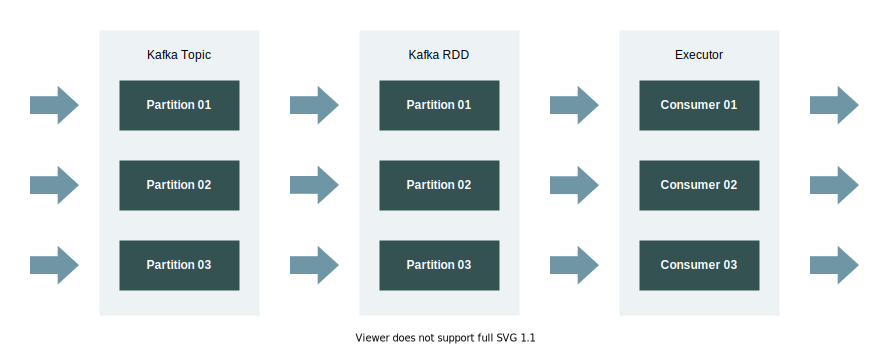
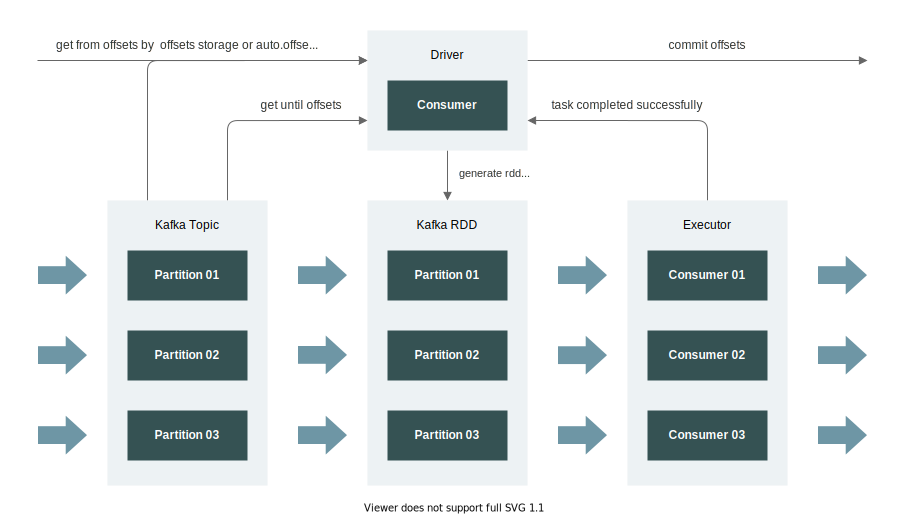
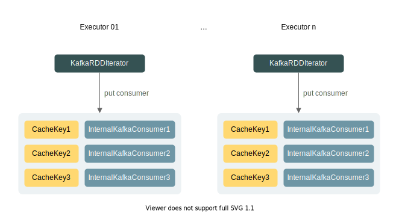
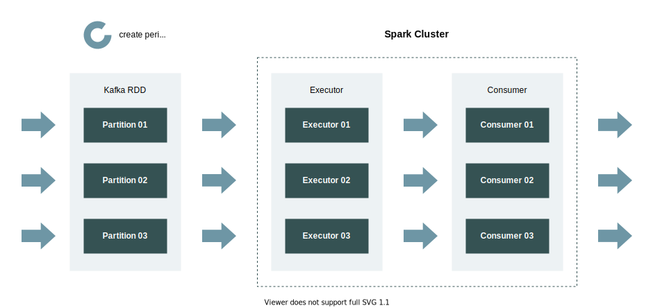

# Spark Streaming 集成 Kafka

## 版本选择

Spark Streaming 自带 Kafka 集成，且 RDD 分区与 Kafka 分区支持 1:1 的对照关系。

目前有 `0.8` 和 `0.10` 两种版本的集成，需要注意的是，除了使用方式有所不同，两者在以下方面也存在明显差异：

-   底层 API：`0.8` 基于 SimpleConsumer 实现，不支持参数调优，`0.10` 基于 Consumer API 实现，**支持参数调优**
-   预取机制：`0.8` 版本不支持预取机制，性能较差，`0.10` 版本支持预取机制，**性能较好**

综上，在条件允许的情况下，建议使用 `0.10` 版本，其 Maven 依赖如下：

```xml
<dependency>
    <groupId>org.apache.spark</groupId>
    <artifactId>spark-streaming-kafka-0-10_${scala.version}</artifactId>
    <version>${spark.version}</version>
</dependency>
```

## 代码示例

Spark Streaming 集成 Kafka 是基于 DirectKafkaInputDStream 和 KafkaRDD 实现的，其编码步骤大致为：

1.  创建 SparkConf 与 StreamingContext，设置批次时间
2.  设置 Kafka Consumer 消费配置，指定 broker 地址、消费者组名等
3.  创建 DirectKafkaInputDStream，设置 **调度偏好**、**订阅策略** 与 **订阅topic**
4.  定义转换算子与输出算子，并完成 **位移提交**
5.  启动 StreamingContext 并阻塞 Driver 进程

以下为示例代码：

```scala
object KafkaStream {

  def main(args: Array[String]): Unit = {
    val conf: SparkConf = new SparkConf().setMaster("local[3]").setAppName("Kafka Streaming App")
    val ssc: StreamingContext = new StreamingContext(conf, Seconds(10))

    val map: util.HashMap[String, Object] = new util.HashMap[String, Object]()
    // 设置 broker 地址
    map.put(ConsumerConfig.BOOTSTRAP_SERVERS_CONFIG, "xxx:9092")
    // 设置消费者组名
    map.put(ConsumerConfig.GROUP_ID_CONFIG, "test")
    // 不自动提交位移
    map.put(ConsumerConfig.ENABLE_AUTO_COMMIT_CONFIG, false: java.lang.Boolean)
    // 位移初始位置策略
    map.put(ConsumerConfig.AUTO_OFFSET_RESET_CONFIG, "earliest")
    map.put(ConsumerConfig.KEY_DESERIALIZER_CLASS_CONFIG, classOf[StringDeserializer])
    map.put(ConsumerConfig.VALUE_DESERIALIZER_CLASS_CONFIG, classOf[StringDeserializer])
    map.put(ConsumerConfig.SESSION_TIMEOUT_MS_CONFIG, 300000: java.lang.Integer)
    map.put(ConsumerConfig.REQUEST_TIMEOUT_MS_CONFIG, 360000: java.lang.Integer)
    map.put(ConsumerConfig.MAX_POLL_RECORDS_CONFIG, 250: java.lang.Integer)

    // 设置消费 topic
    val topics: Array[String] = Array("test")
    // 设置调度偏好、订阅策略
    val stream: InputDStream[ConsumerRecord[String, String]] =
      KafkaUtils.createDirectStream(ssc, PreferConsistent, Subscribe[String, String](topics, map.asScala))

    stream.foreachRDD((rdd, time) => {
      // 获取当前 RDD 对应的位移信息
      val currentOffsets: Array[OffsetRange] = rdd.asInstanceOf[HasOffsetRanges].offsetRanges

      rdd.foreachPartition(iterator => {
        while (iterator.hasNext) {
          val value: String = iterator.next().value()
          println(value)
        }
      })

      // 手动提交位移
      stream.asInstanceOf[CanCommitOffsets].commitAsync(currentOffsets)
    })

    ssc.start()
    ssc.awaitTermination()
  }
}
```

## 消费原理

在代码示例中可以看出，Spark Streaming 集成 Kafka 与 Kafka Consumer API 在编码形式上有很大的不同。为了探究这种不同产生的原因，我们需要深入到 DirectKafkaInputDStream 和 KafkaRDD 的源码，去了解内部的消费原理。

### 消费者分配

回顾一下基于 Kafka Consumer API 开发消费者程序的场景。在资源足够的情况下，通常我们会为每个 Kafka 分区开启一个消费者实例，以达到最佳消费性能。

在 KafkaRDD 中，同样支持 Kafka 分区与消费者实例 1:1 的对照关系，如下图所示：



为实现这种 1:1 的关系，KafkaRDD 的 `compute` 方法会为每个分区返回一个 KafkaRDDIterator。KafkaRDDIterator 是一个运行在 Executor 节点的迭代器，它内部会 **为每一个 topic 分区单独创建一个 Executor 端 Kafka 消费者**，以便从 Kafka 直接拉取数据，如代码所示：

```scala
// KafkaRDDIterator
val consumer = {
  KafkaDataConsumer.init(cacheInitialCapacity, cacheMaxCapacity, cacheLoadFactor)
  KafkaDataConsumer.acquire[K, V](part.topicPartition(), kafkaParams, context, useConsumerCache)
}

// KafkaDataConsumer 会通过 InternalKafkaConsumer 的 createConsumer 创建 Executor 端消费者
private def createConsumer: KafkaConsumer[K, V] = {
  val updatedKafkaParams = KafkaConfigUpdater("executor", kafkaParams.asScala.toMap)
    .setAuthenticationConfigIfNeeded()
    .build()
  val c = new KafkaConsumer[K, V](updatedKafkaParams)
  val topics = ju.Arrays.asList(topicPartition)
  // 使用 assign 订阅
  c.assign(topics)
  c
}
```

:::info

当 RDD 分区、Kafka 分区和 Executor 核心数达到 1:1:1 时，吞吐量最大。如果 Executor 核心数小于 Kafka 分区，那么会出现 Executor 负载不均和消费排队的情况。

:::

### 位移区间分配

在 Spark Streaming 中，每个 RDD 对应一个批次范围内的数据，即数据流中的一段数据。在 KafkaRDD 中，由于 RDD 分区与 Kafka 分区是 1:1 关系，上述对应关系便表现为 KafkaRDD 分区对应 topic 分区中的某一段数据。那么，引申出的一个问题是，KafkaRDD 是怎么知道每个分区应该消费多少数据？这里就涉及到位移区间分配的问题。

实际上，在 Driver 端也存在一个 Kafka 消费者，这个消费者不消费数据，只负责消费位移区间的分配，如下图所示：



DirectKafkaInputDStream 启动时会通过 ConsumerStrategy 创建一个 Kafka 消费者。如果我们在创建 DStream 时便传入位移区间信息，那么该消费者会通过该区间信息确定其位移区间起始点；如果我们没有指定任何位移区间信息，那么该消费者会根据 `auto.offset.reset` 决定位移区间起始点。相关实现代码如下：

```scala
override def start(): Unit = {
  val c = consumer
  paranoidPoll(c)
  if (currentOffsets.isEmpty) {
    currentOffsets = c.assignment().asScala.map { tp =>
      // 如果未调用 seek，position 方法基于 auto.offset.reset 确定分区位移
      tp -> c.position(tp)
    }.toMap
  }
}

def consumer(): Consumer[K, V] = this.synchronized {
  if (null == kc) {
    // 用户传递的 offsetRanges 信息会传递给 ConsumerStrategy，由 ConsumerStrategy 完成位移 seek
    kc = consumerStrategy.onStart(
      currentOffsets.mapValues(l => java.lang.Long.valueOf(l)).toMap.asJava)
  }
  kc
}
```

我们知道，DirectKafkaInputDStream 会周期性地创建 KafkaRDD，位移区间结束点就是在这个时候确定的。在生成 RDD 前，消费者会通过 `seekToEnd` 方法确定 topic 的最新位移，以此作为位移区间结束点。相关实现代码如下：

```scala
override def compute(validTime: Time): Option[KafkaRDD[K, V]] = {
  val untilOffsets = clamp(latestOffsets())
  val offsetRanges = untilOffsets.map { case (tp, uo) =>
    val fo = currentOffsets(tp)
    OffsetRange(tp.topic, tp.partition, fo, uo)
  }
  val useConsumerCache = context.conf.get(CONSUMER_CACHE_ENABLED)
  val rdd = new KafkaRDD[K, V](context.sparkContext, executorKafkaParams, offsetRanges.toArray,
    getPreferredHosts, useConsumerCache)
  // ...
}
```

需要注意的是，位移区间结束点并不总是 topic 各区间的最新位移，还需要考虑两种场景：

- 如果用户设置了 `spark.streaming.kafka.maxRatePerPartition` 参数，那么 DirectKafkaInputDStream 会取**当前位移加上 maxRatePerPartition** 与 **最新位移** 间的最大值
- 如果消费延迟达到一定阈值触发了背压，还会优先以背压比率为参考确定位移区间结束点

:::info

配置项 `spark.streaming.kafka.maxRatePerPartition` 通常用于限制 **每个分区每秒钟** 的消费量，避免上游突发高峰时 Spark 集群因不堪重负而出现异常。

:::

### 数据消费

使用 Kafka Consumer API 时，我们一般会通过循环调用 `poll` 方法来持续消费数据，如下所示：

```java
while (true) {
    ConsumerRecords<String, String> records = consumer.poll(Duration.ofMillis(1000));
    for (ConsumerRecord<String, String> record : records) {
        String message = record.value();
        // do something
    }
    consumer.commitSync();
}
```

在 Spark Streaming 中，我们也是通过循环的方式持续消费数据，这个消费行为的触发入口在我们定义的用户函数里：

```scala
stream.foreachRDD((rdd, time) => {
  rdd.foreachPartition(iterator => {
    while (iterator.hasNext) {
      val value: String = iterator.next().value()
      // do something
    }
  })
  // 提交位移
})
```

在用户函数中，会不断调用迭代器 iterator 的 `hasNext` 方法，获取下一条数据。这个迭代器，实际上就是由 KafkaRDD 的 `compute` 方法创建出来的 KafkaRDDIterator。除了上文提到的消费者创建，KafkaRDDIterator 还会从 KafkaRDD 获取分配到的位移区间，因此它具备了数据消费的基本条件。我们来看看它的核心代码：

```scala
// 获取位移区间起始点
var requestOffset = part.fromOffset

override def hasNext: Boolean = requestOffset < part.untilOffset

override def next(): ConsumerRecord[K, V] = {
  if (!hasNext) {
    throw new ju.NoSuchElementException("Can't call getNext() once untilOffset has been reached")
  }
  val r = consumer.get(requestOffset, pollTimeout)
  // 消费进度 +1
  requestOffset += 1
  r
}
```

可见，数据消费是发生在 KafkaRDDIterator 的 `next` 方法中的，其中的 `consumer` 是 InternalKafkaConsumer ，它对原生的 KafkaConsumer 做了封装，其 `get` 方法会通过原生的 KafkaConsumer 拉取数据，然后将数据存储到缓存队列 `buffer` 中，如代码所示：

```scala
def get(offset: Long, timeout: Long): ConsumerRecord[K, V] = {
  // 只在第一次拉取时触发，nextOffset 的初始值为 -2
  if (offset != nextOffset) {
    seek(offset)
    poll(timeout)
  }

  // 缓存为空，继续拉取，然后添加数据到缓存
  if (!buffer.hasNext()) {
    poll(timeout)
  }
  
  // 从缓存中获取数据
  var record = buffer.next()

  if (record.offset != offset) {
    // 处理异常
  }

  // 消费进度 +1，与 KafkaRDDIterator 的 requestOffset 保持一致
  nextOffset = offset + 1
  record
}

private def poll(timeout: Long): Unit = {
  // 依赖原生 KafkaConsumer 拉取数据
  val p = consumer.poll(Duration.ofMillis(timeout))
  val r = p.records(topicPartition)
  // 将拉取到的数据放入缓存
  buffer = r.listIterator
}
```

看到这里，我们可能会产生一个疑问：消费行为是在外部的用户函数触发的，却作用到 Spark Streaming 内部的消费者实例，这是如何实现的？实际上，我们定义的用户函数 `func`，会被封装到 RDD 中，传递给 ResultTask，最后由它调用用户函数去操作 KafkaRDD 返回的 iterator 对象。具体实现代码如下：

```scala
override def runTask(context: TaskContext): U = {
  // ...
  func(context, rdd.iterator(partition, context))
}
```

### 位移提交

在 Spark Streaming 中，一般来说，位移提交是发生在 Driver 端的，Executor 端的消费者只负责消费，不参与任何位移管理。为实现这个目的，DirectKafkaInputDStream 对传递给 Executor 端的消费者配置进行了覆写，主要包括以下 3 项：

-   `enable.auto.commit`：覆写为 `false`，禁止 Executor 端消费者自动提交位移
-   `auto.offset.reset`：覆写为 `none`，使用 Driver 端分配的位移区间作为消费范围
-   `group.id`：修改为 `spark-executor-${originalGroupId}`，与 Driver 端消费者区分开

### 订阅策略

在创建 DirectKafkaInputDStream 时，我们可以指定订阅策略 ConsumerStrategy，它有 3 种实现类：

-   Subscribe：通过 `subscribe` 方法订阅一个指定的 **topic 集合**
-   SubscribePattern：同 Subscribe，但支持正则表达式匹配 topic 集合
-   Assign：通过 `assign` 方法订阅一个固定的 **topic 分区集合**

编码时，基于 Subscribe 或 SubscribePattern 创建 DirectKafkaInputDStream 会比较简单：

```scala
val topics: Array[String] = Array("test")
val stream: InputDStream[ConsumerRecord[String, String]] =
  KafkaUtils.createDirectStream(ssc, PreferConsistent, Subscribe[String, String](topics, map.asScala))
```

如果基于 Assign 创建 DirectKafkaInputDStream，还需要指定 TopicPartition 集合：

```scala
val partitions: ListBuffer[TopicPartition] = ListBuffer[TopicPartition]()
for (i <- 0 to 3) {
  partitions += new TopicPartition("test", i)
}
val stream: InputDStream[ConsumerRecord[String, String]] =
  KafkaUtils.createDirectStream(ssc, PreferConsistent, Assign[String, String](partitions, map.asScala))
```

需要注意的是，这些订阅策略 **最主要的不同** 不在于使用方式的区别，而在于 `subcribe` 和 `assign` 的区别。在 Kafka Consumer API 中，`assign` 方法只会订阅一个固定的 TopicPartition 集合，至于 topic 是否有新增分区，它不关注；相反地，`subcribe` 方法订阅的是一个 topic 集合，如果其中的 topic 出现分区数变化，那么消费者实例便会收到通知。

:::caution

订阅策略只对 Driver 端消费者生效，Executor 端的消费者是分区级别的，使用的是 `assign` 方法。

:::

借助于 `subcribe` 的特性，`0.10` 版本的 Kafka 集成支持了 **重均衡** 的功能。DirectKafkaInputDStream 在分配位移区间前，会先判断是否有新分区，如果有，将添加新分区的位移信息到当前位移区间后再行分配：

```scala
protected def latestOffsets(): Map[TopicPartition, Long] = {
  val c = consumer
  paranoidPoll(c)
  val parts = c.assignment().asScala

  // 判断是否有新分区
  val newPartitions = parts.diff(currentOffsets.keySet)

  // ...

  // 添加新分区的位移区间到当前的位移区间
  currentOffsets = currentOffsets ++ newPartitions.map(tp => tp -> c.position(tp)).toMap

  c.seekToEnd(currentOffsets.keySet.asJava)
  parts.map(tp => tp -> c.position(tp)).toMap
}
```

:::info

新分区的位移区间起始点由 Driver 端的 `auto.offset.reset` 决定。

:::

## 预取机制

顾名思义，预取机制就是预先消费数据的机制，它可以在下一个 RDD 尚未创建前便预先拉取属于下一个批次的数据，尽可能减少微批特性带来的时间损耗。

### 消费缓存

消费缓存是预取机制的实现基础，它包含消费者缓存和数据缓存。

KafkaRDDIterator 在创建 Executor 端消费者后，会将消费者放入到 Executor 端的一个 LinkedHashMap 中，其中 key 的类型为 CacheKey（由 groupId、topic、partition 共同组成），value 的类型为 InternalKafkaConsumer，如下图所示：



:::info

消费者缓存可以通过配置项 `spark.streaming.kafka.consumer.cache.enabled` 设置，默认开启。

:::

数据缓存实际上是发生在数据消费环节。当 KafkaRDDIterator 的 `next` 被触发时，会调用原生 KafkaConsumer 的 `poll` 方法拉取数据，然后放入到 Executor 端的缓存队列 `buffer` 中。由于 `poll` 是批量拉取的，即便消费位移已达位移区间结束点，还是会有多余的数据存储在 `buffer` 中。

现在让我们以一个例子梳理整个消费缓存的过程。假设我们的 KafkaRDD 有 3 个分区，Executor 数也设置为 3，那么通过消费者缓存机制我们会在 3 个 Executor 上分别留下消费者实例，当下个批次的计算任务执行时，便可以复用之前留下的消费者实例和数据缓存，如下图所示：



但是，仔细思考的话，我们又面临一个新的问题，那就是每个 RDD 分区如何找到对应的 Executor？答案是，调度偏好。

### 调度偏好

在学习 Spark Core 时，我们知道 RDD 的 `getPreferredLocations` 方法用于指定调度偏好，通过调度偏好 Spark 引擎可以尽可能地将计算任务“移动“到数据所在的节点。

我们可以在创建 DirectKafkaInputDStream 时指定调度偏好，如代码示例中使用的便是 PreferConsistent 策略：

```scala
val stream: InputDStream[ConsumerRecord[String, String]] =
  KafkaUtils.createDirectStream(ssc, PreferConsistent, Subscribe[String, String](topics, map.asScala))
```

KafkaRDD 支持的调度偏好策略有 3 种：

-   PreferBrokers：只有 Executor 和 Kafka Broker 在相同节点时可以使用
-   PreferConsistent：最常见的策略，可以将分区分发到所有 Executor
-   PreferFixed：通过配置将 TopicPartition 分配到固定的主机，若有部分 TopicPartition 未在配置文件中指定，则默认使用 PreferConsistent 策略

其中的 PreferConsistent 策略是 \*\*实现将每个分区持续地调度到同一个 Executor \*\*的关键。基于这个策略，KafkaRDD 计算的分区偏好位置为 **分区号与 Executor 数** 的取余，这样就可以保证每个分区都尽可能地调度到同一个 Executor 上。具体的实现代码如下：

```scala
override def getPreferredLocations(thePart: Partition): Seq[String] = {
  val part = thePart.asInstanceOf[KafkaRDDPartition]
  val allExecs = executors()
  val tp = part.topicPartition
  val prefHost = preferredHosts.get(tp)
  val prefExecs = if (null == prefHost) allExecs else allExecs.filter(_.host == prefHost)
  val execs = if (prefExecs.isEmpty) allExecs else prefExecs
  if (execs.isEmpty) {
    Seq.empty
  } else {
    // execs is sorted, tp.hashCode depends only on topic and partition, so consistent index
    val index = Math.floorMod(tp.hashCode, execs.length)
    val chosen = execs(index)
    Seq(chosen.toString)
  }
}
```

## 位移存储

位移存储是本文最后一部分内容，它也是 Spark Streaming 集成 Kafka 中非常重要的部分，其存储方式将影响消息传输保障级别是 At Least Once 还是 Exactly Once。

### Kafka

Kafka Consumer API 自带位移提交功能，可将位移信息保存到特殊的 topic（即 `__consumer_offsets`）中。该功能有两种使用方式：

-   设置 `enable.auto.commit` 为 `true`，消费者会周期性自动提交消费位移
-   设置 `enable.auto.commit` 为 `false`，主动调用 `commit` 方法提交消费位移

通常来说，自动提交消费位移不是可靠的选择，因为我们无法准确预估它何时被触发。如果提交行为发生在数据处理前，当数据处理出现异常时，由于消费进度已确认但并未计算出结果，会出现数据丢失的情况；如果提交行为发生在数据处理后，当位移提交失败时，由于已计算出结果但消费进度被重置，会出现重复计算的现象。

相对于自动提交，手动提交消费位移显得更加可控，因此成为更受欢迎的选择。通常来说，我们会在数据处理成功后手动提交消费位移，其代码示例如下：

```scala
stream.foreachRDD { rdd =>
  val currentOffsets: Array[OffsetRange] = rdd.asInstanceOf[HasOffsetRanges].offsetRanges
  // 数据写出后，提交消费位移
  stream.asInstanceOf[CanCommitOffsets].commitAsync(currentOffsets)
}
```

可以看出，通过 Kafka Consumer API 提交消费位移，在编码上还是比较简单的，但由于 Kafka Consumer API 的位移提交不支持事务，除非下游输出组件支持幂等性，否则这种位移存储方式只能保证 At Least Once 语义。

### Checkpoint

如果启用了 checkpoint 功能，那么位移信息会随着 RDD 自动保存到 checkpoint 文件中。这种方式不需要我们手动提交位移，只需开启 checkpoint，并设定重启时从 checkpoint 恢复作业现场：

```scala
object KafkaCheckpointStream {

  def main(args: Array[String]): Unit = {

    val checkpointDir: String = "./checkpoint"

    def functionToCreateContext(): StreamingContext = {
      val conf: SparkConf = new SparkConf().setMaster("local[3]").setAppName("Kafka Checkpoint Streaming App")
      val ssc: StreamingContext = new StreamingContext(conf, Seconds(10))
      ssc.checkpoint(checkpointDir)

      val map: util.HashMap[String, Object] = new util.HashMap[String, Object]()
      // 省略 kafka consumer 配置

      val topics: Array[String] = Array("test")
      val stream: InputDStream[ConsumerRecord[String, String]] =
        KafkaUtils.createDirectStream(ssc, PreferConsistent, Subscribe[String, String](topics, map.asScala))

      stream.foreachRDD((rdd, time) => {
        rdd.foreachPartition(iterator => {
          while (iterator.hasNext) {
            val value: String = iterator.next().value()
            println(value)
          }
        })
      })
      ssc
    }

    val ssc: StreamingContext = StreamingContext.getOrCreate(checkpointDir, functionToCreateContext _)

    ssc.start()
    ssc.awaitTermination()
  }
}
```

基于 checkpoint 的位移提交在编码上也是比较简单的，但是它存在两个缺陷：

-   除非下游输出组件支持幂等性，否则只能保证 At Least Once 语义
-   一旦计算作业有代码更新，原有的 checkpoint 文件将不可用

可见，基于 checkpoint 保存位移既不灵活，风险系数又高，因此这种方式不建议使用。

### 数据库

将消费位移存储在 Kafka 或者 checkpoint 文件，我们获得了编码上的便利性，但失去了对消费位移的管理权。我们无法自由地去修改它，自然就无法自由地调整流式作业的消费进度，这在很多业务场景中会给我们带来桎梏。

为解决上述问题，我们可以选择将位移信息存储到数据库，但这种方式在编码上会复杂许多，如下所示：

```scala
// 从数据库读取消费位移
val fromOffsets = selectOffsetsFromYourDatabase.map { resultSet =>
  new TopicPartition(resultSet.string("topic"), resultSet.int("partition")) -> resultSet.long("offset")
}.toMap

val stream = KafkaUtils.createDirectStream[String, String](
  streamingContext,
  PreferConsistent,
  Assign[String, String](fromOffsets.keys.toList, kafkaParams, fromOffsets)
)

stream.foreachRDD { rdd =>
  val offsetRanges = rdd.asInstanceOf[HasOffsetRanges].offsetRanges
  // 数据写出
  // 提交消费位移到数据库
}
```

基于数据库存储消费位移同样可以保证 At Least Once 语义。有意思的是，如果下游输出组件是同样的数据库，且它支持事务，那么我们便可以在同一个事务中完成数据写出和位移提交，这就实现了 Exactly Once 语义：

```scala
stream.foreachRDD { rdd =>
  val offsetRanges = rdd.asInstanceOf[HasOffsetRanges].offsetRanges

  val results = yourCalculation(rdd)

  // begin your transaction

  // update results
  // update offsets where the end of existing offsets matches the beginning of this batch of offsets
  // assert that offsets were updated correctly

  // end your transaction
}
```

尽管通过数据库存储位移会带来更高的编码复杂度，但其提供的自由管理位移的能力以及少数支持 Exactly Once 的场景，都足以让我们将其当作 **最优的位移存储方案**。
