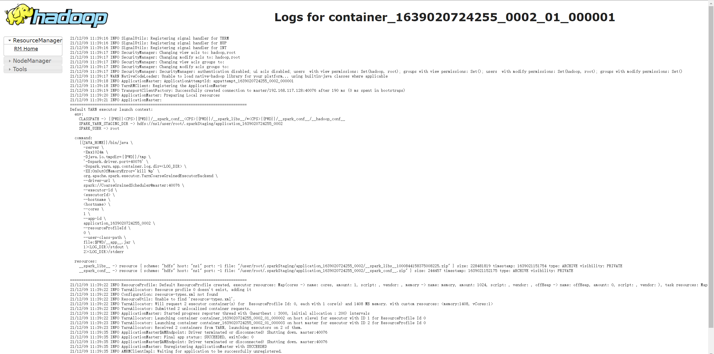
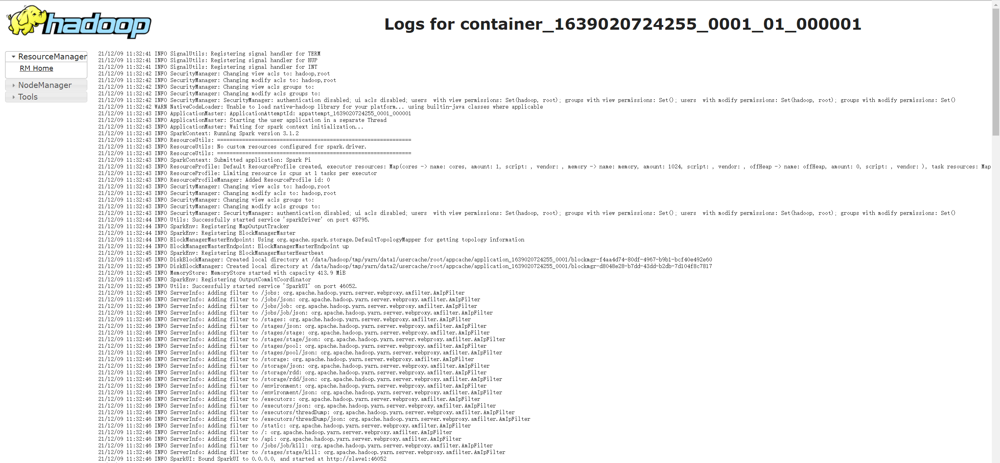

# Spark 应用提交

本文的主要目标是探究用户应用程序的 **提交方式** 以及 **提交后的流转过程**。在开始前，我们需要理清以下几个核心概念：

|**名称**|**说明**|
|---|---|
|SparkSubmit|提交 Spark 应用的进程，运行在本地机器|
|Driver |运行用户程序 `main()` 函数并创建 SparkContext 的实例（不是进程）|
|Executor|执行实际计算任务的实例（不是进程）|
|Master|Standalone 模式下主节点的进程，负责资源的调度与分配，以及集群的监控|
|Worker|Standalone 模式下从节点的进程，负责 Executor 的启动，cluster 模式下负责 Driver 的启动|
|ApplicationMaster|Yarn 模式下的协调进程，负责 Executor 的启动，cluster 模式下负责 Driver 的启动|

:::info

Driver 与 Executor 基本上都是由其他进程启动的实例，其本身并不是进程。

:::

## Spark Submit

`spark-submit` 是官方提供的提交用户程序到 Spark 集群的脚本工具，位于 Spark 安装路径下的 `bin` 目录。

以下为提交应用的命令行示例：

```bash
./bin/spark-submit \
  --class <main-class> \
  --master <master-url> \
  --deploy-mode <deploy-mode> \
  --conf <key>=<value> \
  ... # other options
  <application-jar> \
  [application-arguments]
```

其中，主要参数的含义可参考下表：

|**参数名**|**含义**|
|---|---|
|--class|用户程序 `main()` 函数所在类|
|--master|指定 Spark 应用的运行模式，可以是 `local`、`yarn`、`spark://master:7077` 等|
|--deploy-mode|指定 Spark 应用的部署模式，可以是 `client` 或 `cluster`，默认为 `client`|
|`<application-jar>`|用户程序对应 jar 包，可以是本地文件，也可以是 HDFS 上的文件|
|[application-arguments]|用户程序 `main()` 函数的入参|

:::caution

`--deploy-mode` 中 `client` 和 `cluster` 的区别在于：前者在执行 `spark-submit` 的服务器上启动 Driver，且客户端进程在应用执行结束后才会退出，会占用客户端所在服务器的资源；后者的 Driver 由集群负责启动，且客户端进程在应用提交后即可退出，不会占用客户端所在服务器的资源。

:::

## Standalone Client 模式

### 提交命令

Standalone Client 模式的提交命令如下：

```bash
./bin/spark-submit \
  --class org.apache.spark.examples.SparkPi \
  --master spark://master:7077 \
  --deploy-mode client \
  ./examples/jars/spark-examples_2.12-3.1.2.jar \
  10
```

### 流转过程

1. 用户执行提交命令，SparkSubmit 通过反射执行用户程序的 `main` 方法（此时 Driver 运行在 SparkSubmit 进程中）
2. Driver 与 Master 建立连接并发送 RegisterApplication 请求，向 Master 发起注册应用的申请
3. Driver 注册成功后，发送 RequestExecutors 请求，向 Master 申请 Executor 资源
4. Master 接收到申请，向 Worker 发送 LaunchExecutor 请求，要求 Worker 启动 Executor
5. Worker 接收到指令，启动 CoarseGrainedExecutorBackend 进程，再由该进程启动 Executor
6. CoarseGrainedExecutorBackend 向 Driver 发送 RegisterExecutor 请求，将启动后的 Executor 注册到 Driver
7. 拥有 Executor 资源后，Driver 即可开始分发 Task （由 DAG 切分而来，是最小执行单元）到 Executor 上执行计算

:::info

从 **步骤 5 **即可看出，Executor 并非进程，其状态后端 CoarseGrainedExecutorBackend 才是。

:::

Standalone Client 模式的流转示意图如下：



### 日志查看

在 Standalone Client 模式下，各进程（组件）的日志文件路径如下：

|**进程（组件）名**|**日志路径**|**日志文件名称**|
|---|---|---|
|Master|`/${SPARK_HOME}/logs`|`xxx-org.apache.spark.deploy.master.Master-xxx.out`|
|Worker|`/${SPARK_HOME}/logs`|`xxx-org.apache.spark.deploy.master.Worker-xxx.out`|
|Driver|输出到控制台|-|
|Executor|`/${SPARK_HOME}/work/app-xxx/0/`|`stderr` 和 `stdout`|

## Standalone Cluster 模式

### 提交命令

Standalone Cluster 模式的提交命令如下：

```bash
./bin/spark-submit \
  --class org.apache.spark.examples.SparkPi \
  --master spark://master:7077 \
  --deploy-mode cluster \
  ./examples/jars/spark-examples_2.12-3.1.2.jar \
  10
```

### 流转过程

1. 用户执行提交命令，SparkSubmit 识别出 Standalone Cluster 模式并初始化 Client 实例
2. Client 实例与 Master 建立连接并发送 RequestSubmitDriver 请求，向 Master 申请启动 Driver
3. Master 接收到申请，向 Worker 发送 LaunchDriver 请求，要求 Worker 启动 Driver
4. Worker 接收到指令，启动DriverWrapper 进程，由 DriverWrapper 通过反射执行用户程序的 `main` 方法
5. 后续的步骤便与 Standalone Client 模式一致

:::info

从 **步骤 4** 即可看出，Driver 并非进程，DriverWrapper 才是。

:::

以下为 Standalone Cluster 模式的流转示意图：



### 日志查看

在 Standalone Cluster 模式下，各进程（组件）的日志文件路径如下：

|**进程（组件）名**|**日志路径**|**日志文件名称**|
|---|---|---|
|Master|`/${SPARK_HOME}/logs`|`xxx-org.apache.spark.deploy.master.Master-xxx.out`|
|Worker|`/${SPARK_HOME}/logs`|`xxx-org.apache.spark.deploy.master.Worker-xxx.out`|
|Driver|`/${SPARK_HOME}/work/drive-xxx/`|`stderr` 和 `stdout`|
|Executor|`/${SPARK_HOME}/work/app-xxx/0/`|`stderr` 和 `stdout`|

## Yarn Client 模式

### 提交命令

Yarn Client 模式的提交命令如下：

```bash
./bin/spark-submit \
  --class org.apache.spark.examples.SparkPi \
  --master yarn \
  --deploy-mode client \
  ./examples/jars/spark-examples_2.12-3.1.2.jar \
  10
```

### 流转过程

1. 用户执行提交命令，SparkSubmit 通过反射执行用户程序的 `main` 方法（此时 Driver 运行在 SparkSubmit 进程中）
2. Driver 中的 YarnClient 向 ResourceManager 提交启动 ExecutorLauncher 进程的申请
3. ResourceManager 收到请求后，会在某个 NodeManager 节点启动 ExecutorLauncher 进程，ExecutorLauncher 进程会调用 `ApplicationMaster.main()` 来启动 ApplicationMaster 实例
4. ApplicationMaster 实例与 ResourceManager 和 Driver 建立连接，然后向 ResourceManager 申请资源
5. 申请到资源后，ApplicationMaster 实例会与 NodeManager 建立连接，然后下达指令要求 NodeManager 启动 YarnCoarseGrainedExecutorBackend 进程
6. YarnCoarseGrainedExecutorBackend 启动后与 Driver 建立通信，并启动 Executor
7. YarnCoarseGrainedExecutorBackend 向 Driver 发送 RegisterExecutor 请求，将启动后的 Executor 注册到 Driver
8. 拥有 Executor 资源后，Driver 即可开始分发 Task （由 DAG 切分而来，是最小执行单元）到 Executor 上执行计算

:::danger

由于 Yarn 集群启动 Executor 的延时较长，Driver 端需要有一个等待机制确保 Executor 能正常分配到。该机制的实现将在《Spark 任务调度》中讲解。

:::

Yarn Client 模式的流转示意图如下：



### 日志查看

与 Standalone 模式不同，Yarn Client 模式中各进程（组件）的日志输出依赖于 Yarn 集群的配置，默认情况如下：

|**进程（组件）名**|**日志路径**|**日志文件名称**|
|---|---|---|
|ResourceManager|`/${HADOOP_HOME}/logs`|`hadoop-hadoop-resourcemanager-master.log`|
|NodeManager|`/${HADOOP_HOME}/logs`|`hadoop-hadoop-nodemanager-master.log`|
|ApplicationMaster|`/${HADOOP_HOME}/logs/userlogs/application_xxx/container_xxx`|`stderr` 和 `stdout`|
|Driver|输出到控制台|-|
|Executor|`/${HADOOP_HOME}/logs/userlogs/application_xxx/container_xxx`|`stderr` 和 `stdout`|

:::caution

Yarn 集群的 NodeManager 使用本地路径存储日志时（即 `yarn-site.xml` 使用配置项 `yarn.nodemanager.log-dirs`），由于 ApplicationMaster 和 Executor 可能运行在不同节点，两者的日志也可能存储在不同节点。

:::

当然，也可通过 Yarn 的 Web UI（地址为：[http://master:8088/cluster](http://master:8088/cluster)）查看运行日志：



不过，在 Yarn Client 模式下，因为 Driver 的日志是直接输出到客户端的控制台上，Yarn Web UI 上只能看到 ApplicationMaster 的日志，所以在该模式下 Yarn 的 Web UI 并没有多少实用价值。

## Yarn Cluster 模式

### 提交命令

Yarn Cluster 模式的提交命令如下：

```bash
./bin/spark-submit \
  --class org.apache.spark.examples.SparkPi \
  --master yarn \
  --deploy-mode cluster \
  ./examples/jars/spark-examples_2.12-3.1.2.jar \
  10
```

### 流转过程

1. 用户执行提交命令，SparkSubmit 识别出 Yarn Cluster 模式并初始化 Client 实例
2. Client 实例中的 YarnClient 向 ResourceManager 提交启动 ApplicationMaster 进程的申请
3. ResourceManager 收到请求后，会在某个 NodeManager 节点启动 ApplicationMaster 进程
4. ApplicationMaster 进程会在内部使用单独的线程启动 Driver 实例，执行用户程序代码
5. Driver 成功启动后，ApplicationMaster 进程会与 ResourceManager 建立连接，然后申请资源
6. 后续的步骤便与 Yarn Client 模式一致

:::caution

该模式中 Client 实例的包路径为 `org.apache.spark.deploy.yarn`，与 Standalone Cluster 模式的 Client 不同。

:::

以下为 Yarn Cluster 模式的流转示意图：



### 日志查看

在 Yarn Cluster 模式中，默认情况下各进程（组件）的日志文件路径如下：

|**进程（组件）名**|**日志路径**|**日志文件名称**|
|---|---|---|
|ResourceManager|`/${HADOOP_HOME}/logs`|`hadoop-hadoop-resourcemanager-master.log`|
|NodeManager|`/${HADOOP_HOME}/logs`|`hadoop-hadoop-nodemanager-master.log`|
|ApplicationMaster|`/${HADOOP_HOME}/logs/userlogs/application_xxx/container_xxx`|`stderr` 和 `stdout`|
|Driver|同 ApplicationMaster|同 ApplicationMaster|
|Executor|`/${HADOOP_HOME}/logs/userlogs/application_xxx/container_xxx`|`stderr` 和 `stdout`|

同样地，我们也可通过 Yarn 的 Web UI（地址为：[http://master:8088/cluster](http://master:8088/cluster)）查看运行日志，如下图所示：



在 Yarn Cluster 模式中，因为 Driver 是以独立线程的形式运行在 ApplicationMaster 进程中的，所以我们可以直接在 Yarn Web UI 中查看 Driver 的日志，这给我们带来非常大的便利。

但与此同时，它也带来了一个问题。**如果开发人员没有 Yarn 集群的权限，那么他要怎么控制 Driver 的日志输出级别？**因为 Driver 是依赖于 ApplicationMaster 进程的，用户程序中即便配有 `log4j.properties` 也不会生效。

这里提出两种解决方案。

第一种方案，提交应用时指定并上传 Driver 的 log4j 配置文件：

```bash
./bin/spark-submit \
  --class org.apache.spark.examples.SparkPi \
  --master yarn \
  --deploy-mode cluster \
  --driver-java-options "-Dlog4j.configuration=log4j-driver.properties" \
  --files /opt/spark-yarn/conf/log4j-driver.properties \
  ./examples/jars/spark-examples_2.12-3.1.2.jar \
  10
```

第二种方案，在用户程序中动态修改日志级别：

```scala
Logger.getLogger("org.apache.spark").setLevel(Level.toLevel("ERROR", Level.INFO))
```


