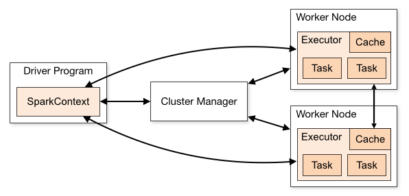
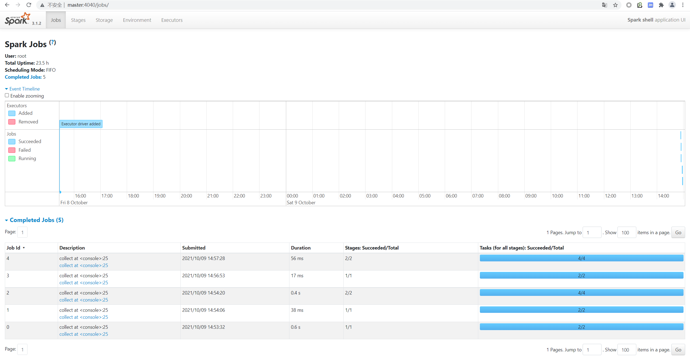

# Spark 快速入门

## Spark 简介

Apache Spark 是用于大规模数据处理的统一分析引擎，与 Hadoop 计算框架 MapReduce 相比，Spark 具备以下特点：

- 使用弹性分布式数据集（Resilient Distributed Datasets，简称 RDD），提供了比 MapReduce 更为丰富的模型
- 基于内存计算，计算性能高于 MapReduce
- 易用性好，提供了 Java、Scala、Python 等语言的 API，还支持用于功能验证和测试的交互式 Shell
- 超强的通用性，集离线计算、实时计算、交互式查询、机器学习和图计算于一体

:::caution

在基于内存计算这方面，Spark 确实比 MR 优秀，它减少了部分中间结果的磁盘输出。但目前国内很多教程对这块的解读是不严谨的，甚至有知名老师说出这样容易让人误解的言论：**内存计算的优势主要体现在 Shuffle 上，Shuffle 优先基于内存实现，可不写磁盘。** 关于 Spark 内存计算的真相，可以查阅这篇文章：[https://0x0fff.com/spark-misconceptions。](https://0x0fff.com/spark-misconceptions/)

:::

## Spark 核心模块

Spark 包含 Spark Core、Spark SQL、Spark Streaming、MLlib、GraphX 等模块，各模块功能可见下表：

|**模块名称**|**模块功能**|
|---|---|
|Spark Core|提供 Spark 最核心的功能，是 Spark SQL、Spark Streaming 等其他模块实现的基础|
|Spark SQL|提供基于 SQL 或 HQL（Apache Hive 提供的 SQL 方言）进行数据查询的组件|
|Spark Streaming|Spark 平台上针对实时数据进行流式计算的组件|
|MLlib|Spark 平台的机器学习算法库|
|GraphX |Spark 面向图计算的组件与算法库|


## Spark 运行架构

Spark 的运行架构如下图所示：



### Spark 运行过程

根据运行架构图，我们来简述一下 Spark 应用的运行过程：

1. Driver 执行用户程序（Application）的 `main()` 方法并创建 SparkContext，与 Cluster Manager 建立通信
2. Cluster Manager 为用户程序分配计算资源，返回可供使用的 Executor 列表
3. 获取 Executor 资源后，Spark 会将用户程序代码及依赖包（Application jar）传递给 Executor（即移动计算）
4. 最后，SparkContext 发送 tasks（经拆解后的任务序列）到 Executor，由其执行计算任务并输出结果

### Spark 常见术语

在 Spark 运行过程中，我们发现存在一些术语。为方便理解，我们将这些术语及其含义整理如下：

|**术语**|**含义**|
|---|---|
|Application|基于 Spark 构建的用户程序|
|Application jar|包含用户 Spark 应用程序的 jar 包（不包含 Hadoop 和 Spark 依赖包，运行时由集群导入）|
|Driver Program|运行用户程序 `main()` 函数并创建 SparkContext 的进程|
|SparkContext|用户程序与 Spark 集群交互的主要入口，用于创建 RDD、累加器和广播变量等|
|Cluster Manager|集群资源管理器，其实现可以是 Standalone、Mesos、YARN 或 Kubernetes|
|Master Node|独立部署集群中的主节点，负责资源调度，类比 Yarn 中的 ResourceManager|
|Worker Node|独立部署集群中的从节点，负责执行计算任务，类比 Yarn 中的 NodeManager|
|Executor|Worker 节点上负责执行实际计算任务的组件|
|Task|分区级别的计算任务，是 Spark 中最基本的任务执行单元|

:::info

此处的 Task 与用户提交的计算应用不是同一个概念。用户提交的计算应用对应于一个或多个 Job，每个 Job 可拆分为一个或多个 Stage，每个 Stage 又由一个或多个 Task 组成，简而言之，即 **Job > Stage > Task**。关于 Job、Stage、Task 三者间的具体关系，将在后续篇章进行讨论。

:::

## Spark 运行模式

Spark 的运行模式包含本地模式、独立运行模式、Mesos、YARN、Kubernetes 等。用户可以在提交 Spark 应用时通过参数 `--master` 指定 Spark 的运行模式。

本节简要介绍几种在国内比较常见的运行模式。

### 本地模式

本地模式（Local）由单机的多个线程模拟 Spark 分布式计算，直接运行在本地，常用于开发调试。

使用本地模式时，`--master` 可以有以下几种取值：

- local：只启动一个 Executor
- local[N]：启动 N 个 Executor
- local[*]：启动与 CPU 核数相同的 Executor

### 独立运行模式

独立运行模式（Standalone）以经典的 Master-Slave 模式部署 Spark 集群，由 Spark 独立提供计算资源。

使用独立运行模式时，`--master` 的取值为 Master 节点的地址，例如：`spark://master:7077`。

### YARN 模式

YARN 模式由 YARN 完成集群计算资源的调度，无需部署和启动 Spark 集群。

使用 YARN 模式时，只需指定 `--master` 为 `yarn` 即可。

## Spark 初体验

本节将展示一个 Spark 应用程序从代码编写到提交执行的过程，以加深我们对上述知识的理解。

### Spark 应用开发

Spark 提供了 Java、Scala、Python 等语言的 API。在本例中，我们使用 Scala 进行 Spark 应用的开发。

首先，使用 Maven 创建 Scala 项目，并添加 Spark 的依赖，如下所示：

```xml
<dependency>
    <groupId>org.apache.spark</groupId>
    <artifactId>spark-core_2.12</artifactId>
    <version>3.1.2</version>
    <scope>provided</scope>
</dependency>
```

:::caution

Scala 的版本与 Spark 要保持一致，避免出现兼容性问题。具体版号对照，可参考 Spark 官网。

:::

然后，我们编写一个词频统计的计算程序，具体代码如下所示：

```scala
import org.apache.spark.rdd.RDD
import org.apache.spark.{SparkConf, SparkContext}

object WordCount {

  def main(args: Array[String]): Unit = {
    val conf: SparkConf = new SparkConf().setMaster("local").setAppName("WordCount App")
    val sc: SparkContext = new SparkContext(conf)

    // 读取每行数据
    val lines: RDD[String] = sc.textFile("data/wc.txt")
    // 获取所有单词
    val words: RDD[String] = lines.flatMap(_.split(" "))
    // 将单词转为 map，例如：(spark, 1)
    val wordMap: RDD[(String, Int)] = words.map((_, 1))
    // 根据 key 进行聚合，得出词频集合
    val results: RDD[(String, Int)] = wordMap.reduceByKey(_ + _)

    results.collect().foreach(result => println(result))
  }
}
```


完成代码开发后，可以使用 `mvn clean package` 命令进行打包。在本例中，打包后的 jar 包名为 `spark-demo-1.0.0.jar`。

### Spark 应用提交

将上述 jar 包上传至 Spark 安装目录下，使用 `spark-submit` 以本地模式提交应用：

```bash
bin/spark-submit \
--class com.panda.WordCount \
--master local \
spark-demo-1.0.0.jar
```

其中，`--class` 用于指定用户程序的主类，`--master` 用于指定运行模式。

提交后，即可在控制台看到词频统计结果。

:::info

使用本地模式提交作业时，无需启动 Driver 和 Executor。它会启动 SparkSubmit 进程，由该进程充当 Driver 和 Executor 的角色，并且在用户程序执行完毕后终止。

:::

### Spark Shell

除了 `spark-submit` 外，我们还可以使用 `spark-shell` 提交计算应用：

```纯文本
[root@master bin]# ./spark-shell 
21/10/08 15:27:21 WARN NativeCodeLoader: Unable to load native-hadoop library for your platform... using builtin-java classes where applicable
Using Spark's default log4j profile: org/apache/spark/log4j-defaults.properties
Setting default log level to "WARN".
To adjust logging level use sc.setLogLevel(newLevel). For SparkR, use setLogLevel(newLevel).
Spark context Web UI available at http://master:4040
Spark context available as 'sc' (master = local[*], app id = local-1633678049624).
Spark session available as 'spark'.
Welcome to
      ____              __
     / __/__  ___ _____/ /__
    _\ \/ _ \/ _ `/ __/  '_/
   /___/ .__/\_,_/_/ /_/\_\   version 3.1.2
      /_/
         
Using Scala version 2.12.10 (Java HotSpot(TM) 64-Bit Server VM, Java 1.8.0_251)
Type in expressions to have them evaluated.
Type :help for more information.

scala>
```


正如日志中显示的，在交互界面中，我们可以通过 `sc` 获得 SparkContext 对象，通过 `spark` 获得 SparkSession 对象，无需再对其进行初始化操作。

在交互界面中，词频统计的实现显得更为简单：

```scala
scala> sc.textFile("data/wc.txt").flatMap(_.split(" ")).map((_, 1)).reduceByKey(_ + _).collect()

```


执行上述代码后，控制台便可以输出统计结果：

```纯文本
res5: Array[(String, Int)] = Array((word,1), (hello,2), (spark,1))
```


与此同时，我们也可以通过 Web UI 来查看执行过程中的细节，如图所示：



显然，与 `spark-submit` 相比，`spark-shell` 无需上传 jar 包，更易于功能的开发与调试。


