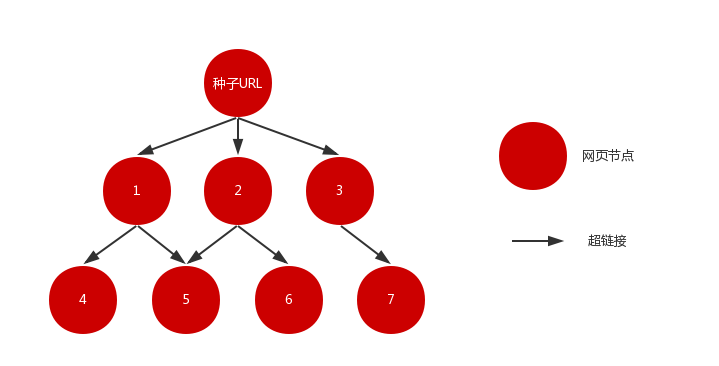
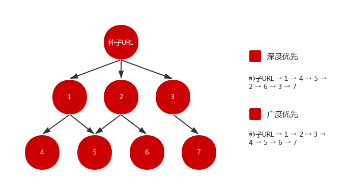

# Java 爬虫从入门到实战

## 背景介绍

我们发现了一些关于数据的有趣的现象。

对于科研工作者来说，从事机器学习和人工智能的研究离不开数据的支撑，他们需要大量的样本来进行推演测试与算法优化。

对于金融从业者来说，进行行业研究和市场分析离不开数据的帮助，他们需要充分的数据来分析市场现状和预测未来走势。

对于电商运营者来说，用户流量和转化率的提升离不开数据的引导，他们需要丰富的数据来决定营销方案和优化页面体验。

……

从没有哪个时代，像今天这样，对数据有着如此迫切的需求。越来越多的个体和单位注意到，业务的扩展延伸，离不开数据的支持。没有数据作为基础，很多研究与业务将被束之高阁，毫无崭露头角的机会。

爬虫，就是在这样的一个背景下，应运而生。

## 简介

爬虫，是一种自动从互联网采集数据的程序。

看似简单的一句定义，实则蕴含着丰富的内容。

第一，它指出了爬虫的对象。爬虫程序的采集对象是互联网资源，整个互联网数以亿计的网页，都可以是它的目标。

第二，它指出了爬虫的行为。爬虫程序的行为是自动的、扩展的，理论上，它的采集对象可以由种子 URL 出发，逐步扩充到整个互联网。

这如何理解呢？

假设种子 URL 所指向的网页为某一节点，而网页中所包含的 URL 链接为指向下一节点的路径，那么由种子 URL 出发，我们可以很容易地获得一个有向图。理论上，只要遍历该图，就可以采集互联网中的绝大部分网页。

但实际上，采集整个互联网的网页，几乎是一件不可能的事。

爬虫程序面临着两个几乎是无解的难题：

- 互联网巨大的网页数量
- 互联网网站爆炸性的增长速度

在现实世界中，无论硬件的配置多高、算法的效率多优秀，爬虫程序基本都无法实现在给定的时间内采集全网的页面。因此，在实际的爬虫程序的设计中，通常会根据目标的特征和项目的目的来选取合适的网页采集策略，以此实现最高效率的采集。

最常见的网页采集策略有深度优先与广度优先。

如图所示，深度优先从种子 URL 进入，提取该页的 URL，选择其中之一进入下一层，之后再不断向下采集，直到没有链接可以提取。这就像递归，一层一层进入方法内部，栈深不断加深，直到达到某一条件，再逐一出栈。但就像我们会遇到堆栈溢出（stackoverflow）一样，深度优先策略在遇到内容层次非常深的网站时可能就会遇到长期陷入的风险，导致资源的巨大浪费。

广度优先则是优先采集当前层次页面，在完成当前层次页面的采集后，才进入下一层采集。这种策略追求广度，覆盖面较广，且可以控制页面的采集深度，避免遇到无穷深度分支时无法退出的问题，但是，由于其层层深入的特性，也导致了该策略需要花费较长的时间才能采集到层次较深的页面。

由于广度优先策略的实现相对简单、应用面较广，因此本教程基于广度优先策略，从零开始一步步构建一个完整的简易爬虫程序。

直通车就在下方，欢迎上车。行驶过程中若有发现纰漏之处，也请多多指点！

## 项目源码

[https://github.com/magicpenta/spider.git](https://github.com/magicpenta/spider.git)