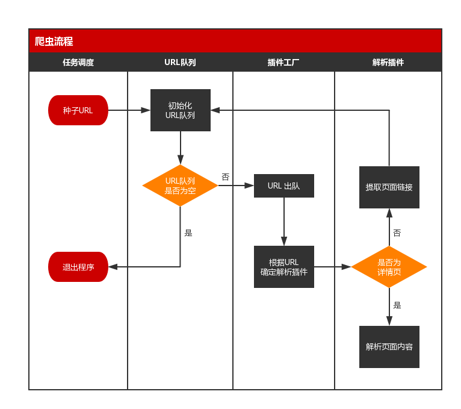

# 一个简易 Java 爬虫程序的实现

:::info

前面，我们分别介绍了爬虫程序的 3 个部分：源码下载、内容解析、页面链接提取。现在，让我们把这些部分串起来，构建一个完整的简易爬虫程序。

:::

## 一、爬虫流程

构建程序前，我们首先需要了解爬虫的具体流程。

一个简易的爬虫程序，具备以下流程：



若以文字表述，就是：

1. 从任务库（可以是 MySQL 等关系型数据库）选取种子 URL；
2. 在程序中初始化一个 URL 队列，将种子 URL 加入到队列中；
3. 若 URL 队列不为空，则位于队头的 URL 出队；若 URL 队列为空，则退出程序；
4. 程序根据出列的 URL，反射出对应的解析类，同时新建线程，开始解析任务；
5. 程序将下载 URL 指向的网页，并判断该页面是详情页还是列表页（如博客中的博客详情与博文列表），若为详情页，则解析出页面内容并入库，若为列表页，则提取出页面链接，加入到 URL 队列中；
6. 解析任务完成后，重复第 3 步。

## 二、程序结构

我们已经清楚爬虫的具体流程，现在，我们需要一个合理的程序结构来实现它。

首先，介绍一下该简易爬虫程序的主要结构组成：

|类名|作用|
|---|---|
|SpiderApplication.java|程序入口，负责任务调度，初始化 URL 队列，线程调度|
|DownloadService.java|下载服务类，负责下载 URL 指向的页面|
|PluginFactory.java|插件工厂，根据 URL 反射对应的插件类（解析类）|
|Plugin.java|插件注解类，用于插件（解析类）的注解|
|AbstractPlugin.java|抽象插件类，所有插件（解析类）的父类，包含公用方法|
|XmuPlugin.java|具体插件类，负责指定 URL 的解析任务|

然后，再了解一下程序中的工具类与实体类。

|类名|作用|
|---|---|
|LinkFilter.java|链接过滤接口，规范过滤方法|
|LinkExtractor.java|基于 htmlparser 的链接提取类|
|HttpUtil.java|封装 HttpClient 的工具类|
|CommonUtil.java|程序通用工具类|
|Task.java|任务对象|
|HttpParams.java|http 请求对象|
|Proxy.java|代理配置类|
|StructData.java|结构化数据|

最后，我们根据类的作用，将其放置到上述流程图中对应的位置中。具体的示意图如下所示：


现在，我们已经完成了实际流程到程序逻辑的转换。接下来，我们将通过源码的介绍，深入到程序中的各个细节。

## 三、任务调度、初始化队列

在简易爬虫程序中，任务调度、初始化队列都在 SpiderApplication 类中完成。

```java
package main;

import entity.Task;
import factory.PluginFactory;
import org.slf4j.Logger;
import org.slf4j.LoggerFactory;
import plugins.AbstractPlugin;

import java.util.*;
import java.util.zip.CRC32;

/**
 * 应用入口
 *
 * @author panda
 * @date 2017/10/28
 */
public class SpiderApplication {

    private static final Logger logger = LoggerFactory.getLogger(SpiderApplication.class);

    // URL 队列
    private static Queue<String> urlQueue = new LinkedList<String>();

    // URL 排重
    private static Map<Long, Integer> urlPool = new HashMap<Long, Integer>();

    public static void main(String[] args) {

        // 实例化任务对象
        Task task = Task.getBuilder()
                .setUrl("http://sm.xmu.edu.cn/")
                .build();

        // 初始化 URL 队列
        urlQueue.add(task.getUrl());
        addUrlPool(task.getUrl(), 1);

        // 循环调度
        String taskUrl;
        while ((taskUrl = urlQueue.poll()) != null) {
            logger.info("当前任务URL：" + taskUrl + "，当前层深：" + getDepth(taskUrl));

            try {
                task.setUrl(taskUrl);
                AbstractPlugin plugin = PluginFactory.getInstance().getPlugin(task);
                plugin.run();

                if (plugin.getUrlList() != null) {
                    int depth = getDepth(taskUrl) + 1;
                    for (String url : plugin.getUrlList()) {
                        if (!isUrlExist(url)) {
                            urlQueue.add(url);
                            addUrlPool(url, depth);
                        }
                    }
                }

                Thread.sleep(300);
            } catch (Exception e) {
                continue;
            }
        }

    }

    /**
     * 添加链接到 url 池
     *
     * @param url
     * @param depth
     */
    private static void addUrlPool(String url, int depth) {
        CRC32 c = new CRC32();
        c.update(url.getBytes());

        urlPool.put(c.getValue(), depth);
    }

    /**
     * 判断 url 是否重复
     *
     * @param url
     * @return
     */
    private static boolean isUrlExist(String url) {

        CRC32 c = new CRC32();
        c.update(url.getBytes());

        return urlPool.containsKey(c.getValue());
    }

    /**
     * 获得层深
     *
     * @param url
     * @return
     */
    private static Integer getDepth(String url) {

        CRC32 c = new CRC32();
        c.update(url.getBytes());

        return urlPool.get(c.getValue()) == null ? 1 : urlPool.get(c.getValue());
    }

}

```

我们看到，SpiderApplication 有两个静态成员变量，分别用于存放 URL 队列和 URL 排重集合。

首先，我们介绍任务调度部分。由于本例是简易的爬虫程序，因此不从数据库抓取任务，而是直接在程序中通过建造者模式实例化一个任务对象。

```java
Task task = Task.getBuilder()
                .setUrl("http://sm.xmu.edu.cn/")
                .build();
```

然后，我们将种子 URL 添加到 URL 队列中。

```java
urlQueue.add(task.getUrl());
addUrlPool(task.getUrl(), 1);
```

其中，`addUrlPool(String url, int depth)` 方法会将 url 加入到排重池中，并标记 url 的采集深度。

接着，我们开始对 URL 队列进行循环调度，直至 URL 队列为空，才退出程序。

```java
while ((taskUrl = urlQueue.poll()) != null) {
    logger.info("当前任务URL：" + taskUrl + "，当前层深：" + getDepth(taskUrl));
    ...
}
```

## 四、插件工厂

在 URL 循环调度中，有个语句需要我们注意：

```java
AbstractPlugin plugin = PluginFactory.getInstance().getPlugin(task);
```

其中，AbstractPlugin 是一个继承 Thread 的抽象插件类。

该语句的意思是，由插件工厂，根据 url，反射实例化继承了 AbstractPlugin 的指定插件。

插件工厂，也可以理解为解析类工厂。

为什么会存在这个定义呢？

我们知道，一个完整的爬虫程序，要能实现大量不同网站的采集，而不是仅仅针对单一网站。由于每个网站的页面布局不同，解析方法也不尽相同，这时候，就需要由一个个插件来负责对应网站的解析。而插件工厂的存在，就是为了管理这些插件，使程序能根据任务 url 来动态地选择插件（解析类）。

在本程序中，插件工厂的实现主要依靠三方面：

### 4.1 Plugin

```java
package plugins;

import java.lang.annotation.*;

/**
 * 插件注解
 *
 * @author panda
 * @date 2017/12/01
 */
@Target({ElementType.TYPE})
@Retention(RetentionPolicy.RUNTIME)
@Documented
public @interface Plugin {
    String value() default "";
}

```

Plugin 实际上是一个注解接口，有 Plugin 的支持，我们可以实现让程序通过注解 `@Plugin` 来识别插件类。这就像 SpringMVC 中，我们通过 `@Controller`、`@Service` 等识别一个个 Bean。

### 4.2 XmuPlugin

```java
@Plugin(value = "sm.xmu.edu.cn")
public class XmuPlugin extends AbstractPlugin {

}
```

XmuPlugin 是众多插件（解析类）之一，由注解 `@Plugin` 标志角色，由注解中的 value 标志其具体身份（即对应哪个 url）。

### 4.3 PluginFactory

```java
package factory;

import entity.Task;
import org.slf4j.Logger;
import org.slf4j.LoggerFactory;
import plugins.AbstractPlugin;
import plugins.Plugin;
import util.CommonUtil;

import java.io.File;
import java.lang.annotation.Annotation;
import java.lang.reflect.Constructor;
import java.util.ArrayList;
import java.util.HashMap;
import java.util.List;
import java.util.Map;

/**
 * 插件工厂
 *
 * @author panda
 * @date 2017/12/01
 */
public class PluginFactory {

    private static final Logger logger = LoggerFactory.getLogger(PluginFactory.class);

    private static final PluginFactory factory = new PluginFactory();

    private List<Class<?>> classList = new ArrayList<Class<?>>();

    private Map<String, String> pluginMapping = new HashMap<String, String>();

    private PluginFactory() {
        scanPackage("plugins");
        if (classList.size() > 0) {
            initPluginMapping();
        }
    }

    public static PluginFactory getInstance() {
        return factory;
    }

    /**
     * 扫描包、子包
     *
     * @param packageName
     */
    private void scanPackage(String packageName) {
        try {
            String path = getSrcPath() + File.separator + changePackageNameToPath(packageName);
            File dir = new File(path);
            File[] files = dir.listFiles();

            if (files == null) {
                logger.warn("包名不存在！");
                return;
            }

            for (File file : files) {
                if (file.isDirectory()) {
                    scanPackage(packageName + "." + file.getName());
                } else {
                    Class clazz = Class.forName(packageName + "." + file.getName().split("\\.")[0]);
                    classList.add(clazz);
                }
            }
        } catch (Exception e) {
            logger.error("扫描包出现异常：", e);
        }
    }

    /**
     * 获取根路径
     *
     * @return
     */
    private String getSrcPath() {
        return System.getProperty("user.dir") +
                File.separator + "src" +
                File.separator + "main" +
                File.separator + "java";
    }

    /**
     * 将包名转换为路径格式
     *
     * @param packageName
     * @return
     */
    private String changePackageNameToPath(String packageName) {
        return packageName.replaceAll("\\.", File.separator);
    }

    /**
     * 初始化插件容器
     */
    private void initPluginMapping() {
        for (Class<?> clazz : classList) {
            Annotation annotation = clazz.getAnnotation(Plugin.class);
            if (annotation != null) {
                pluginMapping.put(((Plugin) annotation).value(), clazz.getName());
            }
        }
    }

    /**
     * 通过反射实例化插件对象
     * @param task
     * @return
     */
    public AbstractPlugin getPlugin(Task task) {

        if (task == null || task.getUrl() == null) {
            logger.warn("非法的任务！");
            return null;
        }

        if (pluginMapping.size() == 0) {
            logger.warn("当前包中不存在插件！");
            return null;
        }

        Object object = null;

        String pluginName = CommonUtil.getHost(task.getUrl());
        String pluginClass = pluginMapping.get(pluginName);

        if (pluginClass == null) {
            logger.warn("不存在名为 " + pluginName + " 的插件");
            return null;
        }

        try {
            logger.info("找到解析插件：" + pluginClass);
            Class clazz = Class.forName(pluginClass);
            Constructor constructor = clazz.getConstructor(Task.class);
            object = constructor.newInstance(task);
        } catch (Exception e) {
            logger.error("反射异常：", e);
        }

        return (AbstractPlugin) object;
    }

}
```

PluginFactory 的作用主要是两个：

- 扫描插件包下有 `@Plugin` 注解的插件类；
- 根据 url 反射指定插件类。

## 五、解析插件

我们上面说到，解析插件实际上就是对应一个个网站的解析类。

由于实际爬虫的解析中，总有许多解析工作是相似甚至相同的，例如链接提取，因此，在解析插件中，我们首先要实现一个父接口，来提供这些公用方法。

本程序中，插件父接口即上面提到的 AbstractPlugin 类：

```java
package plugins;

import entity.Task;
import filter.AndFilter;
import filter.FileExtensionFilter;
import filter.LinkExtractor;
import filter.LinkFilter;
import org.apache.commons.lang3.StringUtils;
import org.slf4j.Logger;
import org.slf4j.LoggerFactory;
import service.DownloadService;
import util.CommonUtil;

import java.util.ArrayList;
import java.util.List;

/**
 * 插件抽象类
 *
 * @author panda
 * @date 2017/12/01
 */
public abstract class AbstractPlugin extends Thread {

    private static final Logger logger = LoggerFactory.getLogger(AbstractPlugin.class);

    protected Task task;

    protected DownloadService downloadService = new DownloadService();

    private List<String> urlList = new ArrayList<String>();

    public AbstractPlugin(Task task) {
        this.task = task;
    }

    @Override
    public void run() {
        logger.info("{} 开始运行...", task.getUrl());
        String body = downloadService.getResponseBody(task);
        if (StringUtils.isNotEmpty(body)) {
            if (isDetailPage(task.getUrl())) {
                logger.info("开始解析详情页...");
                parseContent(body);
            } else {
                logger.info("开始解析列表页...");
                extractPageLinks(body);
            }
        }
    }

    public void extractPageLinks(String body) {

        LinkFilter hostFilter = new LinkFilter() {
            String urlHost = CommonUtil.getUrlPrefix(task.getUrl());

            public boolean accept(String link) {
                return link.contains(urlHost);
            }
        };

        String[] fileExtensions = (".xls,.xml,.txt,.pdf,.jpg,.mp3,.mp4,.doc,.mpg,.mpeg,.jpeg,.gif,.png,.js,.zip," +
                ".rar,.exe,.swf,.rm,.ra,.asf,.css,.bmp,.pdf,.z,.gz,.tar,.cpio,.class").split(",");
        LinkFilter fileExtensionFilter = new FileExtensionFilter(fileExtensions);

        AndFilter filter = new AndFilter(new LinkFilter[]{hostFilter, fileExtensionFilter});

        urlList = LinkExtractor.extractLinks(task.getUrl(), body, filter);
    }

    public List<String> getUrlList() {
        return urlList;
    }

    public abstract void parseContent(String body);

    public abstract boolean isDetailPage(String url);

}
```

父接口定义了两个规则：

- 解析规则，即什么时候解析正文，什么时候提取列表链接；
- 提取链接规则，即过滤掉哪些不需要的链接。

但是我们注意到，父接口中用来解析网站正文内容的 `parseContent(String body)` 是抽象方法。而这，正是实际的插件类应该完成的事情。这里，我们以 XmuPlugin 为例：

```java
package plugins;

import entity.Task;
import org.jsoup.nodes.Document;
import org.jsoup.nodes.Element;
import org.jsoup.select.Elements;
import org.slf4j.Logger;
import org.slf4j.LoggerFactory;
import util.CommonUtil;
import util.FileUtils;

import java.text.SimpleDateFormat;
import java.util.Date;

/**
 * xmu 插件
 *
 * @author panda
 * @date 2017/12/01
 */
@Plugin(value = "sm.xmu.edu.cn")
public class XmuPlugin extends AbstractPlugin {

    private static final Logger logger = LoggerFactory.getLogger(XmuPlugin.class);

    public XmuPlugin(Task task) {
        super(task);
    }

    @Override
    public void parseContent(String body) {

        Document doc = CommonUtil.getDocument(body);

        try {
            String title = doc.select("p.h1").first().text();
            String publishTimeStr = doc.select("div.right-content").first().text();
            publishTimeStr = CommonUtil.match(publishTimeStr, "(\\d{4}-\\d{2}-\\d{2} \\d{2}:\\d{2}:\\d{2})")[1];
            Date publishTime = new SimpleDateFormat("yyyy-MM-dd HH:mm:ss").parse(publishTimeStr);
            String content = "";
            Elements elements = doc.select("p.MsoNormal");
            for (Element element : elements) {
                content += "\n" + element.text();
            }

            logger.info("title: " + title);
            logger.info("publishTime: " + publishTime);
            logger.info("content: " + content);

            FileUtils.writeFile(title + ".txt", content);
        } catch (Exception e) {
            logger.error(" 解析内容异常：" + task.getUrl(), e);
        }
    }

    @Override
    public boolean isDetailPage(String url) {
        return CommonUtil.isMatch(url, "&a=show&catid=\\d+&id=\\d+");
    }

}
```

在 XmuPlugin 中，我们做了两件事：

- 定义详文页的具体规则；
- 解析出具体的正文内容。

## 六、采集示例

至此，我们成功地完成了 Java 简易爬虫程序，下面，让我们看下实际的采集情况。


如动态图所示，程序成功地将网站上的新闻内容采集下来了。


