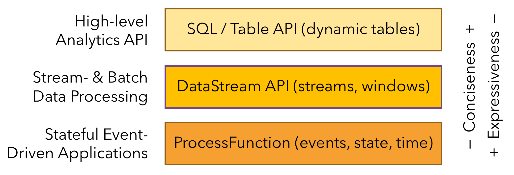
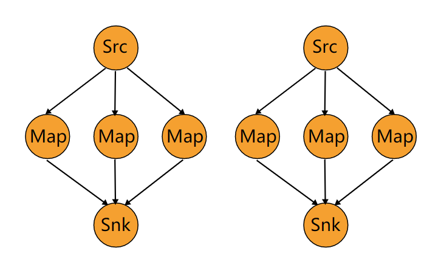

# Flink DataStream API

Flink 根据抽象程度分层，提供了三种不同的 API。每一种 API 在简洁性和表达力上有着不同的侧重，并且针对不同的应用场景。



DataStream API 是 Flink 中用于编写流处理作业的 API，为许多通用的流处理操作提供了处理原语。它支持 Java 和 Scala 语言，预先定义了例如 `map()`、`reduce()`、`aggregate()` 等函数。

在 DataStream API 中，Flink 应用程序同样包含以下步骤：

1. 获取 execution environment
2. 定义数据源
3. 执行转换操作
4. 输出到指定地点
5. 触发执行

本文将主要介绍其中的三大部分，分别是定义数据源的 Source、执行转换操作的 Transformation、输出计算结果的 Sink。

## Source

Source 层负责数据流的读取。Flink 官方已提供多种数据源 Connector，如 File、Socket、Kafka、RabbitMQ 等。同时，Flink 也支持用户自定义 Source。

### File-based

File-based Source 支持从文件中读取数据：

```java
DataStreamSource<String> source = env.readTextFile("data/xxx.log");
```

### Socket-based

Socket-based Source 支持从 Socket 连接中读取数据：<br />

```java
DataStreamSource<String> source = env.socketTextStream("xxx.xxx.xxx.xxx", 9999);
```

### Collection-based

Collection-based Source 支持从集合中读取数据：<br />

```java
DataStreamSource<String> source = env.fromCollection(collection);
```

### Kafka

对于 Kafka 数据源，官方提供了两种实现，分别为 Kafka Source 和 Kafka Consumer。

**Kafka Source 示例：**

```java
KafkaSource<String> kafkaSource = KafkaSource.<String>builder()
    .setBootstrapServers(KAFKA_BROKER_SERVERS)
    .setTopics("test")
    .setGroupId("panda")
    .setStartingOffsets(OffsetsInitializer.earliest())
    .setValueOnlyDeserializer(new SimpleStringSchema())
    .build();

DataStreamSource<String> source =
    env.fromSource(kafkaSource, WatermarkStrategy.noWatermarks(), "Kafka Source");
```

**Kafka Consumer 示例：**

```java
Properties consumerProperties = new Properties();
consumerProperties.setProperty(ConsumerConfig.BOOTSTRAP_SERVERS_CONFIG, KAFKA_BROKER_SERVERS);
consumerProperties.put(ConsumerConfig.GROUP_ID_CONFIG, "panda");
DataStreamSource<String> source =
    env.addSource(new FlinkKafkaConsumer<>("test", new SimpleStringSchema(), consumerProperties));
```

## Transformation

Transformation，又称算子，它可以将一个或多个的 DataStream 转换为新的 DataStream。通常，一个 Flink 应用作业会包含多个算子。<br />

本节，我们将根据官方文档，介绍一些基础的算子。

### Map

*DataStream -> DataStream*

Map 可以通过 **1** 个元素产生 **1** 个新元素。

本例中，Map 会将输入流的元素加倍：

```java
DataStream<Integer> dataStream = //...
dataStream.map(new MapFunction<Integer, Integer>() {
    @Override
    public Integer map(Integer value) throws Exception {
        return 2 * value;
    }
});
```

### FlatMap

*DataStream -> DataStream*

FlatMap 可以通过 **1** 个元素产生 **0、1 或更多** 的新元素。

本例中，FlatMap 会将输入的句子进行拆分，获得一个单词集合：

```java
dataStream.flatMap(new FlatMapFunction<String, String>() {
    @Override
    public void flatMap(String value, Collector<String> out) throws Exception {
        for(String word: value.split(" ")){
            out.collect(word);
        }
    }
});
```

### Filter

*DataStream -> DataStream*

Filter 可以根据用户设置的条件筛选出符合条件的元素。<br />

本例中，Filter 会保留输入流中值不为 0 的元素：

```java
dataStream.filter(new FilterFunction<Integer>() {
    @Override
    public boolean filter(Integer value) throws Exception {
        return value != 0;
    }
});
```

### KeyBy

*DataStream -> KeyedStream*

KeyBy 会将 key 值相同的记录分配到相同的分区中，其作用类似 SQL 中的 group by。<br />

在内部，KeyBy 是通过哈希分区实现的。

```java
dataStream.keyBy(value -> value.getSomeKey());
dataStream.keyBy(value -> value.f0);
```

:::caution

满足以下条件的类型 **不能成为 key**：POJO 类型，但不覆写 `hashCode()` 方法且依赖于 `Object.hashCode()` 实现；任何类型的数组。

:::

### Reduce

*KeyedStream -> DataStream*

Reduce 会将数据流中的元素与上一个 Reduce 后的元素进行合并且产生一个新值。这个合并发生在每次数据流入时，即每流入一个元素，都会有一次合并操作。

```java
keyedStream.reduce(new ReduceFunction<Integer>() {
    @Override
    public Integer reduce(Integer value1, Integer value2) throws Exception {
        return value1 + value2;
    }
});
```

:::caution

Reduce 不能用于无界流，因为对于无界流来说，合并是没有意义的。通常情况下，Reduce 作用于分组或窗口处理后的有界数据流。

:::

### Union

*DataStream\* -> DataStream*

Union 可以将 **两个或以上** 的数据流合并成一个。

```java
dataStream.union(otherStream1, otherStream2, ...);
```

### Connect

*DataStream, DataStream -> ConnectedStream*

Connect 可以连接 **两个** 数据流，并允许在两个流之间共享状态。

```java
DataStream<Integer> someStream = //...
DataStream<String> otherStream = //...

ConnectedStreams<Integer, String> connectedStreams = someStream.connect(otherStream);
```

Union 和 Connect 都有连接、合并的作用，但实际上两者是有区别的：

- Union 是多流合并，Connect 是双流合并
- Union 要求各个流的数据类型要一致，Connect 允许两个流的数据类型不同
- Connect 对被合并的流可以有不同的处理逻辑（参考 CoMap/CoFlatMap），更加灵活

### CoMap

*ConnectedStream -> DataStream*

CoMap 的作用同 Map，但它是作用在 ConnectedStream 上的。

```java
connectedStreams.map(new CoMapFunction<Integer, String, Boolean>() {
    @Override
    public Boolean map1(Integer value) {
        return true;
    }

    @Override
    public Boolean map2(String value) {
        return false;
    }
});
```

### CoFlatMap

*ConnectedStream -> DataStream*

CoFlatMap 的作用同 FlatMap，但它是作用在 ConnectedStream 上的。

```java
connectedStreams.flatMap(new CoFlatMapFunction<Integer, String, String>() {
   @Override
   public void flatMap1(Integer value, Collector<String> out) {
       out.collect(value.toString());
   }

   @Override
   public void flatMap2(String value, Collector<String> out) {
       for (String word: value.split(" ")) {
         out.collect(word);
       }
   }
});
```

## Partitioner

Flink 对数据流提供了分区控制。**其本质上，是将上游 Subtask 处理后的数据通过指定的分区策略输出到下游的 Subtask。**

### Custom

*DataStream -> DataStream*

Flink 支持用户编写自定义的 Partitioner 进行元素的分区选择。Custom Partitoner 只需实现 Partitioner 接口。

```java
dataStream.partitionCustom(partitioner, "someKey");
dataStream.partitionCustom(partitioner, 0);
```

### Random

*DataStream -> DataStream*

Random Partitioner 会根据均匀分布将数据流中的元素随机发往下游任意分区。

```java
dataStream.shuffle();
```

### Rebalance

*DataStream -> DataStream*

Rebalance Partioner 为 **默认分区器**，会通过轮询的方式将元素发往下游分区。

```java
dataStream.rebalance();
```

### Rescale

*DataStream -> DataStream*

Rescale Partioner 也是通过轮询的方式将元素发往下游分区，**但其在分区分配上与 Rebalance 有着非常大的差异。**

:::caution

Rebalance 不管上下游算子并行度为多少，每个上游算子都会被分配到所有下游算子。而在 Rescale 策略中，每个上游算子只会分配到下游算子中的某个子集。该分配机制是由 StreamingJobGraphGenerator 在将 StreamGraph 转换为 JobGraph 时实现的。

:::

我们举个例子。假设，上游并行度是 2，下游是 6，那么在 Rescale 策略下，上游的一个算子以循环的方式将元素输出到下游的 3 个算子上，另一个算子以循环的方式将元素输出到下游剩下的 3 个算子上，如下图所示：



若上游并行度是 6，下游并行度是 2，则上游 3 个算子会将元素输出到下游的一个算子上，上游的另外 3 个算子会将元素输出到下游的另一个算子上。

```java
dataStream.rescale();
```

:::info

在上下游算子并行度成比例的情况下，Rescale 会表现得比 Rebalance 更好，因为它可以减少上下游算子间数据传输所耗费的网络开销。

:::

### Broadcast

*DataStream -> DataStream*

Broadcast Partitioning 的作用正如广播一样，会将数据流中的元素分发到下游每个分区中（类比 Flume 中的 Replicating Selector，如果下游分区数为 8，则流中的元素复制 8 份）。

```java
dataStream.broadcast();
```

## Sink

Sink 层负责计算结果的输出。相较于 Source，官方对 Sink 组件的支持更加丰富，包括但不限于以下：Kafka、ElasticSearch、RabbitMQ、HDFS、JDBC、Redis。同样地，Flink 也支持用户自定义 sink。

### Print

Print Sink 由 PrintSinkFunction 实现，支持将数据输出到控制台，通常用于调试阶段。它本质上是调用了 PrintStream 对象的 `println()` 方法，即我们常用的 `System.out.println()`。

其使用方式如下：

```java
dataStream.print();
```

在 Print Sink 中，对计算结果的输出格式做了一定的处理：

- 若并行度为 1，不做任何处理
- 若并行度大于 1 且未指定 sink 标识，则添加前缀 `1> `
- 若并行度大于 1 且指定 sink 标识为 panda，则添加前缀 `panda:1> `

:::caution

上述前缀中的数字，由当前 subtask 的下标加上数字 1 获得，即 subtaskIndex + 1。

:::

### PrintToErr

PrintToErr 也是由 PrintSinkFunction 实现，它与 Print 的区别在于输出的字体颜色不同。

### Kafka

官方提供了 Kafka Producer，用于将计算结果写入到 Kafka 中：

```java
// 定义 kafka sink
Properties produceProperties = new Properties();
produceProperties.setProperty(ConsumerConfig.BOOTSTRAP_SERVERS_CONFIG, KAFKA_BROKER_SERVERS);
FlinkKafkaProducer<String> kafkaProducer = new FlinkKafkaProducer<>(
    "test",
    new SimpleStringSchema(),
    produceProperties);

dataStream.addSink(kafkaProducer);
```

### Redis

官方并未提供 Redis Sink，但 Apache Bahir 提供了实现：

```java
public static class RedisExampleMapper implements RedisMapper<Tuple2<String, String>>{

    @Override
    public RedisCommandDescription getCommandDescription() {
        return new RedisCommandDescription(RedisCommand.HSET, "HASH_NAME");
    }

    @Override
    public String getKeyFromData(Tuple2<String, String> data) {
        return data.f0;
    }

    @Override
    public String getValueFromData(Tuple2<String, String> data) {
        return data.f1;
    }
}
FlinkJedisPoolConfig conf = new FlinkJedisPoolConfig.Builder().setHost("127.0.0.1").build();

DataStream<String> stream = ...;
stream.addSink(new RedisSink<Tuple2<String, String>>(conf, new RedisExampleMapper());
```

不过这种实现方式存在些许不足：

- 必须按照其接口规范进行编码，缺少灵活性
- `RedisMapper` 并未继承 `RichSinkFunction`，无法获取运行环境上下文等信息

所幸，我们可以自己实现 Redis Sink：

```java
public class MyRedisSink extends RichSinkFunction<Tuple2<String, String>> {

    private static final Logger LOGGER = LoggerFactory.getLogger(MyRedisSink.class);

    private static final String HASH_KEY = "flink-test";

    private Jedis jedis;

    private String key;

    public MyRedisSink() {

    }

    public MyRedisSink(String key) {
        this.key = key;
    }

    @Override
    public void open(Configuration parameters) {
        this.jedis = new Jedis("192.168.117.128", 6379);
    }

    @Override
    public void close() {
        if (this.jedis != null) {
            this.jedis.close();
        }
    }

    @Override
    public void invoke(Tuple2<String, String> value, Context context) {

        LOGGER.info("redis sink invoked, key: {}, value: {}", value.f0, value.f1);

        if (StringUtils.isEmpty(key)) {
            key = HASH_KEY;
        }

        this.jedis.hset(key, value.f0, value.f1);

    }
}
```


