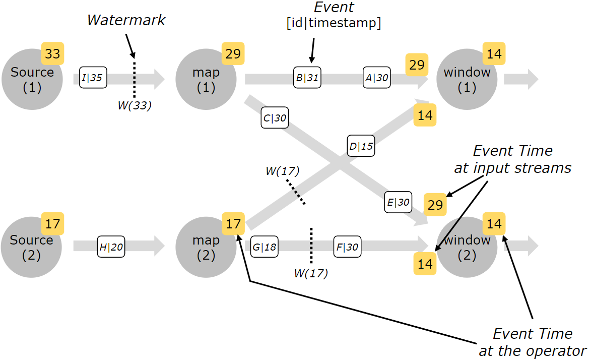

# Flink Watermark

## What is Watermark

在基于 event time 的实时计算中，我们常常会碰到 **乱序数据** 的场景。

在理想情况下，我们以为我们的数据流会是这样的：



但实际上大多数情况下是这样的：


在这种乱序的场景下，数据丢失是必然的。假设我们有一个大小为 [0, 5) 的窗口（单位为秒），当上述 event time 为 5 的元素输入时，该窗口会触发计算并关闭，导致后续流入的元素（2、3、4）找不到对应窗口而丢失。

为了解决这种乱序数据带来的数据丢失问题，Flink 提供了 **Watermark + Allow Lateness + Side Output** 的组合拳。

本节，我们先了解其中最为重要的机制，Watermark。 

从数据结构上来看，Watermark 是一个包含 **时间戳** 的数据对象。

```java
public Watermark(long timestamp) {
    this.timestamp = timestamp;
}
```

从定义上描述，Watermark 是一个 **度量 event time 进展** 的机制，表明 event time 在 Watermark 之前的元素均已流入，**不应该** 再有 event time 小于 Watermark 的元素进入数据流。

:::caution

Watermark 只是一个衡量机制，并无法阻止 event time 在 Watermark 之前的元素再次进入数据流。若出现这种情况，需要后续的 Allow Lateness 和 Side Output 配合处理。

:::

从功能上来理解，Watermark 可以起到 **控制窗口触发时机** 的作用。根据这种特性，用户可以为 Watermark 设置一个 **延时参数**，实现 **延迟触发窗口** 的功能，**为乱序数据流下的窗口提供一定的等待时间**，使窗口所包含的元素尽可能流入，解决乱序下的数据丢失问题。

:::caution

本质上还是通过 EventTimeTrigger 的 `onEventTime(...)` 方法来触发，但是 Watermark 的存在可以影响基于 event time 的计时器。

:::

我们举个具体的例子，来展示下这个过程。假设：

- **窗口大小为 5s**
- **Watermark 延迟策略为 3s**
- **Watermark 生成策略为周期性生成**

那么整个数据流入、Watermark 生成及窗口触发的过程如下图所示：



## Watermark Strategy

在上节中，我们了解了 Watermark 的一些特性：

- 是一个包含时间戳的数据记录
- 是一种延迟窗口触发的机制

那么，我们来思考一个新的问题：**Watermark 是怎么生成的？**

答案是 **Watermark Strategy**。

Watermark Strategy 是 Flink 中用于生成 Watermark 的策略，它由 **TimestampAssigner** 和 **WatermarkGenerator** 组成。

TimestampAssigner 负责告诉应用程序如何从事件中提取 event time，用户只需要实现提取方法即可：

```java
long extractTimestamp(T var1, long var2);
```

WatermarkGenerator 负责指定 Watermark 的生成规则与生成周期，其接口定义如下：

```java
/**
 * The {@code WatermarkGenerator} generates watermarks either based on events or
 * periodically (in a fixed interval).
 *
 * <p><b>Note:</b> This WatermarkGenerator subsumes the previous distinction between the
 * {@code AssignerWithPunctuatedWatermarks} and the {@code AssignerWithPeriodicWatermarks}.
 */
@Public
public interface WatermarkGenerator<T> {

    /**
     * Called for every event, allows the watermark generator to examine 
     * and remember the event timestamps, or to emit a watermark based on
     * the event itself.
     */
    void onEvent(T event, long eventTimestamp, WatermarkOutput output);

    /**
     * Called periodically, and might emit a new watermark, or not.
     *
     * <p>The interval in which this method is called and Watermarks 
     * are generated depends on {@link ExecutionConfig#getAutoWatermarkInterval()}.
     */
    void onPeriodicEmit(WatermarkOutput output);
}
```

其中，`onEvent(...)` 方法在每个元素流入时都会触发，`onPeriodicEmit` 则是周期性触发。

在这两个方法的基础上，Flink 提供了两种类型的 Watermark 生成策略，分别是：**periodic（周期性生成）**和 **punctuated（标记性生成）**。

periodic 的生成策略会监测每个流入元素的 event time，并周期性生成 Watermark。

punctuated 的生成策略会监测每个流入的元素，并在接收到特殊的、带有 Watermark 标记的元素时立即生成 Watermark。

:::info

punctuated 的生成策略通常无需实现 `onPeriodicEmit` 方法。

:::

下面，我们通过阅读 BoundedOutOfOrdernessWatermarks（一个用于有界乱序流的 Watermark 策略）源码，来学习**Watermark 周期性生成策略** 的实现过程：

```java
public class BoundedOutOfOrdernessWatermarks<T> implements WatermarkGenerator<T> {
    private long maxTimestamp;
    private final long outOfOrdernessMillis;

    public BoundedOutOfOrdernessWatermarks(Duration maxOutOfOrderness) {
        Preconditions.checkNotNull(maxOutOfOrderness, "maxOutOfOrderness");
        Preconditions.checkArgument(!maxOutOfOrderness.isNegative(), "maxOutOfOrderness cannot be negative");
        this.outOfOrdernessMillis = maxOutOfOrderness.toMillis();
        this.maxTimestamp = -9223372036854775808L + this.outOfOrdernessMillis + 1L;
    }

    public void onEvent(T event, long eventTimestamp, WatermarkOutput output) {
        this.maxTimestamp = Math.max(this.maxTimestamp, eventTimestamp);
    }

    public void onPeriodicEmit(WatermarkOutput output) {
        output.emitWatermark(new Watermark(this.maxTimestamp - this.outOfOrdernessMillis - 1L));
    }
}
```

在 BoundedOutOfOrdernessWatermarks 中，`onEvent(...)` 方法会实时计算数据流中最大的 event time，`onPeriodicEmit` 会根据 `onEvent(...)` 的结果周期性生成 Watermark。

:::info

简单来说，在本例中，Watermark 的计算公式为：

**Watermark = maxTimestamp（数据流中的最大时间）- outOfOrdernessMillis（Watermark 延迟时间）**

:::

## Watermark in Parallel Streams

前面讲解 Watermark 及其生成策略时，都是以单并行度下的数据流作为示例。在单并行数据流下，Watermark 呈 **单调递增**、**单向传输**。

那么在多并行度下，Watermark 又是如何表现的呢？这首先需要提出两个问题：<br />

**第一，在多并行度下，Watermark 生成几个？**

**第二，在多并行度下，Watermark 如何传输？**

首先回答第一个问题。Watermark 通常于 Source Function 发生时或发生后立即生成。**当 Source Function 的并行度为 N（N > 1）时**，生成的 Watermark 数也为 N，且各个 Watermark 之间是 **相互独立** 的。

:::caution

当 Source Function 是非多并行度时，无论全局并行度设为多少，Watermark 只有一个。

:::

然后是第二个问题。Watermark 是以 **广播** 的形式进行传递的。在单并行度数据流中，这种广播的机制并不明显，但是在多并行度数据流中，便可以发现，**当发生重分区导致 1 个上游 Subtask 对应多个下游 Subtask 时**，上游 Subtask 会将其 Watermark 以广播的形式通知给下游的多个 Subtask。

看到这里，是不是突然又产生了疑问？若上游 Subtask 与下游 Subtask 是多对多的关系，即 1 个下游 Subtask 存在多个上游 Subtask，那么这个下游 Subtask 是否会获取多个 Watermark？若是，以哪个 Watermark 为准？<br />

**答案是会，且以最小的那个 Watermark 为准。**

下面，我们以官网提供的一个示例图，来展现 Watermark 在多并行度数据流下的具体表现： 



此示例图表达了几个特征：

- Watermark 在 Source 时生成，且多个 Source 会生成多个 Watermark
- Watermark 作为一个数据对象，跟普通元素一样，在流中也是一条一条向下游传输的，所以我们会发现* Source(1)* 当前的 Watermark 为 33，而 *map(1)* 为 29
- Watermark 是以广播的形式传递给下游的，所以我们可以看到 *map(1)* 传递给 *window(1)* 和 *window(2)* 的都是 29，*map(2)* 传递给 *window(1)* 和 *window(2) *的都是 14
- 若某个 Subtask 接收到多个 Watermark，会以最小的 Watermark 为准，所以我们会看到 *window(1)* 和 *window(2)* 当前的 Watermark 为 29 和 14 中较小的那一个，即 14

可以说，这份示例图的内容基本囊括了我们上面所说的知识点，值得我们多看多思考。

## Watermark Demo

下面，我们以常见的词频统计作为示例，展现一下 Watermark 的实现代码：<br />

```java
StreamExecutionEnvironment env = StreamExecutionEnvironment.getExecutionEnvironment();

// 设置 Watermark 生成周期为 2s
env.getConfig().setAutoWatermarkInterval(2000);

// 输入数据格式：时间戳，单词，频次
// 例如：1000,a,1
DataStreamSource<String> source = env.socketTextStream("192.168.117.128", 9999);

// 定义 Watermark 策略
WatermarkStrategy<String> strategy =
        WatermarkStrategy.<String>forGenerator(new MyWatermarkGeneratorSupplier<>(Duration.ofSeconds(3)))
                .withTimestampAssigner(context -> (s, l) -> Long.parseLong(s.split(",")[0]));

// 业务处理：transformation
source
        .assignTimestampsAndWatermarks(strategy)
        .map(value -> {
            String[] splits = value.split(",");
            return Tuple2.of(splits[1].trim(), Integer.parseInt(splits[2].trim()));
        })
        .returns(Types.TUPLE(Types.STRING, Types.INT))
        .keyBy(value -> value.f0)
        .window(TumblingEventTimeWindows.of(Time.seconds(5)))
        .reduce((Tuple2<String, Integer> value1, Tuple2<String, Integer> value2) -> {
            System.out.println("-----reduce invoked----" + value1.f0 + "==>" + (value1.f1 + value2.f1));
            return Tuple2.of(value1.f0, value1.f1 + value2.f1);
        }, new ProcessWindowFunction<Tuple2<String, Integer>, String, String, TimeWindow>() {

            @Override
            public void process(String s, Context context, Iterable<Tuple2<String, Integer>> iterable, Collector<String> collector) {

                FastDateFormat format = FastDateFormat.getInstance("yyyy-MM-dd HH:mm:ss.SSS");

                for (Tuple2<String, Integer> element : iterable) {
                    collector.collect("[" + format.format(context.window().getStart()) + "==>" +
                            format.format(context.window().getEnd()) + "], " + element.f0 + "==>" + element.f1);
                }
            }
        })
        .print();

env.execute("Watermark App");
```

在本例中，为了方便 Watermark 的打印，我们实现了自定义的 WatermarkGenerator，其代码如下所示：

```java
public class MyWatermarkGeneratorSupplier<T> implements WatermarkGeneratorSupplier<T> {

    private final Duration duration;

    public MyWatermarkGeneratorSupplier(Duration duration) {
        this.duration = duration;
    }

    @Override
    public WatermarkGenerator<T> createWatermarkGenerator(Context context) {
        return new MyWatermarkGenerator<>(duration);
    }
}

public class MyWatermarkGenerator<T> implements WatermarkGenerator<T> {

    private static final Logger LOGGER = LoggerFactory.getLogger(MyWatermarkGenerator.class);

    private long maxTimestamp;
    private final long outOfOrdernessMillis;

    public MyWatermarkGenerator(Duration maxOutOfOrderness) {
        Preconditions.checkNotNull(maxOutOfOrderness, "maxOutOfOrderness");
        Preconditions.checkArgument(!maxOutOfOrderness.isNegative(), "maxOutOfOrderness cannot be negative");
        this.outOfOrdernessMillis = maxOutOfOrderness.toMillis();
        this.maxTimestamp = -9223372036854775808L + this.outOfOrdernessMillis + 1L;
    }

    public void onEvent(T event, long eventTimestamp, WatermarkOutput output) {
        this.maxTimestamp = Math.max(this.maxTimestamp, eventTimestamp);
    }

    public void onPeriodicEmit(WatermarkOutput output) {
        Watermark watermark = new Watermark(this.maxTimestamp - this.outOfOrdernessMillis - 1L);
        output.emitWatermark(watermark);
        LOGGER.info("current watermark ==> {}", watermark.getTimestamp());
    }
}
```

## Allow Lateness

从字面上来说，Allow Lateness 表示 **允许延迟** 的意思。当用户调用 `allowedLateness(<time>)` 方法时，应用程序将允许数据在指定时间范围内 **延迟进入** 对应的窗口。

多数人在看到这个定义时，可能会产生比较大的困惑，之前不是说 Watermark 可以使数据延迟流入吗？那 Allow Lateness 的这个延迟是什么意思？两者的延迟是一回事么？

**实际上两者是不同的。**

我们之前说过，Watermark 是延迟窗口触发的一种机制，它允许数据延迟是通过 **延迟窗口触发** 实现的。

而 Allow Lateness 提供的延迟，是在窗口已经被触发后，通过 **延迟窗口关闭时间与支持延迟期间内的重复计算** 实现的。

我们举个具体的例子，假设：

- **窗口大小为 5s**
- **Watermark 延迟策略为 2s**
- **Watermark 生成策略为周期性生成**
- **Allow Lateness 允许延迟的时间为 3s**

那么 Allow Lateness 的实现过程如下图所示：



:::caution

重复计算（重复触发窗口）本质上是通过 Trigger 中的 `onElement(...)` 方法实现的，每一个延迟的数据都会触发一次重复计算。

:::

下面，我们给出 Allow Lateness 的代码示例：

```java
DataStream<T> input = ...;

input
    .keyBy(<key selector>)
    .window(<window assigner>)
    .allowedLateness(<time>)
    .<windowed transformation>(<window function>);
```

## Side Output

当我们使用了 Watermark + Allow Lateness 的组合拳后还是存在延迟数据的情况时，就必须祭出最后一个杀手锏 Side Output。

Side Output 机制允许延迟数据输入到另一个流中，当窗口计算结束后用户可以去获取它，其使用示例如下：

```java
final OutputTag<T> lateOutputTag = new OutputTag<T>("late-data"){};

DataStream<T> input = ...;

SingleOutputStreamOperator<T> result = input
    .keyBy(<key selector>)
    .window(<window assigner>)
    .allowedLateness(<time>)
    .sideOutputLateData(lateOutputTag)
    .<windowed transformation>(<window function>);

DataStream<T> lateStream = result.getSideOutput(lateOutputTag);
```

:::caution

OutputTag 后面必须加上 `{}`，否则会抛出如下异常：`InvalidTypesException: Could not determine TypeInformation for the OutputTag type`。

:::

## With Idleness

如果一个 Source 在一定时间内没有数据流入，那么我们可以称这个 Source 为 Idle Source。

在多并行度数据流下，Idle Source 会对 Watermark 的传递带来很大的问题，可能会导致计算任务进入静止状态。

我们已经知道，当某个 Subtask 存在多个上游 Subtask，其 Watermark 取值以多个上游 Subtask 的最小 Watermark 为准。想象一下，若此时存在一个 Idle Source，会出现什么情况？该 Idle Source 会一直向下游传递较小的 Watermark，使得下游 Subtask 的 Watermark 一直以该值为准，**导致其他 Source 对应的窗口计算不会被触发，进而导致整个 Flink 作业进入了静止状态**。

为解决这个问题，Flink Watermark 提供了 With Idleness 机制。**该机制允许当某个 Source 长时间未流入数据时，暂停 Watermark 的生成，直到有数据流入后再次唤醒**。

With Idleness 的使用示例如下：

```java
WatermarkStrategy
        .<Tuple2<Long, String>>forBoundedOutOfOrderness(Duration.ofSeconds(20))
        .withIdleness(Duration.ofMinutes(1));
```


