# Flink 容错机制

## Checkpoint

想一下，对于流计算框架来说，如果没有容错机制，会发生什么？当我们的应用程序因网络、硬件等不可抗力崩溃时，不存在恢复的选项，只能从数据源起点重新消费重新计算。这不仅会导致资源的浪费，还会直接影响实时指标。

为了保证容错，Flink 提供了 **checkpoint** 与 **流重放** 相结合的方式。

checkpoint 中文名为检查点，它每隔一定时间就会绘制一份分布式数据流的 snapshot（快照），这份快照包含了数据流中所有任务在 **某个时间点** 的状态信息。

checkpoint 默认不开启，需要在代码里启用：

```java
StreamExecutionEnvironment env = StreamExecutionEnvironment.getExecutionEnvironment();
env.enableCheckpointing(5000);
```

其中，`5000` 表示 checkpoint 的周期，单位为 `ms`。

:::info

checkpoint 是需要耗费时间和资源的，耗费的量级与 State 的大小有关。若 State 较小，checkpoint 过程就比较轻量，对数据流的处理不会产生影响；若 State 较大，checkpoint 过程可能就比较长，便需要考虑周期、时间间隔等。

:::

:::info

checkpoint 支持异步执行，这样我们的程序在 checkpoint 的过程中不至于出现应用暂停的结果。

:::

现在，我们以一个数据流示意图，来展示 checkpoint 的具体过程：



:::caution

图中的红色虚线表示 Barrier，其含义与作用请见下文。

:::

### In-flight State & State Snapshot

前文提到，checkpoint 会生成状态快照（State Snapshot），那么它与我们一直说的 State 是一个东西吗？

实际上，我们可以将 State 区分为 In-flight State 和 State Snapshot。

In-flight State 又称运行期状态，是 Flink 作业运行过程中产生的状态，与 checkpoint 无关。它通常是由 State Backend 存储在本地内存中的，在某些情况下也可能输出到本地磁盘。由于与 checkpoint 无关，这种状态确实有丢失的可能性，但不会影响服务的恢复。

State Snapshot 即为状态快照，是 checkpoint 期间记录的某个时间点下的状态信息，通常会被存储到外部存储器。State Snapshot 的存储过程可参考下图：


### Barrier

我们已经知道，checkpoint 会记录数据流在某个时间点的快照信息，那么，一个有趣的问题就来了：从 checkpoint 触发开始到 checkpoint 成功生成快照的这个过程里，Flink 是怎么知道流入的数据有哪些是需要在当前 checkpoint 阶段进行“拍照”的？

这就不得不提到 checkpoint 中的核心元素：**Barrier（流屏障）**。

Barrier 同 Watermark 一样：

- **本质上也是一种随数据流流动的数据**
- 以广播的方式向下游传递

它可以标记 checkpoint 的分界线，将数据流中的元素划分为分属不同 checkpoint 周期的数据集，如下图所示：


图中，存在两个屏障 *barrier n-1* 和 *barrier n* 以及 3 个检查周期 *checkpoint n-1*、*checkpoint n* 和 *checkpoint n+1*。

当 *barrier n* 注入到数据流时，表示其所对应的 *checkpoint n* 已经可以确认边界了。Flink 会在 *barrier n* 流经下游任务时触发“拍照”动作，并在所有任务都“拍”完后告知 JobManager，完成 checkpoint 并存储快照。

### Aligned Checkpoint

在单并行度数据流中，Barrier 的处理方式比较简单，但是在多并行度数据流里，Barrier 的处理便需要考虑更多细节。

根据 Barrier 在多个并行子任务的处理方式，我们可以将 Checkpoint 划分为 Aligned Checkpoint 和 Unaligned Checkpoint。两者的区别在于：**是否需要在并行子任务中对 Barrier 进行对齐**。

顾名思义，Aligned Checkpoint 表示 Barrier 需要一个对齐的过程，其 checkpoint 过程如下图所示：


用文字表述完整的流程：

1. JobManager 发起 checkpoint
2. 应用程序从 Source 开始创建带有 checkpoint ID 的 barrier，barrier 生成后以广播形式向多个下游子任务传递
3. 本例中数字流（元素为阿拉伯数字）的 barrier 先抵达 Operator，进入 **等待对齐状态**
4. 字母流的 barrier 在一段时间后也抵达 Operator
5. Operator 确认所有 barrier 已对齐，计算结果存储至 state，并拷贝到 State Backend
6. TaskManager 将状态快照传输至 checkpoint 存储器，并通知 JobManager 当前任务的 checkpoint 已完成
7. **当所有任务均确认完毕，说明本轮 checkpoint 已完成**

:::info

在对齐等待期间，barrier 之后的数据 **会先被缓存，不会被计算**，等到其他线路的 barrier 都对齐后，这些缓存的数据才会继续往下流。

:::

### Checkpoint Storage

当状态快照（State Snapshot）生成时，它需要被持久化保存，才能在服务异常时提供可靠的恢复点。

状态快照（State Snapshot）保存的位置，便称为 Checkpoint Storage。

#### JobManagerCheckpointStorage

顾名思义，JobManagerCheckpointStorage 将状态快照保存在 JobManager 的内存堆中。它具有以下特点：

- 状态读写速度快
- 受内存限制，有 OOM 的风险
- 默认情况下，单个状态的大小不能超过 `5M`

大多数情况下，JobManagerCheckpointStorage 只在本地开发或测试时使用。

#### FileSystemCheckpointStorage

FileSystemCheckpointStorage 会把状态快照保存到 `checkpointDirectory` 指向的存储器上：

- 该存储器可以是本地磁盘，如：`file:///data/flink/checkpoints`
- 也可以是远程存储，如：`hdfs://namenode:40010/flink/checkpoints`

相对 JobManagerCheckpointStorage，**FileSystemCheckpointStorage 的可靠性更高**，但在读写速度上逊色不少。

### Retained Checkpoint

默认情况下，Checkpoint 不是永久保存的，当我们的作业取消后，checkpoint 文件会被删除。若想保存 checkpoint 文件，可以修改清理模式：

```java
CheckpointConfig config = env.getCheckpointConfig();
config.enableExternalizedCheckpoints(ExternalizedCheckpointCleanup.RETAIN_ON_CANCELLATION);
```

ExternalizedCheckpointCleanup 中包含了两种模式：

- DELETE_ON_CANCELLATION：Flink 作业取消后删除 checkpoint 文件
- RETAIN_ON_CANCELLATION：Flink 作业取消后保留 checkpoint 文件

### Recovery

当作业出现故障时，Flink 会停止分布式数据流，将数据流重置到 checkpoint 最新生成的快照上，并根据这份快照完成各个任务状态的恢复。

在这个过程中，有两种策略需要了解，它们分别是：Restart 和 Failover。

#### Restart Strategy

Restart Strategy 译为重启策略，它关注的是 **时间上** 的重启恢复行为。当作业出现异常时，Restart Strategy 决定了 **是否重启作业** 以及 **何时重启作业**。

Restart Strategy 包含 4 种类型的策略：

|**策略类型**|**策略说明**|
|---|---|
|No Restart Strategy|不重启|
|Fixed Delay Restart Strategy|固定重启次数，超出尝试次数则作业失败|
|Failure Rate Restart Strategy|固定 **周期内** 重启次数，**周期内** 超出尝试次数则作业失败|
|Exponential Delay Restart Strategy|尝试 **无限重启** 的策略|

:::info

Exponential Delay Restart Strategy 的实现逻辑较为复杂。在作业运行过程中，每一次异常发生都会导致重启的延迟时间会倍增（由 `backoff-multiplier` 指定），直至达到预设的最大延迟时间。若指定阈值内未出现异常，重启延迟时间会恢复到最初值。

:::

以 Fixed Delay Restart Strategy 为例，我们可以在配置文件 `flink-conf.yaml` 设置重启策略：

```
restart-strategy: fixed-delay
restart-strategy.fixed-delay.attempts: 3
restart-strategy.fixed-delay.delay: 10 s
```

各配置项的说明可见下表：

|**配置项**|**参数类型**|**默认值**|**配置说明**|
|---|---|---|---|
|fixed-delay.attempts|Integer|1|重启尝试次数|
|fixed-delay.delay|Duration|1s|尝试重启的时间延迟|

当然，我们也可以在代码中直接设置重启策略：

```java
ExecutionEnvironment env = ExecutionEnvironment.getExecutionEnvironment();
env.setRestartStrategy(RestartStrategies.fixedDelayRestart(
  3, // number of restart attempts
  Time.of(10, TimeUnit.SECONDS) // delay
));
```

:::info

如果 checkpoint 被禁用，重启策略为 none，即 no restart；如果 checkpoint 启用但是未显式设置重启策略，那么重启策略默认为 fixed-delay，且最大重试次数为 Integer.MAX_VALUE。

:::

:::caution

开启 checkpoint 时，若出现异常，作业并不会直接失败退出，而是由重启策略决定是否退出。

:::

#### Failover Strategy

Failover Strategy 译为故障转移策略，它关注的是 **空间上** 的重启恢复行为。当作业出现异常，Failover Strategy 决定应该 **重启哪些任务** 以恢复作业的运行。

Failover Strategy 包含两种类型的策略：

|**策略类型**|**策略说明**|
|---|---|
|Restart All|全量重启|
|Restart pipelined region|部分任务重启|

### Checkpoint Config

除了已知的 checkpoint interval，checkpoint 还提供了丰富的配置参数，本节对一些常见配置作简要介绍：

|**配置项**|**默认值**|**配置说明**|
|---|---|---|
|checkpoint mode|EXACTLY_ONCE|checkpoint 的一致性模式|
|checkpoint timeout|600000 ms|checkpoint 超时时间|
|checkpoint failure number|-1|能容忍的 checkpoint 最大连续失败数|
|checkpoint max concurrent|1|允许的 checkpoint 最大并发数|
|checkpoint min pause|0|两个 checkpoint 间允许的最小时间间隔|
|checkpoint prefer for recovery|false|当同时存在 savepoint 时，是否更偏向于从 checkpoint 进行恢复|

### Unaligned Checkpoint

Flink 1.11 版本后，提供了非对齐的 Checkpoint 机制。

在 Aligned Checkpoint 中，barrier 必须遵循自己在数据流中的位置，不可越界。**在 Unaligned Checkpoint 中，barrier 便不再有这个限制，Flink 允许它超过位于它之前的元素，尽可能快地从 sink 端输出**。

因为这个特性，Unaligned Checkpoint 的过程如下图所示：


在这个过程中：

1. Operator 会对输入缓存区（Input buffers）中的第一个 barrier 做出响应，立即将其添加到输出缓存区（Output buffers）
2. Operator 会 **异步** 存储所有标记为 **被 barrier 超过** 的数据，并创建自身的状态快照

:::info

步骤 2 会短暂停止数据输入。

:::

我们发现，在 Unaligned Checkpoint 中，barrier 的传输速度是远远快于 Aligned Checkpoint 的，在出现反压时，Unaligned Checkpoint 不会像 Aligned Checkpoint 那样由于 barrier 的积压而出现 checkpoint 失败的情况。**这使得在反压的情况下，Unaligned Checkpoint 会具备更好的稳定性。**

当然，Unaligned Checkpoint 也并非是完美的：

- 除了原有的状态之外，它还需要持久化缓存数据，对磁盘的负载会升高
- 其恢复作业的时间可能更长

:::info

尽管 Unaligned Checkpoint 不存在对齐过程，但由于其在流重放的过程中会重放缓存数据，依然可以支持 EXACTLY_ONCE。

:::

## Savepoint

savepoint 中文名为保存点，提供手动触发 checkpoint 的功能。它的底层实现算法，与 checkpoint 基本上可以说是相同的，两者的主要区别在于：<br />

- savepoint 由用户手动触发，checkpoint 由应用程序自动触发
- checkpoint 会被更新的 checkpoint 覆盖，savepoint 不会
- savepoint 仅支持对齐算法

### Trigger a Savepoint

当 Flink 部署在独立集群时，用户可通过以下命令行手动触发 savepoint：

```Bash
$ bin/flink savepoint ${jobId} ${targetDirectory}
```


### Trigger a Savepoint with YARN

若 Flink 集群由 YARN 管理，则可以通过以下命令触发：

```Bash
$ bin/flink savepoint ${jobId} ${targetDirectory} -yid ${yarnAppId}
```

:::info

`${jobId}` 表示作业 ID，`${targetDirectory}` 表示 Savepoint 存储路径，`${yarnAppId}` 表示 YARN 应用 ID。

:::


