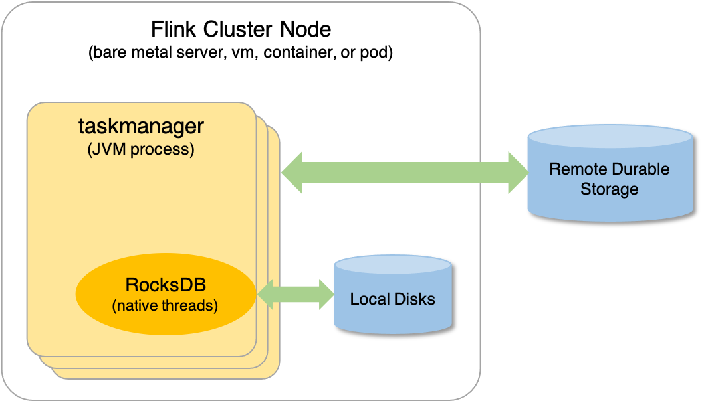

# Flink 状态管理

## State

以最常见的词频统计为例。当单词 panda 第一次流入，统计任务会输出 `(panda, 1)` 的结果；当单词 panda 第二次流入，统计任务会输出 `(panda, 2)` 的结果。在这个过程中，出现了 **1+1** 的计算。

那么我们的问题来了：第一个 1 是已经流走的数据，不像第二个 1 是刚刚流入的，我们的 Flink 程序是怎么记住它的？答案便是 **State**。

State 是记录 **有状态算子任务** 计算结果的载体，支持中间结果的读取、保存、更新与清除。在 Flink 中，一个带有 State 的流处理过程如下图所示：



当然，作为存储各种不同结构计算结果的 State，也存在着多种类型。根据作用域的不同，可将 State 分为 Operator State 和 Keyed State，下文将对两者做进一步的介绍。

:::caution

上述词频统计，还遗留着一个问题。回想一下，无论是 ReduceFunction 还是 Aggregate Function，我们覆写其方法时，是不是拿输入的元素直接进行计算了？那么它是怎么知道这个元素是要累加到哪个值上的？就是说，如果我们输入了两个单词 `panda` 和 `sue`，它是怎么知道要对哪个进行聚合？这个问题，我们将在下文解答，它将帮助我们进一步地理解 Operator State 和 Keyed State 的区别。

:::

## Operator State

Operator State 又称 Non-Keyed State，是一种作用在算子任务上的状态，其流处理示意图如下：



它具有以下特点：

- 作用范围限定于算子任务（Task）
- 对归属于 **相同 Task Slot、相同算子任务** 的子任务（Subtask），其状态是可以共享的

Operator State 包含 List State、Union List State、Broadcast State 三种类型。

### List State

List State 中文名为列表状态，以 List 存储状态信息。我们可以通过 `add(...)` 或者 `addAll(...)` 将状态信息添加到列表，也可以通过迭代器获取列表中的状态信息。

### Union List State

Union List State 中文名为联合列表状态，其底层数据结构也是 List。其与 List State 的区别在于：当从检查点恢复时，每个 Subtask 可以拿到之前所有算子任务上的状态信息。

### Broadcast State

Broadcast State 中文名为广播状态，是一种特殊的状态，会被广播到下游所有子任务（Subtask），其底层数据结构基于 Map 实现。

:::info

实际应用中，使用到 Operator State 的场景较少。 

:::

### CheckpointedFunction

我们可以在自定义的 Function 中实现 CheckpointedFunction 接口，以此来使用 Operator State。

CheckpointedFunction 接口声明了两个方法：

- initializeState：初始化 State，当算子任务初始化时调用
- snapshotState：生成 State 快照，当 checkpoint 触发时调用

为加强理解，我们基于 CheckpointedFunction 实现 Stateful Source Function 和 Stateful Sink Function。

```java title="Stateful Source Function"
public class StatefulSourceFunction extends RichParallelSourceFunction<String> implements CheckpointedFunction {

    private static final Logger LOGGER = LoggerFactory.getLogger(StatefulSourceFunction.class);

    private static final Random RANDOM = new Random();

    private volatile boolean isRunning = true;

    // 记录消费位移
    private Long offset = 0L;

    // state 对象
    private ListState<Long> state;

    @Override
    public void run(SourceContext<String> sourceContext) throws Exception {
        final Object lock = sourceContext.getCheckpointLock();

        String[] names = new String[] {"panda", "sue"};

        while (isRunning) {
            synchronized (lock) {
                for (int i = 0; i < 5; i++) {
                    String name = names[RANDOM.nextInt(names.length)];
                    sourceContext.collect(name);
                    offset++;
                }
            }
            Thread.sleep(10000);
        }
    }

    @Override
    public void cancel() {
        isRunning = false;
    }

    @Override
    public void snapshotState(FunctionSnapshotContext context) throws Exception {
        LOGGER.info("start to snapshot, current offset: {}", offset);
        state.clear();
        state.add(offset);
    }

    @Override
    public void initializeState(FunctionInitializationContext context) throws Exception {
        LOGGER.info("stateful source function init...");
        state = context.getOperatorStateStore()
                .getListState(new ListStateDescriptor<>("source-state", LongSerializer.INSTANCE));

        for (Long l : state.get()) {
            offset = l;
        }
    }

}
```

```java title="Stateful Sink Function"
public class StatefulSinkFunction implements SinkFunction<Tuple2<String, Integer>>, CheckpointedFunction {

    private static final Logger LOGGER = LoggerFactory.getLogger(StatefulSinkFunction.class);

    private transient ListState<Tuple2<String, Integer>> state;

    private final int threshold;

    private final List<Tuple2<String, Integer>> buffers;

    public StatefulSinkFunction(int threshold) {
        this.threshold = threshold;
        this.buffers = Lists.newArrayList();
    }

    @Override
    public void invoke(Tuple2<String, Integer> value, Context context) {
        buffers.add(value);
        if (buffers.size() == threshold) {
            buffers.forEach(element -> LOGGER.info("value: {}", element));
            buffers.clear();
        }
    }

    @Override
    public void snapshotState(FunctionSnapshotContext context) throws Exception {
        state.clear();
        state.addAll(buffers);
    }

    @Override
    public void initializeState(FunctionInitializationContext context) throws Exception {
        state = context.getOperatorStateStore()
                .getListState(new ListStateDescriptor<>("sink-state", Types.TUPLE(Types.STRING, Types.INT)));

        if (context.isRestored()) {
            for (Tuple2<String, Integer> element : state.get()) {
                buffers.add(element);
            }
        }
    }
}
```

## Keyed State

顾名思义，Keyed State 是作用于 Keyed Stream 上的状态，**它是根据数据流中的 key 来进行访问与更新的**。

对于初学者来说，这个定义，恐怕不是很好理解。为什么在 Keyed Stream 中，是通过 key 来操作状态的？之前介绍的 Operator State，不是在算子任务中就可以进行操作吗？

带着这个疑问，我们先来看一个 Keyed State 的流处理图：


:::info

不同颜色的圆形代表着不同 key 值的元素。

:::

在图中，我们可以观察到几个点：

- key 的哈希值相同的元素，尽管其 key 值不同，还是被分配到了同一分区
- 在同一分区的状态存储中，key 值不同的元素，会生成不同的 state 副本

这意味着，Keyed State 在对应的算子任务中实际上会有多个，而不是一个，且当算子任务要访问或更新某个 Keyed State 时，是通过 key 值去映射得到的。这一点，在 StateTable 里得到了体现：

```java
public S get(N namespace) {
    return this.get(this.keyContext.getCurrentKey(), this.keyContext.getCurrentKeyGroupIndex(), namespace);
}
```

看到这里，是否已经明白了我们开头时抛出的问题？**在 reduce 和 aggregate 等聚合操作中，会根据输入元素的 key 值从 stateTable 中找到对应的 Keyed State，然后再对其进行计算与更新。**

下面，我们将对各类型的 Keyed State 展开介绍。

### Value State

Value State 中文名为值状态，是一种保存 **单个值** 的状态。

下面，我们基于 Value State 实现平均值计算的功能：

```java
public class AvgWithValueStateFlapMapFunction
        extends RichFlatMapFunction<Tuple2<String, Integer>, Tuple2<String, Double>> {

    private static final Logger LOGGER = LoggerFactory.getLogger(AvgWithValueStateFlapMapFunction.class);

    private transient ValueState<Tuple2<Integer, Integer>> state;

    @Override
    public void open(Configuration parameters) {

        ValueStateDescriptor<Tuple2<Integer, Integer>> descriptor =
                new ValueStateDescriptor<>("avg", Types.TUPLE(Types.STRING, Types.INT));

        state = getRuntimeContext().getState(descriptor);
    }

    @Override
    public void flatMap(Tuple2<String, Integer> value, Collector<Tuple2<String, Double>> collector) throws Exception {

        Tuple2<Integer, Integer> currentState = state.value();

        if (currentState == null) {
            currentState = Tuple2.of(0, 0);
        }

        // 累加并更新状态
        currentState.f0 += 1;
        currentState.f1 += value.f1;
        state.update(currentState);

        LOGGER.info("key: {}, state: {}", value.f0, state.value());

        // 当累加元素达到 3，计算平均值
        if (currentState.f0 >= 3) {
            collector.collect(Tuple2.of(value.f0, currentState.f1 / currentState.f0.doubleValue()));
            state.clear();
        }
    }
}
```

:::info

通过描述符获取 Keyed State 时，会将 Keyed State 注册到当前任务对应的 State Backend。

:::

:::caution

与 Operator State 不同，Keyed State 不需要用户手动声明 `snapshot(...)` 方法生成快照，而是由 backend 自行触发生成，此过程对用户透明。

:::

### List State

定义同 Operator State 中的 List State。

基于 List State 实现平均值计算的示例如下：

```java
public class AvgWithListStateFlapMapFunction
        extends RichFlatMapFunction<Tuple2<String, Integer>, Tuple2<String, Double>> {

    private transient ListState<Integer> state;

    @Override
    public void open(Configuration parameters) {
        ListStateDescriptor<Integer> descriptor = new ListStateDescriptor<>("avg", Integer.class);
        state = getRuntimeContext().getListState(descriptor);
    }

    @Override
    public void flatMap(Tuple2<String, Integer> value, Collector<Tuple2<String, Double>> collector) throws Exception {

        state.add(value.f1);

        List<Integer> elements = Lists.newArrayList(state.get());
        // 当累加元素达到 3，计算平均值
        if (elements.size() >= 3) {
            Integer count = 0;
            Integer sum = 0;

            for (Integer element : elements) {
                count++;
                sum += element;
            }

            collector.collect(Tuple2.of(value.f0, sum / count.doubleValue()));
            state.clear();
        }
    }
}
```

### Map State

Map State 中文名为映射状态，底层数据结构为 Map，以键值对的形式存储状态。

基于 Map State 实现平均值计算的示例如下：

```java
public class AvgWithMapStateFlapMapFunction
        extends RichFlatMapFunction<Tuple2<String, Integer>, Tuple2<String, Double>> {

    private transient MapState<String, Integer> state;

    @Override
    public void open(Configuration parameters) {
        MapStateDescriptor<String, Integer> descriptor = new MapStateDescriptor<>("avg", String.class, Integer.class);
        state = getRuntimeContext().getMapState(descriptor);
    }

    @Override
    public void flatMap(Tuple2<String, Integer> value, Collector<Tuple2<String, Double>> collector) throws Exception {

        state.put(UUID.randomUUID().toString(), value.f1);
        List<Integer> elements = Lists.newArrayList(state.values());

        // 当累加元素达到 3，计算平均值
        if (elements.size() >= 3) {
            Integer count = 0;
            Integer sum = 0;

            for (Integer element : elements) {
                count++;
                sum += element;
            }

            collector.collect(Tuple2.of(value.f0, sum / count.doubleValue()));
            state.clear();
        }
    }
}
```

### Reducing State & Aggregating State

Reducing State 和 Aggregating State 都是对所有（窗口内）元素进行聚合的状态，两者的区别在于：

- Reducing State 只有输入类型（IN），Aggregating State 既有输入类型（IN）又有输出类型（OUT）
- Reducing State 通常与 ReduceFunction 绑定，Aggregating State 通常与 AggregateFunction 绑定

**那么，Reducing State 和 Aggregating State 与 ReduceFunction 和 AggregateFunction 是否有关系？**

答案是肯定的。当我们调用 WindowedStream 的 `reduce(...)` 方法或者 `aggregate(...)` 方法，它在创建窗口的过程中会相应地创建 Reducing State 或者 Aggregating State，这在 WindowOperatorBuilder 的源码得到了体现：

```java
public <ACC, V, R> WindowOperator<K, T, ?, R, W> aggregate(AggregateFunction<T, ACC, V> aggregateFunction, ProcessWindowFunction<V, R, K, W> windowFunction, TypeInformation<ACC> accumulatorType) {
    Preconditions.checkNotNull(aggregateFunction, "AggregateFunction cannot be null");
    Preconditions.checkNotNull(windowFunction, "ProcessWindowFunction cannot be null");
    if (aggregateFunction instanceof RichFunction) {
        throw new UnsupportedOperationException("This aggregate function cannot be a RichFunction.");
    } else if (this.evictor != null) {
        return this.buildEvictingWindowOperator(new InternalAggregateProcessWindowFunction(aggregateFunction, windowFunction));
    } else {
        AggregatingStateDescriptor<T, ACC, V> stateDesc = new AggregatingStateDescriptor("window-contents", aggregateFunction, accumulatorType.createSerializer(this.config));
        return this.buildWindowOperator(stateDesc, new InternalSingleValueProcessWindowFunction(windowFunction));
    }
}
```

需要注意的是，KeyedStream 中 `sum(...)` 和 `reduce(...)` 方法所依赖的底层状态由 ValueState 实现，而不是 Reducing State 或 Aggregating State。其管理类 StreamGroupedReduceOperator 的源码如下：

```java
public void open() throws Exception {
    super.open();
    ValueStateDescriptor<IN> stateId = new ValueStateDescriptor("_op_state", this.serializer);
    this.values = (ValueState)this.getPartitionedState(stateId);
}

public void processElement(StreamRecord<IN> element) throws Exception {
    IN value = element.getValue();
    IN currentValue = this.values.value();
    if (currentValue != null) {
        IN reduced = ((ReduceFunction)this.userFunction).reduce(currentValue, value);
        this.values.update(reduced);
        this.output.collect(element.replace(reduced));
    } else {
        this.values.update(value);
        this.output.collect(element.replace(value));
    }
}
```

## State TTL

### Cleanup of Expired State

#### Cleanup in full snapshot

#### Incremental cleanup

#### Cleanup during RocksDB compaction

## State Backend

State Backend 中文名为状态后端，是 **状态的管理组件**。它主要解决两件事：

- 管理本地状态，包括访问、存储与更新
- 当 checkpoint 被激活时，决定状态同步的方式和位置

:::caution

由于早期 State Backend 的设计问题，很多人误以为状态快照是由 State Backend 发送到远程存储的。实际上，State Backend 只决定了本地状态存储的格式和位置，而状态快照的生成和传输是由 TaskManager 自身处理的。

:::

在 Flink 中，已经预设了两种 State Backend，分别是：

- HashMapStateBackend
- EmbeddedRocksDBStateBackend

默认情况下，应用程序会使用 HashMapStateBackend。

### HashMapStateBackend

HashMapStateBackend 将状态信息存储在 Java 内存堆中。

因为是在内存中管理状态，所以 HashMapStateBackend 具备 **快速、低延时** 的优点，但与此同时，其**所能管理的状态大小受内存大小的限制，有 OOM 的风险**。

:::info

使用 HashMapStateBackend 时，官方建议将 **managed memory** （堆外内存）设置为 0，以便于分配更多的 JVM 内存。

:::

### EmbeddedRocksDBStateBackend

EmbeddedRocksDBStateBackend 是一种将状态信息保存在 RocksDB 数据库的状态后端。对于 RocksDB，很多人以为是一个需要在集群上运行且由专业人员管理的分布式数据库，但其实 **RocksDB 是一个用于快速存储键值对数据的嵌入式数据库**。

#### How it works

我们已经知道了 RocksDB 是嵌入式数据库，那么它是如何运作的呢？

实际上，当 Flink 作业运行时，**RocksDB 会内嵌到 TaskManager 进程中**，这一点，我们可以通过查看 TaskManager 的线程 ID 来验证：

```
$ ps -T -p 32513 | grep -i rocksdb
32513 32633 ?        00:00:00 rocksdb:low0
32513 32634 ?        00:00:00 rocksdb:high0
```

当 EmbeddedRocksDBStateBackend 启用时，状态首先会被写到 off-heap 内存区（非 JVM 内存），然后在达到指定阈值后才刷新到本地磁盘中，如下图所示：



EmbeddedRocksDBStateBackend 的这种工作方式，意味着：

- 它管理的状态大小不受内存限制（无 OOM 风险），而是受磁盘空间限制
- 它会经历序列化和反序列化过程，需要消耗更多的资源以及处理时间

#### Compare with HashMapStateBackend

综上所述，EmbeddedRocksDBStateBackend 与 HashMapStateBackend 的对比如下：

|**特性/状态后端**|**EmbeddedRocksDBStateBackend**|**HashMapStateBackend**|
|---|---|---|
|状态处理规模|大|小|
|状态处理时间|慢|快|
|是否支持增量 checkpoint|是|否|

### Setting State Backend

我们可以在配置文件 `flink-conf.yaml` 设置默认的 State Backend，它将对整个集群的所有作业生效，例如：

```
# The backend that will be used to store operator state checkpoints
state.backend: hashmap

# Directory for storing checkpoints
state.checkpoints.dir: hdfs://namenode:40010/flink/checkpoints
```

:::info

`state.checkpoints.dir` 是用来存储 checkpoint 快照数据的存储目录（可以是远程）。

:::

当然，我们也可以在代码中直接设置 State Backend，以覆盖默认设置：

```java
StreamExecutionEnvironment env = StreamExecutionEnvironment.getExecutionEnvironment();
env.setStateBackend(new HashMapStateBackend());
```

如果想要使用 EmbeddedRocksDBStateBackend，还需要导入以下依赖包：

```xml
<dependency>
    <groupId>org.apache.flink</groupId>
    <artifactId>flink-statebackend-rocksdb_${scala.binary.version}</artifactId>
    <version>${flink.version}</version>
    <scope>provided</scope>
</dependency>
```


