# Spark RDD

## RDD 基本概念

RDD，全称为 Resilient Distributed Dataset，翻译成中文叫做 **弹性分布式数据集**，是 Spark 中最重要的抽象概念，代表了一个不可变、可分区、支持并行计算的数据集合。它的设计理念源自 AMP 实验室发表的论文《Resilient Distributed Datasets: A Fault-Tolerant Abstraction for In-Memory Cluster Computing》。

:::info

虽然 RDD 被称为数据集，但实际上它只是封装了计算逻辑，并不保存数据。

:::

从定义上来看，RDD 具有很多特性：

- 弹性：RDD 的弹性主要体现在存储、计算、容错、分片等方面
	- 存储的弹性：内存不足时可以和磁盘进行数据交换
	- 计算的弹性：计算出错时具有重试机制
	- 容错的弹性：数据丢失可自动恢复
	- 分片的弹性：可根据需要重新分片
- 不可变（只读）：RDD 是只读的，创建后不可修改，只能通过转换操作（`map`、`join` 等）生成新的 RDD
- 可分区：RDD 可以分成多个分区，每个分区对应大数据集群上的一个数据片段
- 支持并行计算：RDD 的不同分区可对应集群上不同节点的数据片段，进而支持并行计算

在代码层面，RDD 是一个抽象类，主要有 5 个核心方法：

|**名称**|**含义**|
|---|---|
|getPartitions|由子类实现，返回一个分区列表，用于执行并行计算|
|compute|由子类实现，是一个用于 **计算每一个分区** 的 **函数**|
|getDependencies|由子类实现，获取当前 RDD 的依赖关系|
|partitioner|由子类实现（可选），可设置分区器对数据集进行分区（仅适用于 KV 类型的 RDD）|
|getPreferredLocations|由子类实现（可选），可在分区计算时指定 **优先起始位置**，有助于“移动计算”的实现|

## RDD 创建

RDD 可以基于已存在的集合创建：

```scala
val array: Array[Int] = Array(1, 2, 3, 4, 5)
val rdd: RDD[Int] = sc.parallelize(array)

```


它也可以基于外部存储系统的数据集创建，包括本地文件系统、Hadoop 支持的数据集（HDFS、HBase 等），例如：

```scala
val lines: RDD[String] = sc.textFile("data/my.txt")
```


需要补充的是，Spark 在读取外部文件时：

- 支持目录级别读取：`testFile("data/")`
- 支持通配符读取：`testFile("data/*")` 或 `testFile("data/*.txt")`

## RDD 分区

分区是 RDD 中最重要的核心属性。一方面，它存储了数据片段在大数据集群所处的位置；另一方面，它的数量与计算效率息息相关。

分区对计算效率的影响主要在于 CPU 的利用率。举例说明，假设 Spark 集群支持 100 的并行度，且有分区数为 1 的 RDD，由于该 RDD 的分区数较小，其拆解出的计算任务数也偏小，实际计算时将无法充分利用集群的 CPU 资源。相反，若此时有分区数为 100 的 RDD，那么其拆解出的计算任务将尽可能地占满集群的 CPU 资源。

:::info

并行度指计算集群支持并行计算的任务数量，通常希望与集群的 CPU 总核数保持一致。

:::

知道分区的重要性后，我们再来究其本质。前文提到过，RDD 分区对应的其实是大数据集群上的一个数据片段。这个数据片段，与文件系统上的文件并非是一一对应的关系。**它是由 InputFormat 实现类根据一定规则对数据文件进行切分的结果。**以读取 HDFS 文件为例，这个切分的过程如下所示：



该过程的核心在于步骤 4，即计算 split 的大小。**split 的大小将直接影响一个数据文件会被切分成多少个片段，并最终影响 RDD 的分区数。**在 HadoopRDD 中，split 由 `minPartitions` 根据一定运算规则计算得来，`minPartitions` 可以在创建 RDD 时通过参数指定。

:::caution

RDD 的实现类有很多，相应地，split 的计算规则也各不相同。例如，在 DataFrame 的 FileScanRDD 中，split 的大小与默认并行度 `spark.default.parallelism` 有关。

:::

## RDD 算子

对 RDD 数据的操作称为算子，它含有两种类型，分别是 **转换算子** 和 **行动算子**。

### 转换算子

转换算子（transformations）会基于已存的 RDD 创建出新的 RDD，如下图所示：



其中，`flatMap` 和 `map` 便属于转换算子，前者负责对数据进行切分展开，后者负责数据的映射转换。需要注意的是，转换算子是惰性的，**仅记录 RDD 的转换逻辑，不会触发计算**。

下表是一些常见的 RDD 转换算子：

|**操作**|**含义**|
|---|---|
|**filter**(*func*)|筛选出满足条件的元素，并返回一个新的数据集|
|**map**(*func*)|将每个元素传递到函数 *func* 中，返回一个新的数据集，每个输入元素会映射到 **1 个输出结果**|
|**flatMap**(*func*)|与 map 相似，但每个输入元素都可以映射到 **0 或多个输出结果**|
|**mapPartitions**(*func*)|与 map 相似，但是传递给函数 *func* 的是每个分区数据集对应的迭代器|
|**distinct**(*func*)|对原数据集进行去重，并返回新的数据集|
|**groupByKey**(*[numPartitions]*)|应用于 (K, V) 形式的数据集，返回一个新的 (K, Iterable\<V\>) 形式的数据集，可通过 *numPartitions* 指定新数据集的分区数|
|**reduceByKey**(*func*, *[numPartitions]*)|应用于 (K, V) 形式的数据集，返回一个新的 (K, V) 形式的数据集，新数据集中的 V 是原有数据集中每个 K 对应的 V 传递到 *func *中进行聚合后的结果|
|**aggregateByKey**(*zeroValue*)(*seqOp*, *combOp*, *[numPartitions]*)|应用于 (K, V) 形式的数据集，返回一个新的 (K, U) 形式的数据集，新数据集中的 U  是原有数据集中每个 K 对应的 V 传递到 *seqOp* 与 *combOp* 的联合函数且与 *zeroValue* 聚合后的结果|
|**sortByKey**(*[ascending]*, *[numPartitions]*)|应用于 (K, V) 形式的数据集，返回一个根据 K 排序的数据集，K 按升序或降序排序由  *ascending* 指定|
|**union**(*func*)|将两个数据集中的元素合并到一个新的数据集|
|**join**(*func*)|表示内连接，对于给定的两个形式分别为 (K, V) 和 (K, W) 的数据集，只有在两个数据集中都存在的 K 才会被输出，最终得到一个 (K, (V, W)) 类型的数据集|
|**repartition**(*numPartitions*)|对数据集进行重分区，新的分区数由 *numPartitions* 指定|

:::info

上表部分转换算子的概念看起来较为复杂，因此对该部分算子进行补充说明。

:::

---

**关于 `map` 和 `mapPartitions`：**

- 本质区别在于输入给函数 func 的对象不同，前者是 RDD 中的元素，后者是 RDD 分区数据集对应的迭代器。
- 假如某个 RDD 有 n 个分区，所有分区共有 m 个元素，那么该 RDD 调用 `map` 算子时会触发 m 次 func，而调用 `mapPartition` 时只会触发 n 次 func。在这种区别下，当函数 func 中存在创建连接、读取文件等耗费资源的步骤时，`mapPartition` 的性能会比 `map` 更好。 

---

**关于 `aggregateByKey`：**

- `seqOp` 和 `combOp` 表示一个组合函数，前者指定分区内数据的聚合方式，后者指定分区间数据的聚合方式。
-  `zeroValue` 的类型决定了新 RDD 中 V 的类型，且每个分区相同 K 的数据聚合后会添加上 `zeroValue` 的值。

假设有如下 `aggregateByKey` 算子：

```scala
val agg: RDD[(String, Int)] = wordMap.aggregateByKey(2)(
  (x, y) => x + y,
  (x, y) => x + y
)
```

当我们输入下图中的 RDD 时，会有如下转换结果：



### 行动算子

行动算子（actions）不返回新的 RDD，但是它会 **触发计算任务的执行**。

以 `collect()` 算子为例，当它执行后，会向 Spark 发起一个启动计算任务的指令：

```scala
def collect(): Array[T] = withScope {
  val results = sc.runJob(this, (iter: Iterator[T]) => iter.toArray)
  Array.concat(results: _*)
}
```

行动算子触发计算任务后，Spark 才开始分析之前的转换算子并生成 DAG，然后根据 DAG 拆解出实际的计算任务，最终执行计算并将结果返回给 Driver。这种设计，使 Spark 的计算效率得到了显著的提高。

下表是一些常见的 RDD 行动算子：

|**操作**|**含义**|
|---|---|
|**count**()|返回数据集中的元素个数|
|**countByKey**()|仅适用于 (K, V) 形式的数据集，以 (K, Int) 形式的 Map 返回每个 K 的元素个数|
|**collect**()|以数组的形式返回数据集中的所有元素|
|**first**()|返回数据集中的第一个元素|
|**take**(*n*)|以数组的形式返回数据集中的前 *n* 个元素|
|**reduce**(*func*)|通过函数 *func*（输入两个参数并返回一个值）聚合数据集中的元素|
|**foreach**(*func*)|将数据集中的每个元素传递到函数 *func *中运行|
|**saveAsTextFile**(*path*)|将数据集以文本格式写到本地磁盘或 HDFS 的指定目录下|
|**saveAsSequenceFile**(*path*)|将数据集以 SequenceFile 格式写到本地磁盘或 HDFS 的指定目录下，仅适用于 (K, V) 形式且 K 和 V 均实现了 Hadoop Writable 接口的数据集|
|**saveAsObjectFile**(*path*)|将数据集序列化成对象保存至本地磁盘或 HDFS 的指定目录下|

## RDD 依赖关系

在计算逻辑中，不可避免的会出现 RDD 转换的过程，即旧的 RDD 调用转换算子生成新的 RDD。

通常，我们称旧 RDD 为父 RDD，新 RDD 为子 RDD。在这个转换的过程里，新旧 RDD 自然会建立起类似父子的联系，这个联系从概念来说便是 RDD 的依赖关系，在代码层面由抽象类 **Dependency **表示。

为了更直观地理解 RDD 的依赖关系及产生过程，我们可以参考 RDD 的创建方法 `sc.textFile(...)`：

```scala
// 代码片段 1
def textFile(
    path: String,
    minPartitions: Int = defaultMinPartitions): RDD[String] = withScope {
  // ...
  
  // 创建 HadoopRDD，并调用 map 算子转换成 MapPartitionsRDD
  hadoopFile(path, classOf[TextInputFormat], classOf[LongWritable], classOf[Text],
    minPartitions).map(pair => pair._2.toString).setName(path)
}

// 代码片段 2
def hadoopFile[K, V](
    path: String,
    inputFormatClass: Class[_ <: InputFormat[K, V]],
    keyClass: Class[K],
    valueClass: Class[V],
    minPartitions: Int = defaultMinPartitions): RDD[(K, V)] = withScope {
  // ...
  new HadoopRDD(
    this,
    confBroadcast,
    Some(setInputPathsFunc),
    inputFormatClass,
    keyClass,
    valueClass,
    minPartitions).setName(path)
}

// 代码片段 3
def map[U: ClassTag](f: T => U): RDD[U] = withScope {
  // ...
  new MapPartitionsRDD[U, T](this, (_, _, iter) => iter.map(cleanF))
}

// 代码片段 4
private[spark] class MapPartitionsRDD[U: ClassTag, T: ClassTag](
    var prev: RDD[T],
    f: (TaskContext, Int, Iterator[T]) => Iterator[U],  // (TaskContext, partition index, iterator)
    preservesPartitioning: Boolean = false,
    isFromBarrier: Boolean = false,
    isOrderSensitive: Boolean = false)
  extends RDD[U](prev)

// 代码片段 5
def this(@transient oneParent: RDD[_]) =
  this(oneParent.context, List(new OneToOneDependency(oneParent)))

```

在这个创建 RDD 的方法中，具体会经历以下几个步骤：

1. 调用 `hadoopFile` 方法创建 HadoopRDD
2. 由 HadoopRDD 调用 `map` 算子转换生成 MapPartitionsRDD
3. MapPartitionsRDD 生成时，会通过父类 RDD 中的 `this(...)` 方法创建与 HadoopRDD 间的依赖关系

这个过程，我们也可以通过图例来表示：



当然，同 RDD 一样，RDD 的 Dependency 也有多种实现，其类型和产生过程也会根据 RDD 实现类的不同而不同。但大体上，可分为两类：**宽依赖（Wide Dependency）**与** 窄依赖（Narrow Dependency）**。

:::info

掌握宽窄依赖，是后续学习 RDD 阶段划分的基础，而 RDD 阶段划分，又是学习 Spark 任务划分的前提。这一系列知识，将有助于我们了解一个计算应用在提交后的执行过程。 

:::

### 窄依赖

窄依赖存在两种实现类，分别是 **OneToOneDependency**和 **RangeDependency**，它主要表现为 **父 RDD 的每个分区最多被子 RDD 的一个分区所使用**。

窄依赖通常存在于 `map`、`filter`、`union` 等转换操作中，这些转换操作的共同点为 **一个输入分区对应于一个输出分区**，如下图所示：



### 宽依赖

宽依赖仅有 **ShuffleDependency **一个实现类，它主要表现为 **父 RDD 的每个分区对应子 RDD 的多个分区**。

宽依赖通常发生在 `groupByKey`、`reduceByKey` 等转换操作中，这些转换操作通常会导致 shuffle 的发生，如下图：



与窄依赖不同，ShuffleDependency 中包含着大量的信息，其主要变量如下所示：

- `_rdd`：指向父 RDD
- `partitioner`：shuffle 过程中决定数据输出分区的分区器
- `serializer`：序列化器，可由配置 `spark.serializer` 指定
- `keyOrdering`：指定 shuffle 过程中 key 的排序规则，若为空，默认使用 hash 排序
- `aggregator`：指定 shuffle 过程中的聚合器
- `mapSideCombine`：是否需要 map 端聚合，若是，`aggregator` 必须有值
- `shuffleWriterProcessor`：ShuffleMapTask 中用于控制写出行为的处理器
- `shuffleId`：shuffle 的原子性计数，由 `0` 开始递增
- `shuffleHandle`：用于决定 shuffle write 类型的对象

**ShuffleDependency 的这些变量主要用于 shuffle write 和 shuffle read 过程中的信息传递。**对于初学者来说，想直接理解透 ShuffleDependency 显然是不现实的，笔者建议在大致了解了 shuffle 的过程后再回过头来细看这部分内容。

:::caution

在 ShuffleDependency 中，`_rdd` 使用了关键字 `transient` 进行修饰。 这是因为，在 Executor 端，并不需要 `_rdd` 的信息，使用 `transient` 修饰可以减少网络传输中的序列化工作。

:::

## RDD 血缘关系

血缘关系是 RDD 的重要特性之一，基于 RDD 核心属性 `dependencies` 实现，它描述了一个 RDD 是如何从初始 RDD 计算得来的。

我们可以通过 `toDebugString()` 方法打印出这个信息，例如：

```纯文本
(3) MapPartitionsRDD[2] at flatMap at WordCount.scala:21 []
 |  data/* MapPartitionsRDD[1] at textFile at WordCount.scala:15 []
 |  data/* HadoopRDD[0] at textFile at WordCount.scala:15 []
```

我们也可以通过图例来直观地认识血缘关系：



图例展现了一个 Spark 应用从输入到输出的过程。在该过程中，存在着一系列 RDD 的创建与转换，Spark 会记录转换过程中各个 RDD 的依赖关系，并在 RDD F 调用行动算子后构建 DAG 图，触发真正的计算。

将上述过程中 RDD 的依赖关系串联起来，便形成一个血缘关系（Lineage）。在血缘关系中，下一代的 RDD 依赖于上一代的 RDD。以图例说明，B 依赖于 A，D 依赖于 C，E 依赖于 B 和 D。

:::info

血缘关系的存在使 RDD 具备了容错性。当 RDD 的部分分区数据丢失时，Spark 可以通过血缘关系获取足够的关联信息，进而重新计算并恢复丢失的分区。

:::

## RDD 持久化

RDD 持久化是 Spark 中一个很重要的特性。通过这个特性，Spark 可以在内存或磁盘缓存某个 RDD，当其他行动算子需要这个 RDD 时直接复用它，以 **避免重新计算**，进而提高性能。

### 图解说明

我们通过一个例子对 RDD 持久化展开说明：



假设某个计算任务有 3 个阶段：

- STEP 01 从 HDFS 读取文件并创建 RDD A
- STEP 02 通过转换算子基于 RDD A 生成 RDD B
- STEP 03 通过行动算子基于 RDD B 输出两个结果

如果没有缓存机制，STEP 03 将会触发两次完整的计算，即 STEP 01 → STEP 02 → STEP 03 将完整执行两次。

如果使用了缓存机制，STEP 03 在输出 result2 时，将直接复用 result1 中已缓存的 RDD B，RDD B 之前的计算环节不会被重新执行。

### 复用原理

图解部分我们提到，当使用缓存机制时，RDD B 的计算结果会被直接复用，其计算环节不会被重新执行。那么，这个“不会被重新执行”应该如何理解？这里列举两种常见思路：

- 基于 RDD B 拆解出的计算任务不会被调度，自然不会重复计算
- 基于 RDD B 拆解出的计算任务会被调度，但是计算过程中会直接读取缓存的值，不会重复计算

为了解决这个问题，我们可以先尝试从输出日志寻找答案。

以下为未使用缓存机制时的日志片段：

```text
Starting task 0.0 in stage 2.0 (TID 6) (10.6.30.80, executor driver, partition 0, PROCESS_LOCAL, 4504 bytes) taskResourceAssignments Map()
Running task 0.0 in stage 2.0 (TID 6)
**Input split: file:/E:/project/scala/spark-study/data/wc.txt:0+26**
Finished task 0.0 in stage 2.0 (TID 6). 1204 bytes result sent to driver
```

以下为使用缓存机制时的日志片段：

```纯文本
Starting task 0.0 in stage 2.0 (TID 6) (10.6.30.80, executor driver, partition 0, PROCESS_LOCAL, 4504 bytes) taskResourceAssignments Map()
Running task 0.0 in stage 2.0 (TID 6)
**Found block rdd_3_0 locally**
Finished task 0.0 in stage 2.0 (TID 6). 1204 bytes result sent to driver
```

通过日志片段，可以确认两个关键信息：

- 无论缓存是否开启，基于 RDD B 拆解出的计算任务都会被重复调度
- 基于 RDD B 拆解出的计算任务在重复发布到 Executor 执行时，会直接读取缓存中的计算结果，不会触发实际的计算

 为了验证第二点的正确性，我们跟踪了 Executor 端执行任务的源码，具体过程如下图所示：



其中 **步骤 4** 的 BlockResult 便是我们想要的缓存结果。若 BlockResult 有值，直接返回给 Executor，不再触发计算；若 BlockResult 为空，则需要执行计算再返回结果。具体的实现源码如下：

```scala
def getOrElseUpdate[T](
    blockId: BlockId,
    level: StorageLevel,
    classTag: ClassTag[T],
    makeIterator: () => Iterator[T]): Either[BlockResult, Iterator[T]] = {
  // Attempt to read the block from local or remote storage. If it's present, then we don't need
  // to go through the local-get-or-put path.
  get[T](blockId)(classTag) match {
    case Some(block) =>
      return Left(block)
    case _ =>
      // Need to compute the block.
  }
  // ...
}

def get[T: ClassTag](blockId: BlockId): Option[BlockResult] = {
  val local = getLocalValues(blockId)
  if (local.isDefined) {
    logInfo(s"Found block $blockId locally")
    return local
  }
  val remote = getRemoteValues[T](blockId)
  if (remote.isDefined) {
    logInfo(s"Found block $blockId remotely")
    return remote
  }
  None
}
```

### 存储级别

在代码中，我们可以使用 `cache()` 方法或者 `persist()` 方法来指定持久化。其中，`persist()` 方法存在一个名为 **存储级别** 的参数，该参数将决定 RDD 持久化具体的存储位置与存储行为。

:::info

`cache()` 实际上调用的是 `persist(StorageLevel.MEMORY_ONLY)` 方法，即基于内存缓存 RDD。

:::

目前，RDD 已支持的存储级别如下表所示：

|**持久化级别**|**含义**|
|---|---|
|MEMORY_ONLY|将 RDD 以反序列化 Java 对象的形式存储在 JVM 中，如果大小超过可用内存，则超出部分不会缓存，需重新计算|
|MEMORY_AND_DISK|将 RDD 以反序列化 Java 对象的形式存储在 JVM 中，如果大小超过可用内存，则超出部分会存在在磁盘上，当需要时从磁盘读取|
|DISK_ONLY|将所有 RDD 分区存储到磁盘上|
|MEMORY_ONLY_SER|将 RDD 以序列化 Java 对象的形式存储在 JVM 中，具有更好的空间利用率，但是需要占用更多的 CPU 资源|
|MEMORY_AND_DISK_SER|将 RDD 以序列化 Java 对象的形式存储在 JVM 中，如果大小超过可用内存，则超出部分会存在在磁盘上，无需重新计算|
|MEMORY_ONLY_2|与 MEMORY_ONLY 级别相同，存在副本|
|MEMORY_AND_DISK_2|与 MEMORY_AND_DISK 级别相同，存在副本|

对于存储级别的选择，官方给出了以下建议：

---

**Tip 01** 如果 RDD 与默认存储级别 `MEMORY_ONLY` 契合，就选择默认存储级别。

**Tip 02** 如果 RDD 与默认存储级别 `MEMORY_ONLY` 不契合，则尝试使用 `MEMORY_ONLY_SER` 并选择一个合适的序列化库，这支持 Spark 在具备较高空间利用率的情况下依旧支持快速访问。

**Tip 03** 尽量不要将缓存数据写到磁盘上，除非数据量特别大或者需要过滤大量数据，因为重新计算的速度与从硬盘读取数据的速度相差不多。

**Tip 04 ** 如果想要具备故障快速恢复能力，可以选择带有副本的存储级别。当然，没有副本的存储级别并非是不安全的，它们同样具备容错机制，只是在故障恢复时需要重新计算，无法像带有副本的存储级别那样直接通过副本恢复。

## RDD 检查点

检查点是 RDD 的一种容错保障机制，由 RDD 的 `checkpoint()` 方法触发。它主要做了两件事：

- 重新计算调用了 `checkpoint()` 方法的 RDD，并将计算结果保存至外部存储（本地文件系统、分布式文件系统等）
- 切断原有的血缘关系

乍看之下，会觉得检查点与持久化非常相似，都有保存 RDD 计算结果的功能，但实际上两者还是有所区别的：

|区别项|RDD 持久化|RDD 检查点|
|---|---|---|
|生命周期|应用结束便删除|永久保存|
|血缘关系|不切断|切断|
|使用场景|支持在同一个应用中复用计算结果|支持在多个应用中复用计算结果|

### 实现原理

RDD 检查点的实现方式比较特别，当我们调用 `checkpoint()` 方法时，RDD 只是将自身标记为检查状态，并不会马上触发检查点存储，具体如代码所示：

```scala
/**
 * Mark this RDD for checkpointing. It will be saved to a file inside the checkpoint
 * directory set with `SparkContext#setCheckpointDir` and all references to its parent
 * RDDs will be removed. **This function must be called before any job has been
 * executed on this RDD. **It is strongly recommended that this RDD is persisted in
 * memory, otherwise saving it on a file will require recomputation.
 */
def checkpoint(): Unit = RDDCheckpointData.synchronized {
  if (context.checkpointDir.isEmpty) {
    throw new SparkException("Checkpoint directory has not been set in the SparkContext")
  } else if (checkpointData.isEmpty) {
    checkpointData = Some(new ReliableRDDCheckpointData(this))
  }
}
```

那么，RDD 的检查点机制究竟是怎样的一个过程呢？我们在方法注释中注意到一个关键信息：`This function must be called before any job has been * executed on this RDD`。这表明，`checkpoint()` 需要在计算作业开始执行前（即行动算子触发前）调用。基于此，我们有足够的理由猜测检查点机制与行动算子的触发有关。在逐步深入行动算子的源码后，我们最终在 SparkContext 的 `runJob` 方法中发现了检查点机制的身影：

```scala
def runJob[T, U: ClassTag](
    rdd: RDD[T],
    func: (TaskContext, Iterator[T]) => U,
    partitions: Seq[Int],
    resultHandler: (Int, U) => Unit): Unit = {
  // ...
  dagScheduler.runJob(rdd, cleanedFunc, partitions, callSite, resultHandler, localProperties.get)
  progressBar.foreach(_.finishAll())
  **rdd.doCheckpoint()**
}
```

其中，`dagScheduler.runJob` 便是计算作业的执行入口，而 RDD 的 `doCheckpoint()` 方法在其之后调用便可证明一个结论：**RDD 的检查点机制与计算作业并非同步执行，它是在计算作业执行结束后触发的。**

至此，我们已经知晓了检查点机制的触发时机，但仍旧有一个问题：检查点机制是如何保存计算结果的？

为解决这个问题，我们继续深入 `doCheckpoint()` 的源码，最终得到了如下的方法调用链：



图中的 **步骤 4** 表明，**检查点机制本质上就是再执行一遍 RDD 的计算逻辑，然后将计算结果保存至外部存储。**

### 使用示例

RDD 检查点机制的使用主要包含了两个阶段：

- 写出阶段（RDD 计算结果的保存）
- 读取阶段（RDD 计算结果的读取）

以下为存储阶段的代码示例：

```scala
sc.setCheckpointDir("checkpoint")

// ...

rdd.cache()
rdd.checkpoint()

// ...

// action
```

:::info

`setCheckpointDir` 方法参数中的目录地址可以是本地地址也可以是分布式文件系统的地址。

:::

:::caution

官方建议，使用 `checkpoint()` 前最好通过 `cache()` 缓存计算结果，以避免检查点存储快照时发生重复计算。

:::

当我们需要复用之前的计算结果时，可以把检查点保存路径当作数据源来读取 `rdd` 的计算结果：

```scala
object CheckpointReadApp {

  def main(args: Array[String]): Unit = {

    val conf: SparkConf = new SparkConf().setMaster("local").setAppName("Checkpoint Read App")

    val sc: SparkContext = new SparkContext(conf)

    val wordMap: RDD[(String, Int)] =
      CheckpointRecover.recover(sc, "E:\\project\\scala\\spark-study\\checkpoint\\4c2a4f90-acbd-4c66-a956-1221d57e8472\\rdd-3")

    val results: RDD[(String, Int)] = wordMap.reduceByKey(_ + _)

    results.collect().foreach(result => println(result))

  }
  
}

object CheckpointRecover {

  def recover[T: ClassTag](sc: SparkContext, path: String): RDD[T] = {
    sc.checkpointFile[T](path)
  }

}

```

:::danger

因为 SparkContext 中的 `checkpointFile` 方法是 `protected` 级别的，所以示例中的 CheckpointRecover 需要创建在包路径 `org.apache.spark` 下。

:::

通过最终的计算结果可以看出，检查点机制确实可以帮助我们保存之前的中间结果，并在之后的作业中复用它，以避免重复计算的发生，进而节约计算资源。

这样看来，检查点机制好像是一个非常好的特性，但实际工作中，还需要考虑到：

- 检查点的保存需要占用存储资源
- 检查点写出时需要重复调度计算任务，尽管可以事先使用 `cache()` 规避重复计算，但任务调度过程还是无法规避的

在这些因素下，“避免重复计算”所节约的资源是否能大于检查点机制自身耗费的资源，可以说是一个未知数。对于这个问题，我们没有标准答案，只能基于自身的业务情况和机器资源，去寻找最优解。


