# Spark 任务调度

## 任务调度概述

任务调度并非 Spark Core 中的必修内容，但掌握任务调度的原理对于 **提升开发人员在 Spark 应用程序上的故障排查和性能调优的能力** 大有裨益。

当然，掌握任务调度原理绝非易事。一方面，作为大型分布式计算框架，Spark 的任务调度逻辑比较复杂；另一方面，现有的 Spark 教程对于任务调度部分大多数是浅尝辄止，没有过多展开。因此，学习 Spark 任务调度原理，更多的还需要依靠自身去阅读源码。

### 基本概念

本文基于 **Spark 3.1.2** 版本来谈谈 Spark 的任务调度流程，受限于当前的能力和水平，只能从较粗的粒度来介绍这部分内容，但其中涉及到的模块和组件，会尽可能地介绍到。

在展开介绍前，我们首先需要掌握两方面的概念。

**第一方面，是理清 Application、Job、Stage、Task 的含义及关联。**

|**名称**|**含义**|
|---|---|
|Application|指用户提交的 Spark 应用程序|
|Job|指 Spark 作业，是 Application 的子集，由行动算子（action）触发|
|Stage|指 Spark 阶段，是 Job 的子集，以 RDD 的宽依赖为界|
|Task|指 Spark 任务，是 Stage 的子集，Spark 中最基本的任务执行单元，对应单个线程，会被封装成 TaskDescription 对象提交到 Executor 的线程池中执行|

**第二方面，是了解 Driver 和 Executor 在任务调度中扮演的角色。**

Driver 是运行用户程序 `main()` 函数并创建 SparkContext 的实例，是任务调度中最为关键的部分。

在一个完整的任务调度中，用户提交的程序会经历 ***Application → Job → Stage → Task*** 的转化过程，而这整个转化过程，由 Driver 的 3 大核心模块共同完成，它们的名称与职责如下表所示：

|**模块名称**|**模块职责**|
|---|---|
|DAGScheduler|DAG 调度器，负责阶段（Stage）的划分并生成 TaskSet 传递给 TaskScheduler|
|TaskScheduler|Task 调度器，决定任务池调度策略，负责 Task 的管理（包括 Task 的提交与销毁）|
|SchedulerBackend|调度后端，维持与 Executor 的通信，并负责将 Task 提交到 Executor|

Executor 是执行实际计算任务的实例，是任务调度的终点，它包含以下核心模块：

|**模块名称**|**模块功能**|
|---|---|
|ThreadPool|任务执行线程池，用于执行 Driver 提交过来的 Task|
|BlockManager|存储管理器，为 RDD 提供缓存服务，可提高计算速率|
|ExecutorBackend|Executor 调度后端，维持与 Driver 的通信，并负责将任务执行结果反馈给 Driver|

### 调度流程

Spark 任务调度基本上会经历 ***提交 → Stage 划分 → Task 调度 → Task 执行***，这个过程大致可以描述为：

1. 用户提交一个计算应用（Application）
2. Driver 执行用户程序中的 `main()` 方法，根据行动算子提取作业（Job）
3. DAGScheduler 解析各个作业的 DAG 进行阶段（Stage）划分和任务集（TaskSet）组装
4. TaskScheduler 将任务集发送至任务队列 rootPool
5. SchedulerBackend 通过 Cluster Manager 获取 Executor 资源，并将任务（Task）发送给 Executor
6. Executor 执行计算并管理存储块（Block）
7. Driver 最终从 Executor 获得计算结果，汇总后返回给用户

:::info

DAG（Directed Acyclic Graph）是一个有向无环图，由点和线组成，该图具有方向，不会闭环。

:::

该过程也可以使用流程图来表示：



当然，这个过程描述是比较粗粒度的，无法帮助我们了解里面的实现细节。比如说，Stage 是怎么划分的？Task 是怎么进行调度的？Task 是怎么执行的？但是，只要能帮助我们了解大致的过程，以及这个过程出现的模块及组件，那么它的任务便算完成了。具体的实现原理和过程，将在下文逐一介绍。

## Stage 划分

Stage 划分是任务调度的第一步，由 DAGScheduler 完成，它决定了 **一个 Job 将被划分为多少个 TaskSet**。

本节将介绍 Stage 的基本概念以及划分规则，并对其代码实现展开简单描述。

### 基本概念

相较于 Task，Stage 的定义显得难以理解。在官方定义上，**Stage 是一个并行任务（Task）的集合，这个集合上的 Task，都来源于同一个 Job，具有相同的计算逻辑。**

对于部分初学者来说，看到 Stage 的概念可能有此困惑：已知 Task 是实际执行计算任务的单元，为何还需要 Stage 这个集合的概念？将 Job 直接拆分成一系列 Task 然后提交执行不就好了吗？实际上，一个计算作业的执行绝不是简单地拆分、提交 Task 那么简单，它还需要考虑 Task 之间的执行顺序、数据流转等问题。

以 WordCount 为例，计算需要经历 `flatMap` →  `map` → `reduceByKey` 的过程，其中 `reduceByKey` 需要在获取前序阶段的所有计算结果后才可以运行。在分布式计算中，由于数据是分散在多个节点的，计算任务会被分发到各节点执行，如果不考虑 Task 执行顺序的话，那么一旦 `reduceByKey` 提前运行，用户将得到错误的结果。因此，必须有一个 Task 调度机制，告诉 Spark 集群哪些 Task 先执行、哪些 Task 后执行。而这，便是 Stage 存在的意义，是它帮助 Spark 任务调度构建了蓝图。

### 划分规则

Stage 的划分方式可以简述为：**在 DAG 中进行反向解析，遇到宽依赖就断开，遇到窄依赖就把当前的 RDD 加入到当前的阶段中。**之所以这样划分，是因为宽依赖的位置意味着 Shuffle 的发生，表示这个位置后的 RDD 需要等待前序 RDD 计算完成后才可以开始计算。

下图为 Stage 划分的示例：



在这个示例中，DAGScheduler 反向解析，在 ***RDD B → RDD A*** 和 ***RDD G → RDD F*** 间发现 **ShuffleDependency**，于是在这两个位置进行阶段划分，分别得到 Stage 01、Stage 02 和 Stage 03。其中，Stage 01 和 Stage 02 的类型为 **ShuffleMapStage**，而 Stage 03 的类型为 **ResultStage**。 

:::caution

ShuffleDependency 保存在 Shuffle 后面的 RDD 中，但是在阶段划分时，会赋予 Shuffle 前的 Stage。例如，RDD B 的 ShuffleDependency 会赋予 Stage 01 的 ShuffleMapStage，以便于 ShuffleMapTask 可以获取到 ShuffleDependency 中的重要信息。这一点，在后续的 Shuffle 教程中得以体现。

:::

### 代码实现

Stage 划分的代码实现可以参考下图：



该图为 DAGScheduler 中关于阶段划分的源码实现，简单来说就是：

1. 用户提交作业，`handleJobSubmitted` 方法通过最后一个 RDD 解析出 ResultStage并提交给 `submitStage` 方法
2. `submitStage` 方法调用 `getMissingParentStages` 反向解析，提取 ResultStage 的 Parent Stage
3. 若无 Parent Stage，直接调用 `submitMissingTasks` 方法，生成该阶段下的 TaskSet
4. 若存在 Parent Stage，将其添加到到队列 `waitingStages` 中
5. 当前序任务完成，`handleTaskCompletion` 会从 `waitingStages` 取出剩余的 Stage（可能既有 ShuffleMapStage 和 ResultStage）并提交，直至生成所有阶段的 TaskSet

:::caution

可以看出，Stage 划分的最终产物是 TaskSet，它是一组 Task 序列，**与 Stage 是一一对应的关系**，其中的 Task 均来自于同一个 Stage，**且 Task 数量与 Stage 中最后一个 RDD 的分区数一致。**

:::

## RPC 模块

通过 Stage 划分，我们已经获得了任务集 TaskSet，可以进入到 Task 调度阶段。但是，Task 调度阶段中包含了大量 RPC 交互过程，因此我们有必要提前了解一下 Spark 的 RPC 模块。

### 核心概念

Spark 的 RPC 模块主要负责 Spark 集群中各节点间（比如 Driver 与 Executor）通信功能的实现。

自 2.x 版本后，Spark 剥离了 RPC 框架 Akka，并基于 Netty 实现了新的 RPC 框架。尽管 Akka 已经被剥离，但新版的 RPC 框架仍然借鉴了 Akka 的 Actor 模型的设计思想，**以 RpcEnv、RpcEndpoint、RpcEndpointRef 分别替代 Actor 中的 ActorSystem、Actor、ActorRef。**

---

**RpcEnv**

RPC 上下文环境，负责 RpcEndpoint 整个生命周期的管理（包括 RpcEndpoint 的注册、停止等）。

**RpcEndpoint**

进行消息处理的通信终端（可位于 Master、Worker、Driver 等），它的生命周期包含如下过程：

***constructor → onStart → receive* → onStop***

其中，`receive*` 分为 `receive` 和 `receiveAndReply` 两种方法，前者用于响应 RpcEndpointRef 的 `send` 请求，后者用于响应 RpcEndpointRef 的 `ask` 请求。

**RpcEndpointRef**

RpcEndpoint 的一个引用，包含了远程地址 `RpcAddress`，可通过 `send` 或 `ask` 向 RpcEndpoint 发送消息。

### 通信过程

RpcEnv、RpcEndpoint、RpcEndpointRef 间的关系如下图所示：



通过该图，我们可以简单描述 RPC 模块的通信过程：

1. 在 RpcEnv 中注册 RpcEndpoint
2. 启动 RpcEndpoint，获取一个 RpcEndpoint 的引用 RpcEndpointRef
3. RpcEndpointRef 通过 `send` 或 `ask` 方法往 OutBoxes 写入消息
4. RpcEndpoint 通过 `receive*` 方法从 InBox 读取消息并处理

:::info

InBox 可以为 RpcEndpoint 缓存和传递发送给它的消息，OutBox 可以向其他 RpcEndpoint 发送消息。每个 RpcEndpoint 对应 1 个 InBox 和 N 个 OutBox（N ≥ 1）。

:::

:::caution

实际上，RPC 的通信过程复杂得多，还涉及到 Dispatcher、MessageLoop 等组件。本节只为简单地阐述一下这个过程，为后续学习 Task 调度打好理论基础，并不对该部分展开详细介绍。

:::

## Task 调度

Task 调度是本文最后一节也是最为核心的部分。它是一个非常复杂的过程，涉及到 DAGScheduler、TaskScheduler、SchedulerBackend、ExecutorBackend、Executor 等多个模块。

一个相对完整的 Task 调度流转图如下所示：


在这个流转图中，我们可以将 Task 调度大致分为 5 个阶段：

- 初始化阶段：初始化 TaskScheduler 和 SchedulerBackend 的阶段
- 提交阶段：任务提交到任务池 rootPool 的阶段
- 启动阶段：从任务池 rootPool 取出任务并发布到 Executor 的阶段
- 执行阶段：Executor 执行计算任务并存储计算结果的阶段
- 回收阶段：任务回收、状态更新与资源释放的阶段

:::info

调度流程图根据 Standalone 模式下的流转情况进行绘制，Local、Yarn 等模式下的流转过程会有些许区别。

:::

### 初始化阶段

在前面，我们提到过：

- TaskScheduler 是 Task 调度器，负责 Task 的管理，包括提交（提交给任务池 rootPool）、回收、销毁等
- SchedulerBackend 是调度后端，负责与 Executor 保持通信，并负责 Task 的提交（提交给 Executor）

所谓初始化阶段便是 SparkContext 调用 `createTaskScheduler` 方法创建 TaskScheduler 和 SchedulerBackend 实例并完成初始化的过程，其流程图如下所示：



在初始化阶段，TaskScheduler 主要完成以下工作：

- 初始化 SchedulableBuilder，决定任务调度策略，创建任务池 rootPool
- 启动 SchedulerBackend

SchedulerBackend 主要完成以下工作：

- 创建并维持与 Executor 间的 RPC 连接
- 申请 Executor 资源

与 TaskScheduler 基本只有 TaskSchedulerImpl 一个实现类不同，SchedulerBackend 的实现类非常多，大体如下：



实际上，SchedulerBackend 对 Executor 的资源申请在很多情况下是由 Cluster Manager （Yarn、Mesos 等）完成的，也正是因为这个原因，SchedulerBackend 拥有着非常多的实现类。

受限于篇幅，本文仅介绍 Standalone 模式下申请 Executor 的过程，对其他模式不展开介绍，其过程如下：



:::info

在 Driver、Master、Worker 间存在多个 RPC 终端（RpcEndPoint），为避免图例过长，省略了此部分内容。

:::

在这个过程中，Executor 的创建发生在 CoarseGrainedExecutorBackend。它是 Executor 的调度后端，会建立与 Driver 的通信连接，然后创建 Executor 实例并将 Executor 的信息传递给 Driver。接收到 Executor 资源后，Driver 端的SchedulerBackend 会将 Executor 资源放入 `executorDataMap`，等待 Task 调度时提取。

:::caution

CoarseGrainedExecutorBackend 是一个独立的进程，由 ExecuteRunner 调用 Java 的 Process 类库启动，并非是 Worker 进程的一部分。

:::

:::danger

Executor 的申请是一个异步的过程，并不会阻塞 Driver 程序的运行。这里引出了一个问题，如果 Executor 因为种种原因迟迟申请不下来（在 Yarn 模式下这种情况很常见），那么 Driver 程序发布的任务是否会因为获取不到 Executor 而失败？这一点我们将在 **启动阶段** 给出答案。

:::

### 提交阶段

提交阶段由 TaskScheduler 的 `submitTasks` 方法触发，它主要完成以下工作：

- 创建 TaskSetManager
- 将 TaskSetManager 添加至任务池 rootPool

在这个过程中，存在着两个核心角色：TaskSetManager 和 SchedulableBuilder。

**TaskSetManager**

TaskSetManager 由 TaskScheduler 封装 TaskSet 而来，是 TaskScheduler 进行任务调度的基本单元：



TaskSetManager 负责监控和管理同一个 Stage 中的任务集（包括 Executor 资源的匹配、任务执行结果的处理等），同时也负责管理本地化调度级别 TaskLocality。

:::info

本地化调度是“移动计算”的具体实现，是影响 Spark 性能的关键部分，我们将在启动阶段进行详细介绍。

:::

TaskSetManager 有 3 个核心方法：

|**方法名**|**功能描述**|
|---|---|
|**resourceOffer**(*execId*, *host*, *maxLocality*, *taskResourceAssignments*)|为一个任务分配一个 Executor 资源，以描述符 TaskDescription 返回，该描述符包含了 Task、Executor 及依赖包等信息|
|**handleSuccessfulTask**(*tid*, *result*)|标记任务为成功状态，并通知 DAGScheduler 该任务已完成|
|**handleFailedTask**(*tid*, *state*, *reason*)|标记任务为失败状态，并重新加入调度队列|

**SchedulableBuilder**

SchedulableBuilder 负责将 TaskSetManager 添加到任务池 rootPool，它有两种实现类：

- FIFOSchedulableBuilder：对应 FIFO 调度策略，以先进先出的顺序添加 TaskSetManager
- FairSchedulableBuilder ：对应 Fair 调度策略，可通过配置控制入队优先级

:::info

Fair 调度策略的实现方式比较繁琐，涉及子 Pool 的构建以及优先级的排序等，本文不对此部分内容展开介绍。

:::

### 启动阶段

启动阶段指从任务池 rootPool 取出任务并发布到 Executor 的过程。

相较于提交阶段，启动阶段的调度逻辑要复杂很多，涉及到 **RPC 通信**、**资源的筛选**、**任务与资源的匹配**、**本地化调度** 等。以 Standalone 模式为例，这个过程，简单来说，可以表述为：

1. StandaloneSchedulerBackend 的 `reviveOffers` 方法向 DriverEndPoint 发起 ReviveOffers 请求
2. DriverEndPoint 接收到ReviveOffers 请求，触发 `makeOffers` 方法，筛选出活跃的 Executor 资源，然后以 Seq[WorkerOffer] 的形式发送给 TaskScheduler 的 `resourceOffers` 方法
3. TaskScheduler 获取到 Executor 资源后，会先行过滤，然后通过 `Random.shuffle(offers)` 将 Executor 资源随机排列，以避免 Task 总是落到同一个 Worker 节点
4. 排列好资源后，TaskScheduler 便会从 rootPool 提取 TaskSetManager
5. TaskSetManager 根据 TaskLocation（由 RDD 的 `preferredLocations` 方法计算而来）初始化当前任务集所支持的本地化级别 TaskLocality，并将任务所期望的 `executorId`（Executor 的唯一标识）发送给 PendingTasksByLocality
6. TaskScheduler 以当前支持的最大本地化级别分配 Executor 给 Task
7. 若 Task 存储在 PendingTasksByLocality 的期望 `executorId` 与分配到的 Executor 一致，则认为分配成功，**并从 PendingTasksByLocality 中移除已配对成功的 Task 的下标，以避免重复分配的现象发生**
8. 若 Task 存储在 PendingTasksByLocality 的期望 `executorId` 与分配到的 Executor 不一致，则认为分配失败，此时需要降低当前支持的最大本地化级别，并重新配对，直至配对成功
9. 将配对成功的 Task 与 Executor 封装成 TaskDescription 对象，返回给 DriverEndPoint
10. DriverEndPoint 根据 TaskDescription 中的 `executorId` 从 `executorDataMap` 取得 Executor 的通信地址，然后将序列化后的 TaskDescription 对象发布给 Executor，至此启动阶段结束

:::caution

若 Task 的 TaskLocation 为空，则 PendingTasksByLocality 会以数组 `val noPrefs = new ArrayBuffer[Int]` 存储 Task 的下标，并默认以 `PROCESS_LOCAL` 级别去匹配 Executor 资源。

:::

---

***知识扩展：Executor 申请成功的时间晚于 `reviveOffers` 触发的时间，任务会发布失败吗？***

在上述 **步骤 1 **和 **步骤 2** 中，Executor 可能在 `reviveOffers` 触发时还来不及启动，此时会返回空的 WorkerOffer 队列给 TaskScheduler。若出现这种情况，任务难道就直接失败了吗？

我们先来看看 DriverEndpoint 的 `onStart` 方法：

```scala
override def onStart(): Unit = {
  // Periodically revive offers to allow delay scheduling to work
  val reviveIntervalMs = conf.get(SCHEDULER_REVIVE_INTERVAL).getOrElse(1000L)

  reviveThread.scheduleAtFixedRate(() => Utils.tryLogNonFatalError {
    Option(self).foreach(_.send(ReviveOffers))
  }, 0, reviveIntervalMs, TimeUnit.MILLISECONDS)
}
```


该方法会启动一个定时器线程，默认情况下每隔 `1s` 会向 DriverEndPoint 发起 1 个 ReviveOffers 请求。

看到这里，想必大家都已经知道答案了。**即便SchedulerBackend 的 `reviveOffers` 触发时 Executor 还未启动成功，也不影响后续任务的发布。** 因为定时器线程的循环触发意味着 TaskScheduler 的 `resourceOffers` 方法会被循环调用，这样在后续 Executor 启动成功后它一定有机会获取封装了 Executor 资源的 WorkerOffer 队列以发布任务池中的 Task。

---

***知识扩展：Executor 是一次性分配给所有 Task 还是根据资源数逐一分配？***

从 TaskScheduler 的 `resourceOffers` 方法中，我们截取了以下代码片段：

```scala
for (taskSet <- sortedTaskSets) {
  
  // ...
  
  // 遍历当前支持的本地化调度级别
  for (currentMaxLocality <- taskSet.myLocalityLevels) {
    // 是否能在当前的本地化调度级别下成功分配 Executor 并启动任务
    var launchedTaskAtCurrentMaxLocality = false
    do {
      // 分配 Executor 资源给 TaskSet
      val (noDelayScheduleReject, minLocality) = resourceOfferSingleTaskSet(
        taskSet, currentMaxLocality, shuffledOffers, availableCpus,
        availableResources, tasks, addressesWithDescs)
      // 若 minLocality 为空，说明分配失败
      launchedTaskAtCurrentMaxLocality = minLocality.isDefined
      launchedAnyTask |= launchedTaskAtCurrentMaxLocality
      noDelaySchedulingRejects &= noDelayScheduleReject
      globalMinLocality = minTaskLocality(globalMinLocality, minLocality)
    } while (launchedTaskAtCurrentMaxLocality)
  }
  
  // ...
}
```

乍看之下，会以为是一次性为 TaskSet 中的所有任务分配 Executor，实际上并非如此，且看 `resourceOfferSingleTaskSet` 中的核心代码：

```scala
// 遍历 Executor 资源
for (i <- 0 until shuffledOffers.size) {
  val execId = shuffledOffers(i).executorId
  val host = shuffledOffers(i).host
  val taskSetRpID = taskSet.taskSet.resourceProfileId
  if (taskSetRpID == shuffledOffers(i).resourceProfileId) {
    // 是否有多余的 CPU 资源，若没有，跳过
    val taskResAssignmentsOpt = resourcesMeetTaskRequirements(taskSet, availableCpus(i), availableResources(i))
    taskResAssignmentsOpt.foreach { taskResAssignments =>
      try {
        // ...
        
        // 分配 Executor 给某个 Task，若 Executor 与 Task 的预期 Executor 不匹配，则返回空
        val (taskDescOption, didReject) = taskSet.resourceOffer(execId, host, maxLocality, taskResAssignments)
        
        // ...
      }
    }
  }
}

```

简单阅读后发现，在 `resourceOfferSingleTaskSet` 中，是根据 Executor 的数量及其空闲 CPU 数来进行资源配对的。假设 TaskSet 中有 3 个 Task，Executor 数为 1 且可用 CPU 核数为 1，那么 `resourceOfferSingleTaskSet`  只会分配 Executor 给 `tasks(0)`，即 TaskSet 中的第一个 Task。分配后，由于没有可用的 CPU 资源，`resourcesMeetTaskRequirements` 方法会返回空，使得 `resourceOfferSingleTaskSet` 返回空的 `minLocality` ，造成循环跳出，最终导致剩余的 2 个 Task 在本次 `resourceOffers` 调度中不会分配到 Executor。

看到这里，我们不禁产生疑问，`resourceOffers` 调用的 **源头之一** 是 SchedulerBackend 的 `reviveOffers()` 方法，且该方法只在提交阶段由 `sumbitTasks` 触发一次，那么剩下的 2 个 Task 要怎么去匹配 Executor 资源？

**实际上，DriverEndPoint 的 `receive` 方法不仅仅是在接收到 ReviveOffers 请求时会触发 `resourceOffers`，在接收到 StatusUpdate 也可以。** 这句话用一种更直观的方式表述就是，当 Executor 资源不足时，会先分配给序号靠前的 Task，当这些 Task 完成后，会释放占用的 Executor 核数，并在通知 DriverEndPoint 任务完成的同时触发 `resourceOffers`，使后面的 Task 可以享用已经空闲的 Executor，如下图所示：


:::info

由于上述定时器线程的存在，即便 DriverEndPoint 在接收到 StatusUpdate 后不再触发 `resourceOffers`，剩余的任务也依旧可以发布出去。至于为什么 TaskScheduler 的 `resourceOffers` 方法会存在这种重复调用的情况，笔者猜测是为了兼容不同的集群部署模式。

:::

---

***知识扩展：本地化调度是什么？支持哪些级别？***

“移动计算”，即将计算任务移动到数据所在节点，是大数据计算中提升性能的一种手段。Spark 中的本地化调度机制，就是“移动计算”的实现方案。

从 RDD 的 `preferredLocations` 方法，我们可以获得 Seq[TaskLocation]，它表示 RDD 分区所对应计算任务应该执行的位置。由于 TaskLocation 有多种实现类，其指向的位置也有多种，可能是在 **内存**，可能是在 **磁盘**，也可能是在 **分布式文件系统** 中。如果是在内存，我们希望 Task 发往内存中含有这个数据的 Executor；如果是在磁盘，我们希望 Task 发往存储着数据的服务器节点。

根据这个目标，Spark 支持了 5 种级别的本地化调度方式，按优先级由高到低排序依次为：

|**级别**|**含义**|
|---|---|
|PROCESS_LOCAL|进程本地化，Task 和数据在同一个 Executor 中，性能最好|
|NODE_LOCAL|节点本地化，Task 和数据在同一个节点但是不在同一个 Executor，数据需要在进程间进行传输|
|NO_PREF|对于 Task 来说，从哪里获取都一样，没有好坏之分|
|RACK_LOCAL|机架本地化，Task 和数据在同一个机架的两个节点上，数据需要通过网络在节点之间进行传输|
|ANY|Task 和数据可以在集群的任何地方，甚至不在一个机架中，性能最差|

:::info

本地化调度级别按枚举值从高到低排序为 `ANY` → `RACK_LOCAL` → `NO_PREF` → `NODE_LOCAL` → `PROCESS_LOCAL`。

:::

---

***知识扩展：本地化调度是怎么“移动计算”的？调度失败会如何？***

“移动计算”的本质是，已知数据的位置，将计算任务移动至数据所在位置。为实现这个目的，本地化调度做了两件事：

- 初始化 PendingTasksByLocality，记录每个 Task 所期望的 Executor 集合
- 比对 SchedulerBackend 所持有的真实的 Executor 资源，若与预期相符，则完成匹配，否则降级调度

当 TaskSetManager 创建时，会初始化 PendingTasksByLocality。PendingTasksByLocality 中含有 3 个核心变量：

|**变量名称**|**含义**|
|---|---|
|forExecutor|存储所有任务期望的符合 PROCESS_LOCAL 级别的 `executorId`|
|forHost|存储所有任务期望的符合 NODE_LOCAL 级别的 `executorId`|
|noPrefs|存储所有任务期望的符合 RACK_LOCAL 级别的 `executorId`|

其中，各变量的初始化过程可见源码：

```scala
// 遍历 Seq[TaskLocation]
for (loc <- tasks(index).preferredLocations) {
  // 初始化 PROCESS_LOCAL 级别的 Executor 集合
  loc match {
    case e: ExecutorCacheTaskLocation =>
      pendingTaskSetToAddTo.forExecutor.getOrElseUpdate(e.executorId, new ArrayBuffer) += index
    case e: HDFSCacheTaskLocation =>
      val exe = sched.getExecutorsAliveOnHost(loc.host)
      exe match {
        case Some(set) =>
          for (e <- set) {
            pendingTaskSetToAddTo.forExecutor.getOrElseUpdate(e, new ArrayBuffer) += index
          }
          logInfo(s"Pending task $index has a cached location at ${e.host} " +
            ", where there are executors " + set.mkString(","))
        case None => logDebug(s"Pending task $index has a cached location at ${e.host} " +
          ", but there are no executors alive there.")
      }
    case _ =>
  }
  // 初始化 NODE_LOCAL 级别的 Executor 集合
  pendingTaskSetToAddTo.forHost.getOrElseUpdate(loc.host, new ArrayBuffer) += index

  // 初始化 RACK_LOCAL 级别的 Executor 集合
  if (resolveRacks) {
    sched.getRackForHost(loc.host).foreach { rack =>
      pendingTaskSetToAddTo.forRack.getOrElseUpdate(rack, new ArrayBuffer) += index
    }
  }
}

if (tasks(index).preferredLocations == Nil) {
  pendingTaskSetToAddTo.noPrefs += index
}

pendingTaskSetToAddTo.all += index
```

当 TaskScheduler 的 `resourceOfferSingleTaskSet` 方法供给 Executor 资源时，TaskSetManager 的 `resourceOffer` 方法会通过调用 `dequeueTaskHelper` 确认期望的 `executorId` 是否与供给的 `executorId` 匹配，若认为配对成功，便返回 TaskDescription 对象，否则重新匹配。其源码的核心内容如下：

```scala
// forExecutor 中的资源是否有与 execId 相匹配的资源，若有，直接返回
dequeue(pendingTaskSetToUse.forExecutor.getOrElse(execId, ArrayBuffer())).foreach { index =>
  return Some((index, TaskLocality.PROCESS_LOCAL, speculative))
}

// 当前支持的最大调度级别的枚举值是否大于 NODE_LOCAL
// maxLocality = NODE_LOCAL/NO_PREF/RACK_LOCAL/ANY 时触发
if (TaskLocality.isAllowed(maxLocality, TaskLocality.NODE_LOCAL)) {
  // forHost 中的资源是否有与 execId 相匹配的资源，若有，直接返回
  dequeue(pendingTaskSetToUse.forHost.getOrElse(host, ArrayBuffer())).foreach { index =>
    return Some((index, TaskLocality.NODE_LOCAL, speculative))
  }
}

// maxLocality = NO_PREF/RACK_LOCAL/ANY 时触发
if (TaskLocality.isAllowed(maxLocality, TaskLocality.NO_PREF)) {
  dequeue(pendingTaskSetToUse.noPrefs).foreach { index =>
    return Some((index, TaskLocality.PROCESS_LOCAL, speculative))
  }
}

// maxLocality = RACK_LOCAL/ANY 时触发
if (TaskLocality.isAllowed(maxLocality, TaskLocality.RACK_LOCAL)) {
  for {
    rack <- sched.getRackForHost(host)
    index <- dequeue(pendingTaskSetToUse.forRack.getOrElse(rack, ArrayBuffer()))
  } {
    return Some((index, TaskLocality.RACK_LOCAL, speculative))
  }
}

// maxLocality = ANY 时触发
if (TaskLocality.isAllowed(maxLocality, TaskLocality.ANY)) {
  dequeue(pendingTaskSetToUse.all).foreach { index =>
    return Some((index, TaskLocality.ANY, speculative))
  }
}
None
```

:::caution

PendingTasksByLocality 中的预期资源在匹配成功后会被移除，以避免可用资源充足的情况下发生重复分配，具体可参考 `dequeueTaskFromList` 方法。

:::

当然，梦想不可能总成为现实，有时候期望的 Executor 资源无法在 `spark.locality.wait` 指定的时间范围内及时获取，此时会触发本地化调度级别的降级过程：**仍然尝试以当前本地化调度级别发布任务，若依旧失败，则降低级别，尝试将期望级别较低的 Executor 资源提供给 Task，直至成功。**

:::info

如果发现大量计算任务的本地化调度级别跨节点甚至是跨机架，可以考虑增加 `spark.locality.wait` 的值，以适当提高本地化调度的等待时间。但是在大多数情况下，默认值 `3s` 是可以有效运作的。

:::

### 执行阶段

执行阶段由 Executor 负责。

在 Standalone 模式下，Executor 由独立的 JVM 进程 CoarseGrainedExecutorBackend 创建。

Executor 的 `launchTask` 方法会启动执行阶段，它会将 TaskDescription 封装成 TaskRunner，然后交由线程池执行。当 TaskRunner 的 `run` 方法被线程池调度后，一个计算任务的执行就正式开始了。

**STEP 01：依赖包下载**

Driver 端在发布任务的时候，会将所需的依赖信息注入到 TaskDescription 对象中。在 Executor 执行计算之前，需要先调用 `updateDependencies` 方法下载所需依赖包，并将其添加至 ClassLoader 中，以确保 Executor 完全具备执行 Task 的能力，关键代码如下所示：

```scala
// Fetch file with useCache mode, close cache for local mode.
Utils.fetchFile(name, new File(SparkFiles.getRootDirectory()), conf, env.securityManager, 
  hadoopConf, timestamp, useCache = !isLocal)

// ...

// Add it to our class loader
val url = new File(SparkFiles.getRootDirectory(), localName).toURI.toURL
if (!urlClassLoader.getURLs().contains(url)) {
  urlClassLoader.addURL(url)
}
```

**STEP 02：执行计算**

下载完依赖后，Executor 会将 TaskDescription 中的 `serializedTask` 反序列化为 Task 对象，然后通过 Task 对象的 `runTask` 方法执行计算。`runTask` 方法是抽象类，需要子类负责实现，所以真实的计算逻辑由 Task 的子类决定。

在 Spark 中，Task 的子类有 ShuffleMapTask 和 ResultTask 两种。前者表示 ShuffleMapStage 中的任务；后者表示最终响应数据给 Application 的任务。

若 Task 为 ShuffleMapTask，则 `runTask` 主要做的事情为：

- 反序列化字节数组 `taskBinary`，获得 RDD 和 ShuffleDependency 实例
- 从 SparkEnv 中获取 ShuffleManager，并通过 ShuffleManager 获取 ShuffleWriter 实例
- 调用 RDD 的 `iterator` 方法执行计算，并使用 ShuffleWriter 将计算结果写入到 Executor 端的存储系统
- **返回 MapStatus 对象**，该对象包含了 Executor 端的 BlockManager 地址

若 Task 为 ResultTask，则 `runTask` 主要做的事情为：

- 反序列化字节数组 `taskBinary`，获得 RDD 实例
- 调用 RDD 的 `iterator` 方法执行计算，并 **直接返回计算后的结果**

:::caution

`iterator` 方法最终实际上调用的便是 RDD 的 `compute` 方法，`compute` 方法的具体实现由子类决定。

:::

**STEP 03：处理计算结果**

我们先了解两个与计算结果相关的类的概念：

|**类名称**|**含义**|
|---|---|
|DirectTaskResult|表示直接计算结果，以 ByteBuffer 存储计算后的结果|
|IndirectTaskResult|表示间接计算结果，仅存储 DirectTaskResult 在 BlockManager 的引用及其大小|

Executor 完成计算后，首先会对计算结果进行序列化，得到 DirectTaskResult 对象，主要代码如下：

```scala
val ser = env.closureSerializer.newInstance()
val resultSer = env.serializer.newInstance()

val valueBytes = resultSer.serialize(value)

val directResult = new DirectTaskResult(valueBytes, accumUpdates, metricPeaks)
val serializedDirectResult = ser.serialize(directResult)
// 序列化结果的大小
val resultSize = serializedDirectResult.limit()

```

根据 `resultSize` 的大小，Executor 采用了 3 种不同的方式处理计算结果：

- 若 `resultSize` > `maxResultSize`，直接丢弃并转化为 IndirectTaskResult 回传给 Driver
- 若 `resultSize` > `maxDirectResultSize`，存储到 BlockManager 并转化为 IndirectTaskResult 回传给 Driver
- 若 `resultSize` 不符合以上两种情况，直接回传给 Driver

:::info

`maxResultSize` 表示最大结果大小，由 Spark 配置参数 `spark.driver.maxResultSize` 指定，默认值为 `1g`；`maxDirectResultSize` 表示最大直接回传结果大小，由 Spark 配置参数 `spark.task.maxDirectResultSize` 和 `spark.rpc.message.maxSize` 中的最小值决定，前者默认值为 `1MB`，后者默认值为 `128MB`。

:::

:::caution

若任务类型为 ShuffleMapTask，尽管返回给 Driver 的结果也是 DirectTaskResult，但实际上封装的是 MapStatus 的信息，并非真实的计算结果。

:::

### 回收阶段

回收阶段由 ExecutorBackend 的 `statusUpdate` 方法发起，在 Standalone 模式下，主要过程为：

1. 构造 StatusUpdate 对象（包含 `executorId`、`taskId`、`state`、`data` 等字段），发给 DriverEndPoint
2. DriverEndPoint 接收请求后，调用 TaskScheduler 的 `statusUpdate` 方法接收回收任务
3. 若任务状态为 `FINISHED`，TaskResultGetter 的 `enqueueSuccessfulTask` 方法会对回收任务进行异步处理：
	- 若接收结果为 DirectTaskResult，直接获取计算结果返回值
	- 若接收结果为 IndirectTaskResult，则先通过 `blockId` 找到 BlockManager，再获取计算结果返回值
4. 调用 TaskSetManager 的 `handleSuccessfulTask` 方法，标记任务执行结果，并通知 DAGScheduler
5. DAGScheduler 通过 `handleTaskCompletion` 方法完成最终的回收：
	- 若任务类型为 ShuffleMapTask，**将 MapStatus 注册到 MapOutputTracker**，然后继续提交队列中的任务
	- 若任务类型为 ResultTask，标记 Job 为结束状态，**上报计算结果到 JobWaiter 并回传给 Application**

:::info

本节只展示成功任务的回收过程，不描述失败任务的回收及重发过程。

:::

看到 JobWaiter，有些人可能会有些陌生。实际上，它不仅是任务调度的终点，也是任务调度的起点。回顾一下，我们最初触发行动算子时，会调用到 SparkContext 的 `runJob` 方法：

```scala
def runJob[T, U: ClassTag](
    rdd: RDD[T],
    func: (TaskContext, Iterator[T]) => U,
    partitions: Seq[Int]): Array[U] = {
  val results = new Array[U](partitions.size)
  runJob[T, U](rdd, func, partitions, (index, res) => results(index) = res)
  results
}
```

其中的 `results` 即为返回给 Application 的结果，它的赋值最终由 JobWaiter 完成，整个过程的核心代码如下：

```scala
// DAGScheduler
val waiter = submitJob(rdd, func, partitions, callSite, resultHandler, properties)

// JobWaiter
override def taskSucceeded(index: Int, result: Any): Unit = {
  synchronized {
    resultHandler(index, result.asInstanceOf[T])
  }
  if (finishedTasks.incrementAndGet() == totalTasks) {
    jobPromise.success(())
  }
}

```

至此，我们完成了对 Spark 任务调度整个过程的梳理，但是仔细思索的话，我们会发现还有一些很重要的问题没有展开讨论，那就是：**ResultTask 是怎么获得 ShuffleMapTask 中的计算结果的？两者之间究竟是通过什么方式完成数据传递？**

这一切，都将在我们的下一篇文章《Spark Shuffle》中得到解答。 


