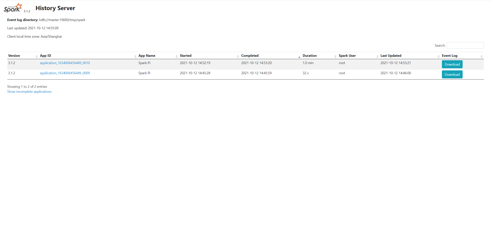

# Spark 集群部署

Spark 集群支持以下部署模式：

- Standalone
- Mesos
- YARN
- Kubernetes

本文主要介绍 Standalone、Standalone（HA）和 YARN 三种部署模式，并简要介绍提交工具 `spark-submit`。

## Standalone 模式

Standalone 为独立部署模式，在该模式下，用户可以** 不依赖第三方组件** 部署单独的 Spark 集群。

Standalone 模式中包含 Master 节点和 Slave节点，体现了经典的 Master-Slave 架构。其中，Master 节点会启动 Master 进程，负责集群资源管理和任务调度，Worker 节点会启动 Worker 进程，负责实际计算任务的执行。

### 集群规划

假设当前有 3 台服务器，主机名分别为 master，slave1，slave2，我们可以按照如下方式规划 Spark 集群：

|**主机名**|**启动 Master**|**启动 Worker**|
|---|---|---|
|master|✅|✅|
|slave1|❌|✅|
|slave2|❌|✅|

### 安装与配置

完成规划后，我们将执行 Standalone 模式下的安装与配置过程。

第一步，将安装包 `spark-3.1.2-bin-hadoop3.2.tgz` 上传至服务器并重命名：

```bash
tar -zxvf spark-3.1.2-bin-hadoop3.2.tgz -C /opt
cd /opt
mv spark-3.1.2-bin-hadoop3.2 spark-standalone
```

第二步，重命名 `conf` 目录下的 `workers.template` 为 `workers`，并按照集群规划配置 Worker 节点：

```纯文本
master
slave1
slave2
```

第三步，重命名 `conf` 目录下的 `spark-env.sh.template` 为 `spark-env.sh`，并设置环境变量：

```bash
export SPARK_SSH_OPTS="-p 22222"
SPARK_MASTER_HOST=master
SPARK_MASTER_PORT=7077
SPARK_MASTER_WEBUI_PORT=38080
SPARK_WORKER_WEBUI_PORT=38081
```

其中，各环境变量的含义如下所示：

- `SPARK_SSH_OPTS`：Spark 集群的 `ssh` 端口，默认为 `22`
- `SPARK_MASTER_HOST`：Master 进程所在的主机地址
- `SPARK_MASTER_PORT`：Master 进程监听的端口，默认为 `7077`
- `SPARK_MASTER_WEBUI_PORT`：Master 进程 Web UI 的监听端口，默认为 `8080`
- `SPARK_WORKER_WEBUI_PORT`：Worker 进程 Web UI 的监听端口，默认为 `8081`

:::info

由于 `8080` 端口和 `8081` 常常被其他组件占用，Web UI 的监听端口建议修改为其他值。

:::

最后，使用同步命令将 Spark 安装目录同步到集群的所有节点：

```bash
xsync /opt/spark-standalone
```

:::info

xsync 为基于 rsync编写的集群内同步脚本，非 Linux 自带命令。

:::

### 集群启动

完成安装与配置后，我们可以在 master 主机启动集群：

```bash
cd /opt/spark-standalone/sbin
./start-all.sh
```

若启动成功，Spark 集群中各节点的 JVM 进程启动情况如下所示：

|**master**|**slave1**|**slave2**|
|---|---|---|
|Master、Worker|Worker|Worker|

此时，访问地址 [http://master:38080](http://master:38080/)，即可看到 Spark Master 的可视化界面：


### 配置历史服务

通过前述步骤，我们已经可以正常启动 Spark 集群并提交计算应用。但此时还存在一个隐患，当 Spark 集群重启或发生异常停止时，原有的应用信息便丢失了，不会重新显示在 Web UI 上。好在，Spark 向用户提供了 **历史服务（history-server）**，可以满足历史应用信息存储与查看的需求。

历史服务的启用同样需要一系列步骤。

第一步，重命名 `conf` 目录下的 `spark-defaults.conf.template` 为 `spark-defaults.conf`，并追加以下配置：

```纯文本
spark.eventLog.enabled  true
spark.eventLog.dir      file:///tmp/spark
```

各配置项的含义如下：

- `spark.eventLog.enabled`：是否启用计算应用日志存储，默认为 `false`
- `spark.eventLog.dir`：指定计算应用日志存储的路径，可以是本地路径，也可以是 HDFS 路径

:::caution

`spark.eventLog.dir` 若为本地路径，需要以 `file:///` 开头。同时，“本地”指的是客户端所对应的服务器（即执行 `spark-submit` 的服务器），并非 Master 所处的服务器。

:::

第二步，在 `spark-env.sh` 追加以下变量：

```bash
export SPARK_HISTORY_OPTS="
-Dspark.history.ui.port=18080 
-Dspark.history.fs.logDirectory=file:///tmp/spark 
-Dspark.history.retainedApplications=30"
```

`SPARK_HISTORY_OPTS` 用于指定历史服务的配置参数，上述各配置参数的含义如下：

- `spark.history.ui.port`：指定历史服务 Web UI 的监听端口，默认为 `18080`
- `spark.history.fs.logDirectory`：指定历史服务读取的计算应用日志路径
- `spark.history.retainedApplications`：指定历史计算应用记录的最大保存个数

:::info

`spark.eventLog.dir` 与 `spark.history.fs.logDirectory` 作用对象不同。前者指计算应用日志的输出路径，与历史服务无关；后者指历史服务扫描的计算应用日志路径，在启用历史服务时生效。

:::

:::caution

`spark.history.retainedApplications` 保存的个数指的是内存中的应用个数，并非页面上显示的应用个数。

:::

第三步，同步上述配置文件到集群所有节点：

```bash
xsync /opt/spark-standalone/conf
```

最后，重启 Spark 集群并启用历史服务：

```bash
cd /opt/spark-standalone/sbin
./start-all.sh
./start-history-server.sh

```

若启动成功，访问地址 [http://master:18080](http://master:18080/)，便可以看到历史服务的可视化界面：


## Standalone（HA）模式

普通的 Standalone 模式中，Master 进程只有一个。对于生产环境来说，这是不可接收的，一旦 Master 进程异常下线，整个 Spark 集群都将处于不可用的状态。

为解决这个问题，Spark 支持了 Standalone（HA）模式，通过引入 Zookeeper 以实现 Master 主备机制。

### 集群规划

在高可用要求下，我们的集群规划如下所示：

|**主机名**|**启用 Zookeeper**|**启用 Master**|**启用 Worker**|
|---|---|---|---|
|master|✅|✅|✅|
|slave1|✅|✅|✅|
|slave2|✅|❌|✅|

### 安装与配置

完成规划后，我们将执行 Standalone（HA）模式下的安装与配置过程。

第一步，启动 Zookeeper 集群。

第二步，将安装包 `spark-3.1.2-bin-hadoop3.2.tgz` 上传至服务器并重命名：

```bash
tar -zxvf spark-3.1.2-bin-hadoop3.2.tgz -C /opt
cd /opt
mv spark-3.1.2-bin-hadoop3.2 spark-standalone-ha
```

第三步，重命名 `conf` 目录下的 `workers.template` 为 `workers`，并按照集群规划配置 Worker 节点：

```纯文本
master
slave1
slave2
```

第四步，重命名 `conf` 目录下的 `spark-env.sh.template` 为 `spark-env.sh`，并设置环境变量：

```bash
export SPARK_SSH_OPTS="-p 22222"
SPARK_MASTER_WEBUI_PORT=38080
SPARK_WORKER_WEBUI_PORT=38081
export SPARK_DAEMON_JAVA_OPTS="
-Dspark.deploy.recoveryMode=ZOOKEEPER 
-Dspark.deploy.zookeeper.url=master,slave1,slave2
-Dspark.deploy.zookeeper.dir=/spark"
```

各环境变量的含义如下所示：

- `SPARK_SSH_OPTS`：Spark 集群的 `ssh` 端口，默认为 `22`
- `SPARK_MASTER_WEBUI_PORT`：Master 进程 Web UI 的监听端口，默认为 `8080`
- `SPARK_WORKER_WEBUI_PORT`：Worker 进程 Web UI 的监听端口，默认为 `8081`
- `SPARK_DAEMON_JAVA_OPTS`：Zookeeper 配置，包括 Zookeeper 主机地址以及 Spark 所对应的 Zookeeper 内的路径

最后，使用同步命令将 Spark 安装目录同步到集群的所有节点：

```bash
xsync /opt/spark-standalone-ha
```

### 集群启动

完成安装与配置后，我们可以在 master 主机启动集群：

```bash
cd /opt/spark-standalone-ha/sbin
./start-all.sh
```

然后，在 slave1 主机单独启动 Master 进程：

```bash
cd /opt/spark-standalone-ha/sbin
./start-master.sh
```

若启动成功，Spark 集群中各节点的 JVM 进程启动情况如下所示：

|**主机名**|**启动的 JVM 进程**|
|---|---|
|master|QuorumPeerMain、Master、Worker|
|slave1|QuorumPeerMain、Master、Worker|
|slave2|QuorumPeerMain、Worker|

此时，访问地址 [http://slave1:38080](http://slave1:38080/)，即可看到备用的 Master 进程已启动，且状态为 `STANDBY`：


:::info

如果我们将主节点的 Master 进程 kill 掉，该备用 Master 的状态将变为 `ALIVE`，并以 Master 的角色对外提供服务。

:::

### 配置历史服务

与 Standalone 模式中的步骤一致，不再赘述。

## Yarn 模式

在 Standalone 模式中，计算资源由 Spark 集群自身完成调度和分配。

尽管它能稳定工作，但是，Spark 毕竟是计算框架，资源调度并非它的强项，若使用 Standalone 模式，**集群资源利用率可能无法达到最理想的状态**。

因此，将 Spark 计算应用运行在 Yarn（专业的资源调度框架）模式中，成为大部分厂商的选择。

### 集群规划

使用 Yarn 模式，无需部署和启动独立的 Spark 集群，但是需要部署 Hadoop 和 Yarn 环境：

|**主机名**|**启动的 JVM 进程**|
|---|---|
|master|NameNode、DataNode、ResourceManager、NodeManager、JournalNode|
|slave1|NameNode、DataNode、ResourceManager、NodeManager、JournalNode|
|slave2|DataNode、NodeManager、JournalNode|

:::info

该规划为 Hadoop HA 环境的节点分配示例，包含 HDFS 和 Yarn 的相关进程，本文不展开介绍。 

:::

### 安装与配置

完成规划后，我们将执行 Yarn 模式下的安装与配置过程。

第一步，在 Hadoop 配置文件 `/opt/hadoop/etc/hadoop/yarn-site.xml` 追加以下配置，并分发至所有节点：

```xml
<!-- 是否启动一个线程检查每个任务正使用的物理内存量，如果任务超出分配值，则直接将其杀掉，默认是 true -->
<property>
    <name>yarn.nodemanager.pmem-check-enabled</name>
    <value>false</value>
</property>
<!-- 是否启动一个线程检查每个任务正使用的虚拟内存量，如果任务超出分配值，则直接将其杀掉，默认是 true -->
<property>
    <name>yarn.nodemanager.vmem-check-enabled</name>
    <value>false</value>
</property>
```

第二步，将安装包 `spark-3.1.2-bin-hadoop3.2.tgz` 上传至服务器并重命名：

```bash
tar -zxvf spark-3.1.2-bin-hadoop3.2.tgz -C /opt
cd /opt
mv spark-3.1.2-bin-hadoop3.2 spark-yarn
```

最后一步，重命名 `conf` 目录下的 `spark-env.sh.template` 为 `spark-env.sh`，并设置环境变量：

```properties
YARN_CONF_DIR=/opt/hadoop/etc/hadoop
```

### 集群启动

在 Yarn 模式下，只需启动 HDFS 和 Yarn，**无需启动 Spark 进程**：

```bash
cd /opt/hadoop/sbin
./start-dfs.sh
./start-yarn.sh
```

此时，我们可以通过 `spark-submit` 提交计算应用到 Yarn，以验证部署结果：

```bash
bin/spark-submit \
--class org.apache.spark.examples.SparkPi \
--master yarn \
--deploy-mode cluster \
./examples/jars/spark-examples_2.12-3.1.2.jar \
10
```

:::caution

执行该命令的用户（例如 root）需要具备 HDFS 的写入权限，否则 Yarn 输出临时数据到 HDFS 时会出现权限不够的异常。 

:::

若提交成功，可通过 Yarn 的 Web UI（地址为：[http://master:8088/cluster](http://master:8088/cluster)）查看执行结果：


### 配置历史服务

使用 Yarn 模式，历史服务的计算应用日志需要存储在 HDFS 上。

第一步，重命名 `conf` 目录下的 `spark-defaults.conf.template` 为 `spark-defaults.conf`，并追加以下配置：

```纯文本
spark.eventLog.enabled  true
spark.eventLog.dir      hdfs://master:19000/tmp/spark
```

:::caution

`19000` 为 NameNode 的 rpc 端口，路径 `/tmp/spark` 要提前在 HDFS 上创建好。

:::

第二步，在 `spark-env.sh` 追加以下变量：

```bash
export SPARK_HISTORY_OPTS="
-Dspark.history.ui.port=18080 
-Dspark.history.fs.logDirectory=hdfs://master:19000/tmp/spark 
-Dspark.history.retainedApplications=30"
```

第三步，同步上述配置文件到集群所有节点：

```bash
xsync /opt/spark-yarn/conf
```

最后，启用历史服务：

```bash
cd /opt/spark-yarn/sbin
./start-history-server.sh

```

若启动成功，提交应用后即可在历史服务 Web UI 看见如下结果：



